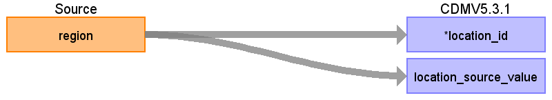

# CDM Table name: LOCATION

## Reading from CPRD.Practice

| Destination Field | Source field | Logic | Comment field |
| --- | --- | --- | --- |
| location_id | region |  |  |
| address_1 |  |  |  |
| address_2 |  |  |  |
| city |  |  |  |
| state |  |  |  |
| zip |  |  |  |
| county |  |  |  |
| location_source_value | region | Use practice.region to look up the location_source_value in the prg table. Store prg.txt as location_source_value. |  |