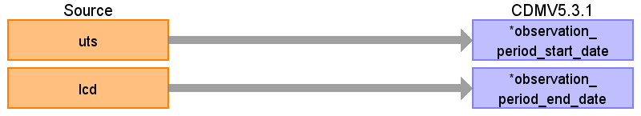

## Table of contents
{: .no_toc .text-delta }

1. TOC
{:toc}

---

# CDM Table name: OBSERVATION_PERIOD

Remove any patients whose OBSERVATION_PERIOD_START_DATE is prior to their OBSERVATION_PERIOD_END_DATE. An example of a scenario where a patient could have no valid observation time occurs when the patient’s transfer out date (patient.tod) is prior to the date the practice is deemed to be of research quality (practice.uts). CPRD verified that about 10% of patients do not contribute any valid observation time to the database. 

## Reading from CPRD.Patient

| Destination Field | Source field | Logic | Comment field |
| --- | --- | --- | --- |
| observation_period_id |  |  | Autogenerate |
| person_id | patid |  |  |
| observation_period_start_date | frd | Take the latest date between patient.frd and practice.uts.  | max(patient.frd, practice.uts) |
| observation_period_end_date | tod | Take the earliest date between patient.tod, practice.lcd, and the date data received. | Use min(patient.tod, practice.lcd,date data received).    THEMIS rule #23 now allows for data to be retained after the OBSERVATION_PERIOD_END_DATE and an option is now available in ATLAS to include that data in an analysis. |
| period_type_concept_id |  | Use **32880** - Standard algorithm |  |

## Reading from CPRD.Practice

| Destination Field | Source field | Logic | Comment field |
| --- | --- | --- | --- |
| observation_period_id |  |  | Autogenerate |
| person_id |  |  |  |
| observation_period_start_date | uts | Take the latest date between patient.crd and practice.uts. |  |
| observation_period_end_date | lcd | Take the earliest date between patient.tod, practice.lcd, and the date data received. |  |
| period_type_concept_id |  |Use **32880** - Standard algorithm   |  |
