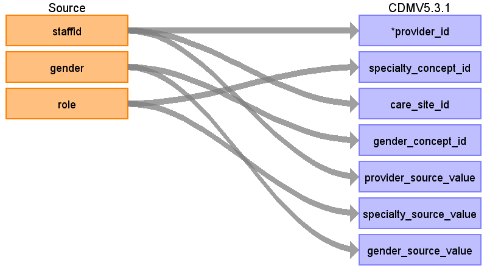

## CDM Table name: PROVIDER

### Reading from CPRD.Staff

Use the staff table to populate the provider table. In CPRD, the staffid field represents the unique identifier given to the practice staff member entering the data, it does not necessarily represent the provider.  

| Destination Field | Source field | Logic | Comment field |
| --- | --- | --- | --- |
| provider_id | staffid |  |  |
| provider_name |  |  |  |
| npi |  |  |  |
| dea |  |  |  |
| specialty_concept_id | role | Join onto SOURCE_TO_CONCEPT_MAP, lookup the role in the source_code field using the SOURCE_TO_STANDARD_QUERY with the following filter:    WHERE SOURCE_VOCABULARY_ID = 'JNJ_CPRD_PROV_SPEC' | Use the file 'CPRD_Native_Specialties.sql' to find all provider specialities and counts if mapping updates to the source_to_concept_map need to be made. |
| care_site_id | staffid | right(staffid,3) | Last 3 digits of the staffid are the practice identifier with the leading zeros removed. |
| year_of_birth |  |  |  |
| gender_concept_id | gender | Map the CPRD gender code to gender_concept_id using the following logic:    CPRD                Description   Gender 				Description                 concept_id  Code  0	Data Not Entered	                                                                   0  1	Male		M	MALE		8507  2	Female		F	FEMALE		8532  3	Indeterminate	                                                                           	0  4	Unknown                                                                                                 0 |  |
| provider_source_value | staffid |  |  |
| specialty_source_value | role | Join the staff table to the ROL lookup table on role = code where lookup_type_id = 76. Put the text from the lookup table as the speciality_source_value. | See the file 'CPRD_Native_Specialties.sql' for more information on how to join the tables. |
| specialty_source_concept_id |  |  | 0 |
| gender_source_value | gender |  |  |
| gender_source_concept_id |  |  | 0 |
