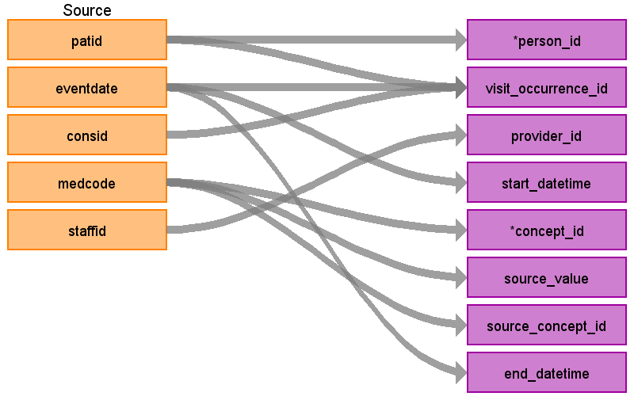
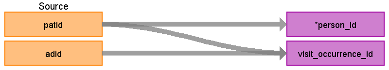

1.TOC
{:toc}

## CDM Table name: stem_table

**NEED MORE INFORMATION ABOUT THE STEM TABLE**

### Reading from CPRD.Clinical

| Destination Field | Source field | Logic | Comment field |
| --- | --- | --- | --- |
| id |  |  | Autogenerate |
| domain_id |  |  | This should be the domain_id of the standard concept in the concept_id field.     If a read code is mapped to concept_id 0, put the domain_id as Observation. |
| person_id | patid |  |  |
| visit_occurrence_id | consid  patid  eventdate | Look up visit_occurrence_id based on the unique patid, consid, and eventdate. | Use the Visit_occurrence_id assigned in the previous visit definition step |
| provider_id | staffid | Use the staffid to look up provider_id in the provider table. | ADDITIONAL: Map staffid to provider_id |
| start_datetime | eventdate |  | TEST: Set time as midnight    ADDITIONAL: Join back to the Clinical table using adid and set the eventdate as the start_datetime and set the time to midnight. |
| concept_id | medcode | Use the medcode to link to the medical table to find the read code.     Use source to standard query to map the read code to standard concept(s) with the following filters:    Where source_vocabulary_id = 'Read'  and Target_standard_concept = 'S'  and Invalid_concept is NULL    *BE CAREFUL - READ CODES ARE CASE SENSITIVE    If there is no mapping available, set concept_id to zero. | See the query [CPRD_Clinical_Medcodes.sql](https://github.com/OHDSI/ETL-LambdaBuilder/blob/master/docs/CPRD/Queries/CPRD_Clinical_Medcodes.sql) as a high-level look at the domains covered by this table and how the link to the medical table should be made.  TEST:   Using the test_int table, map the read_code to a standard concept using the SOURCE_TO_STANDARD query with the filters:    WHERE source_vocabulary_id = 'Read'  AND standard_concept = 'S'  AND invalid_concept is NULL    ADDITIONAL:  Map the source value (add_int.enttype + '-' + add_int.category + '-' + add_int.description + '-' + add_int.data) to a concept using the SOURCE_TO_STANDARD_QUERY with the filters:    WHERE source_vocabulary_id = 'JNJ_CPRD_ADD_ENTTYPE'  AND standard_concept = 'S'  AND invalid_concept is NULL |
| source_value | medcode | Use the medcode to link to the medical table to find the read code. Store read code as source_value. | TEST: Concatenate test_int.code + '-' + test_int.description + '-' + test_int.read_code. This will retain the read_code as well as the enttype. Some of the read codes map to conditions so this will help to identify the records coming from the test table. Please refer to appendix 1 which is a table showing the mapping of read codes in the test table to concepts, domains, and counts of each.      ADDITIONAL: Concatenate add_int.enttype + '-' + add_int.category + '-' + add_int.description + '-' + add_int.data. This will retain the information from the entity table about the record and the specific data field being mapped. Please refer to appendix 2 which is a table showing the enttypes and data_field descriptions from the additional table and counts of each. |
| source_concept_id | medcode | Use the medcode to link to the medical table to find the read code.     Use source to source query to map the read code to a source concept id with the following filters:    Where source_vocabulary_id = 'Read'        *BE CAREFUL - READ CODES ARE CASE SENSITIVE    If there is no mapping available set source_concept_id to zero. | TEST:  Map test_int.read_code to a source_concept_id using the SOURCE_TO_SOURCE query with the filter:    WHERE source_vocabulary_id = 'Read'    ADDITIONAL:  0 |
| type_concept_id |  |  | Use the following type concepts based on the domain of the concept_id:    Condition - 32020 EHR encounter diagnosis  Observation - 38000280 Observation recorded from EHR  Procedure - 38000275 EHR order list entry  Measurement - 44818702 Lab result  Drug - 38000177 prescription written  Drug and concept vocabulary_id is 'CVX' - 38000179 Physician administered drug (identified as procedure) |
| operator_concept_id |  |  | TEST:  Map test_int.operator to a standard concept_id using the following logic:    <	as  4171756  <= 	as  4171754  =	as  4172703  >	as  4172704  >=	as  4172704    This can also be done by joining to the CONCEPT table where operator = concept_name and domain = 'Meas Value Operator' and standard_concept = 'S' and invalid_reason is NULL.    ADDITIONAL: NULL |
| unit_concept_id |  |  | TEST:	  Look up test_int.unit in the CONCEPT table where vocabulary_id = 'UCUM' and standard_concept = 'S' and invalid_reason is NULL.    ADDITIONAL:  Look up add_int.unit_source_value in the CONCEPT table where vocabulary_id = 'UCUM' and standard_concept = 'S' and invalid_reason is NULL. |
| unit_source_value |  |  | TEST:  Set to test_int.unit    ADDITIONAL:  Set to add_int.unit_source_value |
| start_date |  |  | TEST: test_int.eventdate    ADDITIONAL: add_int.eventdate  For the additional table, the adid is used to link back to the clinical table to get the eventdate. |
| end_date |  |  |  |
| range_high |  |  | TEST:  Test_int.range_high |
| range_low |  |  | TEST:  Test_int.range_low |
| value_as_number |  |  | TEST:  Test_int.value_as_number    ADDITIONAL:  add_int.value_as_number |
| value_as_string |  |  | ADDITIONAL:  Set as add_int.value_as_string |
| value_as_concept_id |  |  | TEST:  Lookup the values in test_int.value_as_concept_id in the CONCEPT table where domain_id=' Meas Value' and vocabulary_id=' LOINC' and standard_concept = 'S' and invalid_concept is NULL.    ADDITIONAL:   If the last part of the source value says 'Read code for condition' then map the code in add_int.value_as_string to a standard concept using the SOURCE_TO_STANDARD query with the filters:    WHERE source_vocabulary_id = 'Read'  AND standard_concept = 'S'  AND invalid_concept is NULL    If the last part of the source value says 'Drug code' then map the code in add_int.value_as_string to a standard concept using the SOURCE_TO_STANDARD query with the filters:    WHERE source_vocabulary_id = 'Gemscript'  AND standard_concept = 'S'  AND invalid_concept is NULL    Otherwise, if the value in add_int.qualifier_source_value is not null then lookup the values in add_int.qualifier_source_value in the CONCEPT table where domain_id=' Meas Value' and vocabulary_id=' LOINC' and standard_concept = 'S' and invalid_concept is NULL. |
| value_source_value |  |  | TEST:  If not NULL, put test_int.value_as_concept_id here.    ADDITIONAL:  If not NULL, put add_int.qualifier_source_value here. |
| end_datetime |  |  |  |
| verbatim_end_date |  |  |  |
| days_supply |  |  |  |
| dose_unit_source_value |  |  |  |
| lot_number |  |  |  |
| modifier_concept_id |  |  |  |
| modifier_concept_id |  |  |  |
| modifier_source_value |  |  |  |
| quantity |  |  |  |
| refills |  |  |  |
| route_concept_id |  |  |  |
| route_source_value |  |  |  |
| sig |  |  |  |
| stop_reason |  |  |  |
| unique_device_id |  |  |  |
| anatomic_site_concept_id |  |  |  |
| disease_status_concept_id |  |  |  |
| specimen_source_id |  |  |  |
| anatomic_site_source_value |  |  |  |
| disease_status_source_value |  |  |  |
| condition_status_concept_id |  |  |  |
| condition_status_source_value |  |  |  |

### Reading from CPRD.Referral

| Destination Field | Source field | Logic | Comment field |
| --- | --- | --- | --- |
| id |  |  | Autogenerate |
| domain_id |  |  | This should be the domain_id of the standard concept in the concept_id field.     If a read code is mapped to concept_id 0, put the domain_id as Observation. |
| person_id | patid |  |  |
| visit_occurrence_id | patid  eventdate  consid | Look up visit_occurrence_id based on the unique patid, consid, and eventdate | Use the Visit_occurrence_id assigned in the previous visit definition step |
| provider_id | staffid | Use staffid as the lookup to find the provider_id | ADDITIONAL: Map staffid to provider_id |
| start_datetime | eventdate |  | Set time as midnight  TEST: Set time as midnight    ADDITIONAL: Join back to the Clinical table using adid and set the eventdate as the start_datetime and set the time to midnight. |
| concept_id | medcode | Use the medcode to link to the medical table to find the read code.     Use source to standard query to map the read code to standard concept(s) with the following filters:    Where source_vocabulary_id = 'Read'  and Target_standard_concept = 'S'  and Invalid_concept is NULL    *BE CAREFUL - READ CODES ARE CASE SENSITIVE    If there is no mapping available, set concept_id to zero. | See CPRD_Referral_Medcodes.sql for an idea of how the codes in the referral table map to the vocabulary and how the link between the referral table and medical table should be made.  TEST:   Using the test_int table, map the read_code to a standard concept using the SOURCE_TO_STANDARD query with the filters:    WHERE source_vocabulary_id = 'Read'  AND standard_concept = 'S'  AND invalid_concept is NULL    ADDITIONAL:  Map the source value (add_int.enttype + '-' + add_int.category + '-' + add_int.description + '-' + add_int.data) to a concept using the SOURCE_TO_STANDARD_QUERY with the filters:    WHERE source_vocabulary_id = 'JNJ_CPRD_ADD_ENTTYPE'  AND standard_concept = 'S'  AND invalid_concept is NULL |
| source_value | medcode | Use the medcode to link to the medical table to find the read code.  Store the read code as the condition_source_value. | TEST: Concatenate test_int.code + '-' + test_int.description + '-' + test_int.read_code. This will retain the read_code as well as the enttype. Some of the read codes map to conditions so this will help to identify the records coming from the test table. Please refer to appendix 1 which is a table showing the mapping of read codes in the test table to concepts, domains, and counts of each.      ADDITIONAL: Concatenate add_int.enttype + '-' + add_int.category + '-' + add_int.description + '-' + add_int.data. This will retain the information from the entity table about the record and the specific data field being mapped. Please refer to appendix 2 which is a table showing the enttypes and data_field descriptions from the additional table and counts of each. |
| source_concept_id | medcode | Use the medcode to link to the medical table to find the read code.     Use source to source query to map the read code to a source concept id with the following filters:    Where source_vocabulary_id = 'Read'        *BE CAREFUL - READ CODES ARE CASE SENSITIVE    If there is no mapping available set source_concept_id to zero. | TEST:  Map test_int.read_code to a source_concept_id using the SOURCE_TO_SOURCE query with the filter:    WHERE source_vocabulary_id = 'Read'    ADDITIONAL:  0 |
| type_concept_id |  |  | Use the following type concepts based on the domain of the concept_id:    Condition - 32020 EHR encounter diagnosis  Observation - 38000280 Observation recorded from EHR  Procedure - 38000275 EHR order list entry  Measurement - 44818702 Lab result  Drug - 38000177 prescription written  Drug and concept vocabulary_id is 'CVX' - 38000179 Physician administered drug (identified as procedure) |
| operator_concept_id |  |  | TEST:  Map test_int.operator to a standard concept_id using the following logic:    <	as  4171756  <= 	as  4171754  =	as  4172703  >	as  4172704  >=	as  4172704    This can also be done by joining to the CONCEPT table where operator = concept_name and domain = 'Meas Value Operator' and standard_concept = 'S' and invalid_reason is NULL.    ADDITIONAL: NULL |
| unit_concept_id |  |  | TEST:	  Look up test_int.unit in the CONCEPT table where vocabulary_id = 'UCUM' and standard_concept = 'S' and invalid_reason is NULL.    ADDITIONAL:  Look up add_int.unit_source_value in the CONCEPT table where vocabulary_id = 'UCUM' and standard_concept = 'S' and invalid_reason is NULL. |
| unit_source_value |  |  | TEST:  Set to test_int.unit    ADDITIONAL:  Set to add_int.unit_source_value |
| start_date |  |  | TEST: test_int.eventdate    ADDITIONAL: add_int.eventdate  For the additional table, the adid is used to link back to the clinical table to get the eventdate. |
| end_date |  |  |  |
| range_high |  |  | TEST:  Test_int.range_high |
| range_low |  |  | TEST:  Test_int.range_low |
| value_as_number |  |  | TEST:  Test_int.value_as_number    ADDITIONAL:  add_int.value_as_number |
| value_as_string |  |  | ADDITIONAL:  Set as add_int.value_as_string |
| value_as_concept_id |  |  | TEST:  Lookup the values in test_int.value_as_concept_id in the CONCEPT table where domain_id=' Meas Value' and vocabulary_id=' LOINC' and standard_concept = 'S' and invalid_concept is NULL.    ADDITIONAL:   If the last part of the source value says 'Read code for condition' then map the code in add_int.value_as_string to a standard concept using the SOURCE_TO_STANDARD query with the filters:    WHERE source_vocabulary_id = 'Read'  AND standard_concept = 'S'  AND invalid_concept is NULL    If the last part of the source value says 'Drug code' then map the code in add_int.value_as_string to a standard concept using the SOURCE_TO_STANDARD query with the filters:    WHERE source_vocabulary_id = 'Gemscript'  AND standard_concept = 'S'  AND invalid_concept is NULL    Otherwise, if the value in add_int.qualifier_source_value is not null then lookup the values in add_int.qualifier_source_value in the CONCEPT table where domain_id=' Meas Value' and vocabulary_id=' LOINC' and standard_concept = 'S' and invalid_concept is NULL. |
| value_source_value |  |  | TEST:  If not NULL, put test_int.value_as_concept_id here.    ADDITIONAL:  If not NULL, put add_int.qualifier_source_value here. |
| end_datetime |  |  |  |
| verbatim_end_date |  |  |  |
| days_supply |  |  |  |
| dose_unit_source_value |  |  |  |
| lot_number |  |  |  |
| modifier_concept_id |  |  |  |
| modifier_concept_id |  |  |  |
| modifier_source_value |  |  |  |
| quantity |  |  |  |
| refills |  |  |  |
| route_concept_id |  |  |  |
| route_source_value |  |  |  |
| sig |  |  |  |
| stop_reason |  |  |  |
| unique_device_id |  |  |  |
| anatomic_site_concept_id |  |  |  |
| disease_status_concept_id |  |  |  |
| specimen_source_id |  |  |  |
| anatomic_site_source_value |  |  |  |
| disease_status_source_value |  |  |  |
| condition_status_concept_id |  |  |  |
| condition_status_source_value |  |  |  |

### Reading from CPRD.Therapy

It was necessary to impute drug_exposure_end_date in the drug_exposure table in order to facilitate creation of the CDM Drug_era table. Though it is best in the CDM not to impute data, there is no way to create the drug eras without imputing in this case, as only approximately 7% of records have valid days supplied or duration values (numdays) in the CPRD therapy file. It is difficult to systematically impute duration for drug exposures in CPRD as the ‘numdays’ field is not consistently entered and the quantity divided by numeric daily dose (fields available more frequently than ‘numdays’ in the raw CPRD data) does not consistently create a valid duration for a particular drug exposure. The imputation method below was decided upon, using most common ‘numdays’ for duration for a particular combination of ‘prodcode’, ‘daily_dose’ (available from the commondosages table joining to therapy on dosageid), ‘qty’ and ‘numpacks’ using the ‘daily_dose’ and ‘qty’ fields to validate the imputations.
The imputing process is as follows: first if the ‘numdays’ field is populated with valid data (>0 and <365), that will become the days supplied.  Then the most common days supplied in the data for each combination of prodcode, daily_dose, qty, and numpack (null values for any of the fields are converted to 0) is used if numdays is 0 or >365 (in table Daysupply_Decodes).  If a combination does not have a valid ‘numdays’ value in the data, then the modal days supplied is used for each prodcode (Daysupply_Modes).  Lastly, if there are not valid days supplied in the data for a particular prodcode, we will use assume the product was used for one day only.  We created a process to validate the drug duration imputations which is described here:

Matcho A, Ryan P, Fife D, Reich C. Fidelity assessment of a clinical practice research datalink conversion to the OMOP common data model. Drug safety : an international journal of medical toxicology and drug experience. Nov 2014;37(11):945-959.

Mapping statistics for all domains are also described in the above publication (% codes mapped, % data in domain mapped, top 100 code validations etc.) 

The days_supply field in the drug_exposure table will hold the original ‘numdays’ value, no imputation will be done for this field.  Numdays values of 0 (93% of data) and >365 (.0004% of data) will be considered invalid.  Drug_exposure_start_date plus imputed days supplied minus one will be the value of drug_exposure_end_date.  One day is being subtracted from the total because we are considering day 1 of drug exposure to be the start date. 

| Destination Field | Source field | Logic | Comment field |
| --- | --- | --- | --- |
| id |  |  | Autogenerate |
| domain_id |  |  | This should be the domain_id of the standard concept in the concept_id field.     If a read code is mapped to concept_id 0, put the domain_id as Observation. |
| person_id | patid | Look up visit_occurrence_id based on the unique patid, consid, and eventdate |  |
| visit_occurrence_id | eventdate  patid | Look up visit_occurrence_id based on the unique patid, consid, and eventdate  Look up visit_occurrence_id based on the unique patid, consid, and eventdate | Use the Visit_occurrence_id assigned in the previous visit definition step |
| provider_id |  |  | ADDITIONAL: Map staffid to provider_id |
| start_datetime | eventdate | Set time as midnight | TEST: Set time as midnight    ADDITIONAL: Join back to the Clinical table using adid and set the eventdate as the start_datetime and set the time to midnight. |
| concept_id | prodcode | Use the prodcode to find the associated gemscript code in the product table. Find the standard concept_id associated with the gemscript using the SOURCE_TO_STANDARD query with the filters:    WHERE source_vocabulary_id in ('gemscript')  and eventdate between valid_start_date and valid_end_date  and standard_concept = 'S'    Look for an Rxnorm mapping first, if one does not exist then look in the RxNorm_Extension vocabulary.    If a gemscript does not have a standard map, set this to 0 | Use the query CPRD_Therapy_Prodcodes.sql to get an idea of the domains covered by the prodcodes and how to join to the product table.  TEST:   Using the test_int table, map the read_code to a standard concept using the SOURCE_TO_STANDARD query with the filters:    WHERE source_vocabulary_id = 'Read'  AND standard_concept = 'S'  AND invalid_concept is NULL    ADDITIONAL:  Map the source value (add_int.enttype + '-' + add_int.category + '-' + add_int.description + '-' + add_int.data) to a concept using the SOURCE_TO_STANDARD_QUERY with the filters:    WHERE source_vocabulary_id = 'JNJ_CPRD_ADD_ENTTYPE'  AND standard_concept = 'S'  AND invalid_concept is NULL |
| source_value | prodcode | Use the prodcode to find the associated gemscript code in the product table. Use the gemscript as the source_value | TEST: Concatenate test_int.code + '-' + test_int.description + '-' + test_int.read_code. This will retain the read_code as well as the enttype. Some of the read codes map to conditions so this will help to identify the records coming from the test table. Please refer to appendix 1 which is a table showing the mapping of read codes in the test table to concepts, domains, and counts of each.      ADDITIONAL: Concatenate add_int.enttype + '-' + add_int.category + '-' + add_int.description + '-' + add_int.data. This will retain the information from the entity table about the record and the specific data field being mapped. Please refer to appendix 2 which is a table showing the enttypes and data_field descriptions from the additional table and counts of each. |
| source_concept_id | prodcode | Use the prodcode to find the associated gemscript code in the product table. Find the concept_id associated with the gemscript using the SOURCE_TO_SOURCE query with the filters:    WHERE source_vocabulary_id in ('gemscript')  and eventdate between valid_start_date and valid_end_date | TEST:  Map test_int.read_code to a source_concept_id using the SOURCE_TO_SOURCE query with the filter:    WHERE source_vocabulary_id = 'Read'    ADDITIONAL:  0 |
| type_concept_id |  |  | Use the following type concepts based on the domain of the concept_id:    Condition - 32020 EHR encounter diagnosis  Observation - 38000280 Observation recorded from EHR  Procedure - 38000275 EHR order list entry  Measurement - 44818702 Lab result  Drug - 38000177 prescription written  Drug and concept vocabulary_id is 'CVX' - 38000179 Physician administered drug (identified as procedure) |
| operator_concept_id |  |  | TEST:  Map test_int.operator to a standard concept_id using the following logic:    <	as  4171756  <= 	as  4171754  =	as  4172703  >	as  4172704  >=	as  4172704    This can also be done by joining to the CONCEPT table where operator = concept_name and domain = 'Meas Value Operator' and standard_concept = 'S' and invalid_reason is NULL.    ADDITIONAL: NULL |
| unit_concept_id |  |  | TEST:	  Look up test_int.unit in the CONCEPT table where vocabulary_id = 'UCUM' and standard_concept = 'S' and invalid_reason is NULL.    ADDITIONAL:  Look up add_int.unit_source_value in the CONCEPT table where vocabulary_id = 'UCUM' and standard_concept = 'S' and invalid_reason is NULL. |
| unit_source_value |  |  | TEST:  Set to test_int.unit    ADDITIONAL:  Set to add_int.unit_source_value |
| start_date |  |  | TEST: test_int.eventdate    ADDITIONAL: add_int.eventdate  For the additional table, the adid is used to link back to the clinical table to get the eventdate. |
| end_date | numdays | Follow the imputation logic as described above. |  |
| range_high |  |  | TEST:  Test_int.range_high |
| range_low |  |  | TEST:  Test_int.range_low |
| value_as_number |  |  | TEST:  Test_int.value_as_number    ADDITIONAL:  add_int.value_as_number |
| value_as_string |  |  | ADDITIONAL:  Set as add_int.value_as_string |
| value_as_concept_id |  |  | TEST:  Lookup the values in test_int.value_as_concept_id in the CONCEPT table where domain_id=' Meas Value' and vocabulary_id=' LOINC' and standard_concept = 'S' and invalid_concept is NULL.    ADDITIONAL:   If the last part of the source value says 'Read code for condition' then map the code in add_int.value_as_string to a standard concept using the SOURCE_TO_STANDARD query with the filters:    WHERE source_vocabulary_id = 'Read'  AND standard_concept = 'S'  AND invalid_concept is NULL    If the last part of the source value says 'Drug code' then map the code in add_int.value_as_string to a standard concept using the SOURCE_TO_STANDARD query with the filters:    WHERE source_vocabulary_id = 'Gemscript'  AND standard_concept = 'S'  AND invalid_concept is NULL    Otherwise, if the value in add_int.qualifier_source_value is not null then lookup the values in add_int.qualifier_source_value in the CONCEPT table where domain_id=' Meas Value' and vocabulary_id=' LOINC' and standard_concept = 'S' and invalid_concept is NULL. |
| value_source_value |  |  | TEST:  If not NULL, put test_int.value_as_concept_id here.    ADDITIONAL:  If not NULL, put add_int.qualifier_source_value here. |
| end_datetime |  |  |  |
| verbatim_end_date |  |  |  |
| days_supply | numdays |  |  |
| dose_unit_source_value |  |  |  |
| lot_number |  |  |  |
| modifier_concept_id |  |  |  |
| modifier_concept_id |  |  |  |
| modifier_source_value |  |  |  |
| quantity | qty |  |  |
| refills | issueseq |  |  |
| route_concept_id |  |  |  |
| route_source_value |  |  |  |
| sig | dosageid | Use dosageid as a lookup in the commondosages table and store the field 'text' from the commondosages table here. |  |
| stop_reason |  |  |  |
| unique_device_id |  |  |  |
| anatomic_site_concept_id |  |  |  |
| disease_status_concept_id |  |  |  |
| specimen_source_id |  |  |  |
| anatomic_site_source_value |  |  |  |
| disease_status_source_value |  |  |  |
| condition_status_concept_id |  |  |  |
| condition_status_source_value |  |  |  |

### Reading from CPRD.Immunisation

| Destination Field | Source field | Logic | Comment field |
| --- | --- | --- | --- |
| id |  |  | Autogenerate |
| domain_id |  |  | This should be the domain_id of the standard concept in the concept_id field.     If a read code is mapped to concept_id 0, put the domain_id as Observation. |
| person_id | patid | Use patid to lookup Person_id |  |
| visit_occurrence_id | patid  eventdate  consid | Look up visit_occurrence_id based on the unique patid, consid, and eventdate | Use the Visit_occurrence_id assigned in the previous visit definition step |
| provider_id | staffid | Use staffid to look up provider id in the provider table | ADDITIONAL: Map staffid to provider_id |
| start_datetime | eventdate |  | TEST: Set time as midnight    ADDITIONAL: Join back to the Clinical table using adid and set the eventdate as the start_datetime and set the time to midnight. |
| concept_id | medcode | Use the medcode to link to the medical table to find the read code.     Use source to standard query to map the read code to standard concept(s) with the following filters:    Where source_vocabulary_id = 'Read'  and Target_standard_concept = 'S'  and Invalid_concept is NULL    *BE CAREFUL - READ CODES ARE CASE SENSITIVE    If there is no mapping available, set concept_id to zero. | TEST:   Using the test_int table, map the read_code to a standard concept using the SOURCE_TO_STANDARD query with the filters:    WHERE source_vocabulary_id = 'Read'  AND standard_concept = 'S'  AND invalid_concept is NULL    ADDITIONAL:  Map the source value (add_int.enttype + '-' + add_int.category + '-' + add_int.description + '-' + add_int.data) to a concept using the SOURCE_TO_STANDARD_QUERY with the filters:    WHERE source_vocabulary_id = 'JNJ_CPRD_ADD_ENTTYPE'  AND standard_concept = 'S'  AND invalid_concept is NULL |
| source_value | medcode | find the READ code that corresponds with medcode by looking up the READ in the medical table. | TEST: Concatenate test_int.code + '-' + test_int.description + '-' + test_int.read_code. This will retain the read_code as well as the enttype. Some of the read codes map to conditions so this will help to identify the records coming from the test table. Please refer to appendix 1 which is a table showing the mapping of read codes in the test table to concepts, domains, and counts of each.      ADDITIONAL: Concatenate add_int.enttype + '-' + add_int.category + '-' + add_int.description + '-' + add_int.data. This will retain the information from the entity table about the record and the specific data field being mapped. Please refer to appendix 2 which is a table showing the enttypes and data_field descriptions from the additional table and counts of each. |
| source_concept_id | medcode | Use the medcode to link to the medical table to find the read code.     Use source to source query to map the read code to a source concept id with the following filters:    Where source_vocabulary_id = 'Read'        *BE CAREFUL - READ CODES ARE CASE SENSITIVE    If there is no mapping available set source_concept_id to zero. | TEST:  Map test_int.read_code to a source_concept_id using the SOURCE_TO_SOURCE query with the filter:    WHERE source_vocabulary_id = 'Read'    ADDITIONAL:  0 |
| type_concept_id |  |  | Use the following type concepts based on the domain of the concept_id:    Condition - 32020 EHR encounter diagnosis  Observation - 38000280 Observation recorded from EHR  Procedure - 38000275 EHR order list entry  Measurement - 44818702 Lab result  Drug - 38000177 prescription written  Drug and concept vocabulary_id is 'CVX' - 38000179 Physician administered drug (identified as procedure) |
| operator_concept_id |  |  | TEST:  Map test_int.operator to a standard concept_id using the following logic:    <	as  4171756  <= 	as  4171754  =	as  4172703  >	as  4172704  >=	as  4172704    This can also be done by joining to the CONCEPT table where operator = concept_name and domain = 'Meas Value Operator' and standard_concept = 'S' and invalid_reason is NULL.    ADDITIONAL: NULL |
| unit_concept_id |  |  | TEST:	  Look up test_int.unit in the CONCEPT table where vocabulary_id = 'UCUM' and standard_concept = 'S' and invalid_reason is NULL.    ADDITIONAL:  Look up add_int.unit_source_value in the CONCEPT table where vocabulary_id = 'UCUM' and standard_concept = 'S' and invalid_reason is NULL. |
| unit_source_value |  |  | TEST:  Set to test_int.unit    ADDITIONAL:  Set to add_int.unit_source_value |
| start_date |  |  | TEST: test_int.eventdate    ADDITIONAL: add_int.eventdate  For the additional table, the adid is used to link back to the clinical table to get the eventdate. |
| end_date |  |  |  |
| range_high |  |  | TEST:  Test_int.range_high |
| range_low |  |  | TEST:  Test_int.range_low |
| value_as_number |  |  | TEST:  Test_int.value_as_number    ADDITIONAL:  add_int.value_as_number |
| value_as_string |  |  | ADDITIONAL:  Set as add_int.value_as_string |
| value_as_concept_id |  |  | TEST:  Lookup the values in test_int.value_as_concept_id in the CONCEPT table where domain_id=' Meas Value' and vocabulary_id=' LOINC' and standard_concept = 'S' and invalid_concept is NULL.    ADDITIONAL:   If the last part of the source value says 'Read code for condition' then map the code in add_int.value_as_string to a standard concept using the SOURCE_TO_STANDARD query with the filters:    WHERE source_vocabulary_id = 'Read'  AND standard_concept = 'S'  AND invalid_concept is NULL    If the last part of the source value says 'Drug code' then map the code in add_int.value_as_string to a standard concept using the SOURCE_TO_STANDARD query with the filters:    WHERE source_vocabulary_id = 'Gemscript'  AND standard_concept = 'S'  AND invalid_concept is NULL    Otherwise, if the value in add_int.qualifier_source_value is not null then lookup the values in add_int.qualifier_source_value in the CONCEPT table where domain_id=' Meas Value' and vocabulary_id=' LOINC' and standard_concept = 'S' and invalid_concept is NULL. |
| value_source_value |  |  | TEST:  If not NULL, put test_int.value_as_concept_id here.    ADDITIONAL:  If not NULL, put add_int.qualifier_source_value here. |
| end_datetime | eventdate |  |  |
| verbatim_end_date |  |  |  |
| days_supply |  |  |  |
| dose_unit_source_value |  |  |  |
| lot_number |  |  |  |
| modifier_concept_id |  |  |  |
| modifier_concept_id |  |  |  |
| modifier_source_value |  |  |  |
| quantity |  |  |  |
| refills |  |  |  |
| route_concept_id |  |  |  |
| route_source_value |  |  |  |
| sig |  |  |  |
| stop_reason |  |  |  |
| unique_device_id |  |  |  |
| anatomic_site_concept_id |  |  |  |
| disease_status_concept_id |  |  |  |
| specimen_source_id |  |  |  |
| anatomic_site_source_value |  |  |  |
| disease_status_source_value |  |  |  |
| condition_status_concept_id |  |  |  |
| condition_status_source_value |  |  |  |

### Reading from test

Measurement and observation values will also be drawn from the ‘Test’ file.  This file contains categorical (qualifiers and/or operators) and continuous data values, units, and normal ranges for lab tests and procedures.  Test types (enttype) in the ‘test’ file have 4, 7 or 8 fields; this information (data_fields) can be found in the ‘Entity’ lookup where enttype = test.code.  The query 'CPRD_Test_Setup.sql' should be used to create an intermediate table and all mapping to the CDM will be done from this table, referred to below as test_int. Each record in the test_int will become one record in the measurement table. Please the refer to 'CPRD_Test_Setup.sql' for comments and rationale for how the test_int table is created. 

Each record in the test table has an associated read code. It was decided that the read codes should be mapped to standard concepts instead of mapping the individual enttypes. The reasoning behind this choice was based on the distribution of the read codes associated with each enttype which can be found in appendix 1. While some of the read codes map to conditions, the majority map to observations or measurements. What this means is that the generic enttype 290 which stands for 'Immunoglobulin' can be made much more specific since the read codes point to IgA, IgG, or IgM. At this point the mapping will be left as-is, meaning that the codes that map to conditions will stay that way for now. When choosing to use records from the test table in an analysis please refer back to appendix 1 to determine how many read codes corresponding to a certain enttype map to a domain other than a measurement or observation. At the point when a use case is determined, those read codes and enttypes can be reexamined and their mapping updated. All records from the test table will retain the pattern 'enttype-description-readcode' in the source_value field of the table they end up in so it is possible to find them and group by enttype if so desired.

| Destination Field | Source field | Logic | Comment field |
| --- | --- | --- | --- |
| id |  |  | Autogenerate |
| domain_id |  |  | This should be the domain_id of the standard concept in the concept_id field.     If a read code is mapped to concept_id 0, put the domain_id as Observation. |
| person_id | patid | Use patid to lookup person_id. |  |
| visit_occurrence_id | patid  eventdate  consid | Look up visit_occurrence_id based on the unique combination of patid, consid, and eventdate. | Use the Visit_occurrence_id assigned in the previous visit definition step |
| provider_id | staffid | Use staffid to lookup provider_id in the provider table. | ADDITIONAL: Map staffid to provider_id |
| start_datetime | eventdate |  | Set time to midnight 00:00:00  TEST: Set time as midnight    ADDITIONAL: Join back to the Clinical table using adid and set the eventdate as the start_datetime and set the time to midnight. |
| concept_id |  |  | TEST:   Using the test_int table, map the read_code to a standard concept using the SOURCE_TO_STANDARD query with the filters:    WHERE source_vocabulary_id = 'Read'  AND standard_concept = 'S'  AND invalid_concept is NULL    ADDITIONAL:  Map the source value (add_int.enttype + '-' + add_int.category + '-' + add_int.description + '-' + add_int.data) to a concept using the SOURCE_TO_STANDARD_QUERY with the filters:    WHERE source_vocabulary_id = 'JNJ_CPRD_ADD_ENTTYPE'  AND standard_concept = 'S'  AND invalid_concept is NULL |
| source_value |  |  | TEST: Concatenate test_int.code + '-' + test_int.description + '-' + test_int.read_code. This will retain the read_code as well as the enttype. Some of the read codes map to conditions so this will help to identify the records coming from the test table. Please refer to appendix 1 which is a table showing the mapping of read codes in the test table to concepts, domains, and counts of each.      ADDITIONAL: Concatenate add_int.enttype + '-' + add_int.category + '-' + add_int.description + '-' + add_int.data. This will retain the information from the entity table about the record and the specific data field being mapped. Please refer to appendix 2 which is a table showing the enttypes and data_field descriptions from the additional table and counts of each. |
| source_concept_id |  |  | TEST:  Map test_int.read_code to a source_concept_id using the SOURCE_TO_SOURCE query with the filter:    WHERE source_vocabulary_id = 'Read'    ADDITIONAL:  0 |
| type_concept_id |  |  | Use the following type concepts based on the domain of the concept_id:    Condition - 32020 EHR encounter diagnosis  Observation - 38000280 Observation recorded from EHR  Procedure - 38000275 EHR order list entry  Measurement - 44818702 Lab result  Drug - 38000177 prescription written  Drug and concept vocabulary_id is 'CVX' - 38000179 Physician administered drug (identified as procedure) |
| operator_concept_id |  |  | TEST:  Map test_int.operator to a standard concept_id using the following logic:    <	as  4171756  <= 	as  4171754  =	as  4172703  >	as  4172704  >=	as  4172704    This can also be done by joining to the CONCEPT table where operator = concept_name and domain = 'Meas Value Operator' and standard_concept = 'S' and invalid_reason is NULL.    ADDITIONAL: NULL |
| unit_concept_id |  |  | TEST:	  Look up test_int.unit in the CONCEPT table where vocabulary_id = 'UCUM' and standard_concept = 'S' and invalid_reason is NULL.    ADDITIONAL:  Look up add_int.unit_source_value in the CONCEPT table where vocabulary_id = 'UCUM' and standard_concept = 'S' and invalid_reason is NULL. |
| unit_source_value |  |  | TEST:  Set to test_int.unit    ADDITIONAL:  Set to add_int.unit_source_value |
| start_date |  |  | TEST: test_int.eventdate    ADDITIONAL: add_int.eventdate  For the additional table, the adid is used to link back to the clinical table to get the eventdate. |
| end_date |  |  |  |
| range_high |  |  | TEST:  Test_int.range_high |
| range_low |  |  | TEST:  Test_int.range_low |
| value_as_number |  |  | TEST:  Test_int.value_as_number    ADDITIONAL:  add_int.value_as_number |
| value_as_string |  |  | ADDITIONAL:  Set as add_int.value_as_string |
| value_as_concept_id |  |  | TEST:  Lookup the values in test_int.value_as_concept_id in the CONCEPT table where domain_id=' Meas Value' and vocabulary_id=' LOINC' and standard_concept = 'S' and invalid_concept is NULL.    ADDITIONAL:   If the last part of the source value says 'Read code for condition' then map the code in add_int.value_as_string to a standard concept using the SOURCE_TO_STANDARD query with the filters:    WHERE source_vocabulary_id = 'Read'  AND standard_concept = 'S'  AND invalid_concept is NULL    If the last part of the source value says 'Drug code' then map the code in add_int.value_as_string to a standard concept using the SOURCE_TO_STANDARD query with the filters:    WHERE source_vocabulary_id = 'Gemscript'  AND standard_concept = 'S'  AND invalid_concept is NULL    Otherwise, if the value in add_int.qualifier_source_value is not null then lookup the values in add_int.qualifier_source_value in the CONCEPT table where domain_id=' Meas Value' and vocabulary_id=' LOINC' and standard_concept = 'S' and invalid_concept is NULL. |
| value_source_value |  |  | TEST:  If not NULL, put test_int.value_as_concept_id here.    ADDITIONAL:  If not NULL, put add_int.qualifier_source_value here. |
| end_datetime |  |  |  |
| verbatim_end_date |  |  |  |
| days_supply |  |  |  |
| dose_unit_source_value |  |  |  |
| lot_number |  |  |  |
| modifier_concept_id |  |  |  |
| modifier_concept_id |  |  |  |
| modifier_source_value |  |  |  |
| quantity |  |  |  |
| refills |  |  |  |
| route_concept_id |  |  |  |
| route_source_value |  |  |  |
| sig |  |  |  |
| stop_reason |  |  |  |
| unique_device_id |  |  |  |
| anatomic_site_concept_id |  |  |  |
| disease_status_concept_id |  |  |  |
| specimen_source_id |  |  |  |
| anatomic_site_source_value |  |  |  |
| disease_status_source_value |  |  |  |
| condition_status_concept_id |  |  |  |
| condition_status_source_value |  |  |  |

### Reading from additional

Observation values will also be drawn from the ‘Additional’ file.  This file contains categorical and continuous data values, units, dates, medcodes (conditions), and prodcodes (drugs) pertaining to diseases including allergy, asthma, hypertension, epilepsy and diabetes and lifestyle data (smoking, alcohol use, diet and exercise), as well as child health surveillance, death, elder health care, examination, immunization, maternity, pathology and blood group information.  There is also score/scale data (e.g. The Patient Health Questionnaire (PHQ-9) which measures severity of depression) in the ‘Additional’ file which will be captured. The query 'CPRD_Additional_Setup.sql' should be used to create an intermediate table and all mapping to the CDM will be done from this table, referred to below as add_int. Each record in the add_int table will become between one and seven records in the measurement table. Please refer to 'CPRD_Additional_Setup.sql' for comments and rationale for how the add_int table is created. 

To map the values in the additional table to standard concepts concatenate the fields add_int.enttype + '-' + add_int.category + '-' + add_int.description + '-' + add_int.data. This will retain the information from the entity table about the record and the specific data field being mapped. Please refer to appendix 2 which is a table showing the enttypes and data_field descriptions from the additional table and counts of each.

These concatenated source values will then be mapped to standard concepts using the mapping file created in Usagi. The source_vocabulary_id is 'JNJ_CPRD_ADD_ENTTYPE' and the query used to prepare the data for mapping is CPRD_Additional_Descriptions.sql.

| Destination Field | Source field | Logic | Comment field |
| --- | --- | --- | --- |
| id |  |  | Autogenerate |
| domain_id |  |  | This should be the domain_id of the standard concept in the concept_id field.     If a read code is mapped to concept_id 0, put the domain_id as Observation. |
| person_id | patid |  |  |
| visit_occurrence_id | patid  adid | Look up visit_occurrence_id based on the unique combination of patid, consid, and eventdate. To find consid and eventdate use adid to link back to the clinical table. | Use the Visit_occurrence_id assigned in the previous visit definition step |
| provider_id |  |  | ADDITIONAL: Map staffid to provider_id |
| start_datetime |  |  | TEST: Set time as midnight    ADDITIONAL: Join back to the Clinical table using adid and set the eventdate as the start_datetime and set the time to midnight. |
| concept_id |  |  | TEST:   Using the test_int table, map the read_code to a standard concept using the SOURCE_TO_STANDARD query with the filters:    WHERE source_vocabulary_id = 'Read'  AND standard_concept = 'S'  AND invalid_concept is NULL    ADDITIONAL:  Map the source value (add_int.enttype + '-' + add_int.category + '-' + add_int.description + '-' + add_int.data) to a concept using the SOURCE_TO_STANDARD_QUERY with the filters:    WHERE source_vocabulary_id = 'JNJ_CPRD_ADD_ENTTYPE'  AND standard_concept = 'S'  AND invalid_concept is NULL |
| source_value |  |  | TEST: Concatenate test_int.code + '-' + test_int.description + '-' + test_int.read_code. This will retain the read_code as well as the enttype. Some of the read codes map to conditions so this will help to identify the records coming from the test table. Please refer to appendix 1 which is a table showing the mapping of read codes in the test table to concepts, domains, and counts of each.      ADDITIONAL: Concatenate add_int.enttype + '-' + add_int.category + '-' + add_int.description + '-' + add_int.data. This will retain the information from the entity table about the record and the specific data field being mapped. Please refer to appendix 2 which is a table showing the enttypes and data_field descriptions from the additional table and counts of each. |
| source_concept_id |  |  | TEST:  Map test_int.read_code to a source_concept_id using the SOURCE_TO_SOURCE query with the filter:    WHERE source_vocabulary_id = 'Read'    ADDITIONAL:  0 |
| type_concept_id |  |  | Use the following type concepts based on the domain of the concept_id:    Condition - 32020 EHR encounter diagnosis  Observation - 38000280 Observation recorded from EHR  Procedure - 38000275 EHR order list entry  Measurement - 44818702 Lab result  Drug - 38000177 prescription written  Drug and concept vocabulary_id is 'CVX' - 38000179 Physician administered drug (identified as procedure) |
| operator_concept_id |  |  | TEST:  Map test_int.operator to a standard concept_id using the following logic:    <	as  4171756  <= 	as  4171754  =	as  4172703  >	as  4172704  >=	as  4172704    This can also be done by joining to the CONCEPT table where operator = concept_name and domain = 'Meas Value Operator' and standard_concept = 'S' and invalid_reason is NULL.    ADDITIONAL: NULL |
| unit_concept_id |  |  | TEST:	  Look up test_int.unit in the CONCEPT table where vocabulary_id = 'UCUM' and standard_concept = 'S' and invalid_reason is NULL.    ADDITIONAL:  Look up add_int.unit_source_value in the CONCEPT table where vocabulary_id = 'UCUM' and standard_concept = 'S' and invalid_reason is NULL. |
| unit_source_value |  |  | TEST:  Set to test_int.unit    ADDITIONAL:  Set to add_int.unit_source_value |
| start_date |  |  | TEST: test_int.eventdate    ADDITIONAL: add_int.eventdate  For the additional table, the adid is used to link back to the clinical table to get the eventdate. |
| end_date |  |  |  |
| range_high |  |  | TEST:  Test_int.range_high |
| range_low |  |  | TEST:  Test_int.range_low |
| value_as_number |  |  | TEST:  Test_int.value_as_number    ADDITIONAL:  add_int.value_as_number |
| value_as_string |  |  | ADDITIONAL:  Set as add_int.value_as_string |
| value_as_concept_id |  |  | TEST:  Lookup the values in test_int.value_as_concept_id in the CONCEPT table where domain_id=' Meas Value' and vocabulary_id=' LOINC' and standard_concept = 'S' and invalid_concept is NULL.    ADDITIONAL:   If the last part of the source value says 'Read code for condition' then map the code in add_int.value_as_string to a standard concept using the SOURCE_TO_STANDARD query with the filters:    WHERE source_vocabulary_id = 'Read'  AND standard_concept = 'S'  AND invalid_concept is NULL    If the last part of the source value says 'Drug code' then map the code in add_int.value_as_string to a standard concept using the SOURCE_TO_STANDARD query with the filters:    WHERE source_vocabulary_id = 'Gemscript'  AND standard_concept = 'S'  AND invalid_concept is NULL    Otherwise, if the value in add_int.qualifier_source_value is not null then lookup the values in add_int.qualifier_source_value in the CONCEPT table where domain_id=' Meas Value' and vocabulary_id=' LOINC' and standard_concept = 'S' and invalid_concept is NULL. |
| value_source_value |  |  | TEST:  If not NULL, put test_int.value_as_concept_id here.    ADDITIONAL:  If not NULL, put add_int.qualifier_source_value here. |
| end_datetime |  |  |  |
| verbatim_end_date |  |  |  |
| days_supply |  |  |  |
| dose_unit_source_value |  |  |  |
| lot_number |  |  |  |
| modifier_concept_id |  |  |  |
| modifier_concept_id |  |  |  |
| modifier_source_value |  |  |  |
| quantity |  |  |  |
| refills |  |  |  |
| route_concept_id |  |  |  |
| route_source_value |  |  |  |
| sig |  |  |  |
| stop_reason |  |  |  |
| unique_device_id |  |  |  |
| anatomic_site_concept_id |  |  |  |
| disease_status_concept_id |  |  |  |
| specimen_source_id |  |  |  |
| anatomic_site_source_value |  |  |  |
| disease_status_source_value |  |  |  |
| condition_status_concept_id |  |  |  |
| condition_status_source_value |  |  |  |
