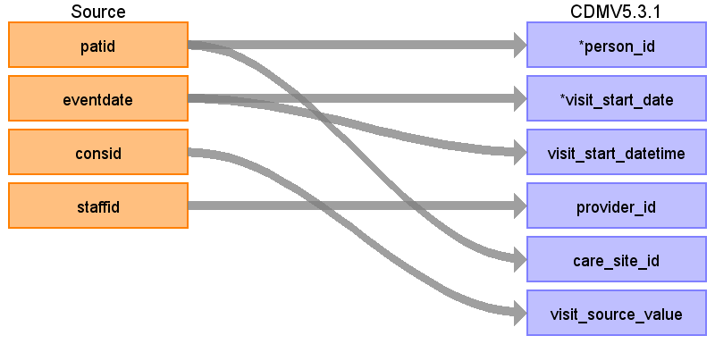

## Table of contents
{: .no_toc .text-delta }

1. TOC
{:toc}

---

# CDM Table name: VISIT_OCCURRENCE

## Reading from CPRD.Clinical

Take all records from CPRD tables Clinical, Immunisation, Referral, Test, and Therapy. Using only the fields patid, consid, and eventdate, stack records sequentially by patid and consid. Each unique combination of the three fields will create a visit. Set visit_start_date as eventdate. If eventdate is blank, remove record. 

The 'accept' flag in the patient table should remove records where eventdate < date of birth. In the case this was not universally applied at the source, if any eventdates are prior to patient date of birth, set eventdate to patient.frd. 

For datetime fields, set time to midnight 00:00:00.

| Destination Field | Source field | Logic | Comment field |
| --- | --- | --- | --- |
| visit_occurrence_id |  |  | Autogenerate |
| person_id | patid |  |  |
| visit_concept_id |  |  | 9202 - OP |
| visit_start_date | eventdate | If eventdate is blank, remove record. The 'accept' flag in the patient table should remove records where eventdate < date of birth. In the case this was not universally applied at the source, if any eventdates are prior to patient date of birth, set eventdate to patient.frd. |  |
| visit_start_datetime | eventdate | Use the same logic used to set visit_start_date. Set time to 00:00:00 |  |
| visit_end_date |  |  | Set as visit_start_date |
| visit_end_datetime |  |  | set visit_end_datetime to visit_start_datetime |
| visit_type_concept_id |  |  | 44818518-Visit derived from EHR record |
| provider_id | staffid |  |  |
| care_site_id | patid | Use the last three digits of the patid (removing leading zeros) to look up the care_site_id in the care_site table. |  |
| visit_source_value | constype | Use the consid to link back to the consultation table. Use the constype from the consultation table as the visit_source_value. If there are two based on how the visit was defined, choose one. |  |
| visit_source_concept_id |  |  | 0 |
| admitting_source_concept_id |  |  |  |
| admitting_source_value |  |  | NULL |
| discharge_to_concept_id |  |  |  |
| discharge_to_source_value |  |  | NULL |
| preceding_visit_occurrence_id |  |  | Put the visit_occurrence_id of the most recent prior visit here. |

## Reading from CPRD.Immunisation

| Destination Field | Source field | Logic | Comment field |
| --- | --- | --- | --- |
| visit_occurrence_id |  |  | Autogenerate |
| person_id | patid |  |  |
| visit_concept_id |  |  | 9202 - OP |
| visit_start_date | eventdate | If eventdate is blank, remove record. The 'accept' flag in the patient table should remove records where eventdate < date of birth. In the case this was not universally applied at the source, if any eventdates are prior to patient date of birth, set eventdate to patient.frd. |  |
| visit_start_datetime | eventdate | Use the same logic used to set visit_start_date. Set time to 00:00:00 |  |
| visit_end_date |  |  | Set as visit_start_date |
| visit_end_datetime |  |  | set visit_end_datetime to visit_start_datetime |
| visit_type_concept_id |  |  | 44818518-Visit derived from EHR record |
| provider_id | staffid |  |  |
| care_site_id | patid | Use the last three digits of the patid (removing leading zeros) to look up the care_site_id in the care_site table. |  |
| visit_source_value | constype | Use the consid to link back to the consultation table. Use the constype from the consultation table as the visit_source_value. If there are two based on how the visit was defined, choose one. |  |
| visit_source_concept_id |  |  | 0 |
| admitting_source_concept_id |  |  |  |
| admitting_source_value |  |  | NULL |
| discharge_to_concept_id |  |  |  |
| discharge_to_source_value |  |  | NULL |
| preceding_visit_occurrence_id |  |  | Put the visit_occurrence_id of the most recent prior visit here. |

## Reading from CPRD.Referral

| Destination Field | Source field | Logic | Comment field |
| --- | --- | --- | --- |
| visit_occurrence_id |  |  | Autogenerate |
| person_id | patid |  |  |
| visit_concept_id |  |  | 9202 - OP |
| visit_start_date | eventdate | The 'accept' flag in the patient table should remove records where eventdate < date of birth. In the case this was not universally applied at the source, if any eventdates are prior to patient date of birth, set eventdate to patient.frd. |  |
| visit_start_datetime | eventdate | Use the same logic used to set visit_start_date.  Set time to 00:00:00 |  |
| visit_end_date |  |  | Set as visit_start_date |
| visit_end_datetime |  |  | set visit_end_datetime to visit_start_datetime |
| visit_type_concept_id |  |  | 44818518-Visit derived from EHR record |
| provider_id | staffid |  |  |
| care_site_id | patid | Use the last three digits of patid to look up the care_site_id. |  |
| visit_source_value | constype | Use the consid to link back to the consultation table. Use the constype from the consultation table as the visit_source_value. If there are two based on how the visit was defined, choose one. |  |
| visit_source_concept_id |  |  | 0 |
| admitting_source_concept_id |  |  |  |
| admitting_source_value |  |  | NULL |
| discharge_to_concept_id |  |  |  |
| discharge_to_source_value |  |  | NULL |
| preceding_visit_occurrence_id |  |  | Put the visit_occurrence_id of the most recent prior visit here. |

## Reading from CPRD.Test

| Destination Field | Source field | Logic | Comment field |
| --- | --- | --- | --- |
| visit_occurrence_id |  |  | Autogenerate |
| person_id | patid |  |  |
| visit_concept_id |  |  | 9202 - OP |
| visit_start_date | eventdate | If eventdate is blank, remove record. The 'accept' flag in the patient table should remove records where eventdate < date of birth. In the case this was not universally applied at the source, if any eventdates are prior to patient date of birth, set eventdate to patient.frd. |  |
| visit_start_datetime | eventdate | Use the same logic used to set visit_start_date.  Set time as 00:00:00 |  |
| visit_end_date |  |  | Set as visit_start_date |
| visit_end_datetime |  |  | set visit_end_datetime to visit_start_datetime |
| visit_type_concept_id |  |  | 44818518-Visit derived from EHR record |
| provider_id | staffid |  |  |
| care_site_id | patid | Use the last three digits of the patid to find the care_site_id. |  |
| visit_source_value | constype | Use the consid to link back to the consultation table. Use the constype from the consultation table as the visit_source_value. If there are two based on how the visit was defined, choose one. |  |
| visit_source_concept_id |  |  | 0 |
| admitting_source_concept_id |  |  |  |
| admitting_source_value |  |  | NULL |
| discharge_to_concept_id |  |  |  |
| discharge_to_source_value |  |  | NULL |
| preceding_visit_occurrence_id |  |  | Put the visit_occurrence_id of the most recent prior visit here. |

## Reading from CPRD.Therapy

| Destination Field | Source field | Logic | Comment field |
| --- | --- | --- | --- |
| visit_occurrence_id |  |  | Autogenerate |
| person_id | patid |  |  |
| visit_concept_id |  |  | 9202 - OP |
| visit_start_date | eventdate | If eventdate is blank, remove record. The 'accept' flag in the patient table should remove records where eventdate < date of birth. In the case this was not universally applied at the source, if any eventdates are prior to patient date of birth, set eventdate to patient.frd. |  |
| visit_start_datetime | eventdate | Use the same logic used to set visit_start_date. Set time to 00:00:00 |  |
| visit_end_date |  |  | Set as visit_start_date |
| visit_end_datetime |  |  | set visit_end_datetime to visit_start_datetime |
| visit_type_concept_id |  |  | 44818518-Visit derived from EHR record |
| provider_id | staffid |  |  |
| care_site_id | patid | Use the last three digits of the patid to find the care_site_id. |  |
| visit_source_value | constype | Use the consid to link back to the consultation table. Use the constype from the consultation table as the visit_source_value. If there are two based on how the visit was defined, choose one. |  |
| visit_source_concept_id |  |  | 0 |
| admitting_source_concept_id |  |  |  |
| admitting_source_value |  |  | NULL |
| discharge_to_concept_id |  |  |  |
| discharge_to_source_value |  |  | NULL |
| preceding_visit_occurrence_id |  |  | Put the visit_occurrence_id of the most recent prior visit here. |
