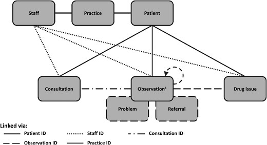
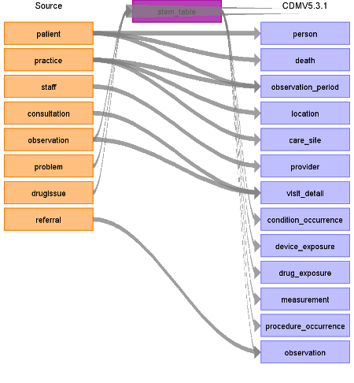

# Clinical Practice Research Datalink Aurum (CPRD) ETL Documentation

These materials are meant to serve as documentation and reference for how the [CPRD Aurum](https://www.cprd.com/primary-care) database was converted to the [OMOP Common Data Model (CDM)](https://ohdsi.github.io/CommonDataModel/). 

The Clinical Practice Research Datalink Aurum (CPRD Aurum) database contains routinely-collected data from practices using EMIS Web® electronic patient record system software.  In the UK, 98% of the population is registered with a GP who is the gatekeeper of care in the National Health Service (NHS). The GP is primarily responsible for non-emergency care and referral to secondary care as needed. Participating GPs provide their electronic health record data to CPRD on a monthly basis, which includes all patients registered with the practice unless the patient has specifically requested to opt out of data sharing[1](#f1).

**Specifically, CPRD Aurum includes GP data relating to:**

* Demographics
* Diagnoses
* Symptoms
* Signs
* Prescriptions
* Referrals
* Immunisations
* Behavioural factors
* Diagnostic Tests

Entries to a patient record are considered consultations, though not all involve a face-to-face encounter with a provider. For example, reminder phone calls will be recorded as a consultation in the Consultation table. Within a consultation multiple events can be recorded in the corresponding event tables (Figure 1).

**Figure 1**

The image below (Figure 2) show a high-level diagram of how the native tables in the Aurum database were mapped to the OMOP CDM. The main event tables (Observation, Problem, and DrugIssue) are mapped to what is known as the STEM table. The STEM table is a staging area where source codes like Read codes will first be mapped to concept_ids. After a record is mapped and staged, the domain of the concept_id dictates which OMOP table (Condition_occurrence, Drug_exposure, Procedure_occurrence, Measurement, Observation, Device_exposure) the record will move to.  

 
**Figure 2**

<b id="f1">1</b> Achim Wolf, Daniel Dedman, Jennifer Campbell, Helen Booth, Darren Lunn, Jennifer Chapman, Puja Myles, Data resource profile: Clinical Practice Research Datalink (CPRD) Aurum, International Journal of Epidemiology, Volume 48, Issue 6, December 2019, Pages 1740–1740g, https://doi.org/10.1093/ije/dyz034 [↩](#cprd1)

