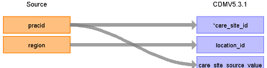

# CDM Table name: CARE_SITE

## Reading from CPRD_Aurum.Practice

| Destination Field | Source field | Logic | Comment field |
| --- | --- | --- | --- |
| care_site_id | pracid |  |  |
| care_site_name |  |  |  |
| place_of_service_concept_id |  | Use **8977** - Public Health Clinic |  |
| location_id | region |  |  |
| care_site_source_value | pracid |  |  |
| place_of_service_source_value |  |  | NULL |