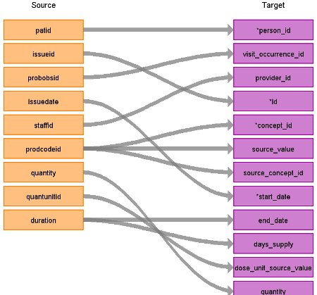

# CDM Table name: stem_table

The STEM table is a staging area where CPRD source codes like Read codes will first be mapped to concept_ids. The STEM table itself is an amalgamation of the OMOP event tables to facilitate record movement. This means that all fields present across the OMOP event tables are present in the STEM table. After a record is mapped and staged, the domain of the concept_id dictates which OMOP table (Condition_occurrence, Drug_exposure, Procedure_occurrence, Measurement, Observation, Device_exposure) the record will move to. Please see the STEM -> CDM mapping files for a description of which STEM fields move to which STEM tables. 

## Reading from CPRD.Drug_Issue

In the below table, only the relevant STEM fields are shown. 

| Destination Field | Source field | Logic | Comment field |
| --- | --- | :---: | --- |
| id |  |  | Autogenerate |
| domain_id |  | This should be the domain_id of the standard concept in the concept_id field. |  |
| person_id | patid | Use patid to lookup Person_id |  |
| visit_occurrence_id | probobsid | Lookup the visit_occurrence_id of the observation record in the visit_detail table, matching probobsid to visit_detail_id |  |
| start_date | issuedate |  |  |
| end_date | duration | Add start_date + duration - 1 to find end_date. If no duration then set end_date as start_date. | | 
| concept_id | prodcodeid | Lookup the prodcodeid in the productdictionary. Use the [SOURCE_TO_STANDARD](https://github.com/OHDSI/ETL-LambdaBuilder/blob/master/docs/Standard%20Queries/SOURCE_TO_STANDARD.sql) query to map the dm+d code to standard concept(s) with the following filters:      Where source_vocabulary_id = 'dm+d'  and target_standard_concept = 'S'  and target_invalid_reason is NULL   If there is no mapping available, set concept_id to zero.  |  |
| source_value | prodcodeid | Lookup prodcodeid and put the dm+d code here|  |
| source_concept_id | prodcodeid | Lookup the prodcodeid in the productdictionary.     Use the [SOURCE_TO_SOURCE](https://github.com/OHDSI/ETL-LambdaBuilder/blob/master/docs/Standard%20Queries/SOURCE_TO_SOURCE.sql) query to map the dm+d code to a source concept id with the following filters:   Where source_vocabulary_id = 'dm+d'    If there is no mapping available set source_concept_id to zero. | |
| type_concept_id |  | Set all from drug issue as **32838** - EHR prescription. |  |
| dose_unit_source_value | quantunitid | Lookup in quantunit and put english version of unit here.|
| quantity | quantity | |

