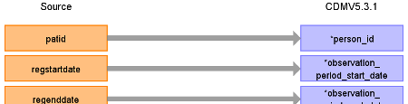
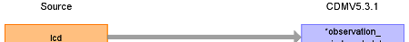

## Table of contents
{: .no_toc .text-delta }

1. TOC
{:toc}

---

# CDM Table name: OBSERVATION_PERIOD

Occasionally registration end date (regenddate) is NULL. In this case take the practice last collection date (lcd). Otherwise, take the earliest of last collection date and regenddate for the OBSERVATION_PERIOD_END_DATE.

## Reading from CPRD_Aurum.Patient

| Destination Field | Source field | Logic | Comment field |
| --- | --- | --- | --- |
| observation_period_id |  |  | Autogenerate |
| person_id | patid |  |  |
| observation_period_start_date | regstartdate |  |  |
| observation_period_end_date | regenddate, lcd | Take the earliest between patient.regenddate and practice.lcd. If regenddate is NULL take lcd and if lcd is NULL take regenddate. |  |
| period_type_concept_id |  | Use **32882** - Period inferred by algorithm |  |

## Reading from CPRD_Aurum.Practice

| Destination Field | Source field | Logic | Comment field |
| --- | --- | --- | --- |
| observation_period_id |  |  | Autogenerate |
| person_id |  |  |  |
| observation_period_start_date |  |  |  |
| observation_period_end_date | lcd | Take the earliest between patient.regenddate and practice.lcd. If regenddate is null take lcd |  |
| period_type_concept_id |  |Use **32882** - Period inferred by algorithm|  |

