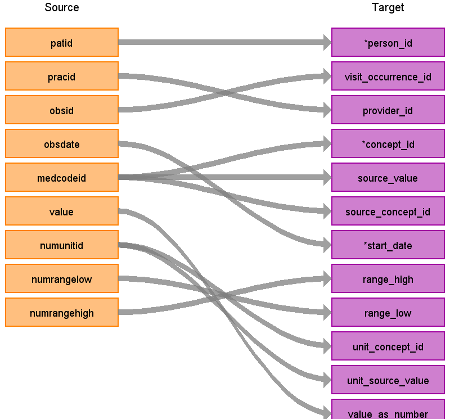

# CDM Table name: stem_table

The STEM table is a staging area where CPRD source codes like Read codes will first be mapped to concept_ids. The STEM table itself is an amalgamation of the OMOP event tables to facilitate record movement. This means that all fields present across the OMOP event tables are present in the STEM table. After a record is mapped and staged, the domain of the concept_id dictates which OMOP table (Condition_occurrence, Drug_exposure, Procedure_occurrence, Measurement, Observation, Device_exposure) the record will move to. Please see the STEM -> CDM mapping files for a description of which STEM fields move to which STEM tables. 

## Reading from CPRD.Observation

In the below table, only the relevant STEM fields are shown. 

| Destination Field | Source field | Logic | Comment field |
| --- | --- | :---: | --- |
| id |  |  | Autogenerate |
| domain_id |  | This should be the domain_id of the standard concept in the concept_id field. |  |
| person_id | patid | Use patid to lookup Person_id |  |
| visit_occurrence_id | obsid | Lookup the visit_occurrence_id of the observation record in the visit_detail table |  |
| provider_id | consultation.staffid | Lookup the staffid in the consultation table using the consid.| |
| start_date | obsdate | If obsdate is 12-31-9999 then set to obs_period_start_date –1 day |  |
| end_date |  |  | | 
| concept_id | medcodeid | Lookup the medcodeid in the medicaldictionary, if there is a read code map the read. If not, map the snomed. Use the [SOURCE_TO_STANDARD](https://github.com/OHDSI/ETL-LambdaBuilder/blob/master/docs/Standard%20Queries/SOURCE_TO_STANDARD.sql) query to map either the read or snomed code to standard concept(s) with the following filters:      Where source_vocabulary_id = 'Read' *or 'SNOMED'*  and Target_standard_concept = 'S'  and target_invalid_reason is NULL  *BE CAREFUL - READ CODES ARE CASE SENSITIVE*. If there is no mapping available, set concept_id to zero.  |  |
| source_value |  | Concatenate read code and term or snomed and term from the lookup table, depending on which code is mapped to a standard concept id |  |
| source_concept_id | Either the Read or SNOMED code found from looking up the medcodeid | Use the medcodeid to link to the medicaldictionary table to find the read code.     Use the [SOURCE_TO_SOURCE](https://github.com/OHDSI/ETL-LambdaBuilder/blob/master/docs/Standard%20Queries/SOURCE_TO_SOURCE.sql) query to map the read or snomed code to a source concept id with the following filters:   Where source_vocabulary_id = 'Read' *or 'SNOMED'*   *BE CAREFUL - READ CODES ARE CASE SENSITIVE*. If there is no mapping available set source_concept_id to zero. | |
| type_concept_id |  | Set all from observation as **32840** - observation recorded from EHR |  |
| range_high | numrangehigh | |
| range_low | numrangelow | |
| unit_concept_id | numunitid | Lookup up the unitid in the lookup tables and use the [SOURCE_TO_STANDARD](https://github.com/OHDSI/ETL-LambdaBuilder/blob/master/docs/Standard%20Queries/SOURCE_TO_STANDARD.sql) query to map either the numunitid to standard concept(s) with the following filters:      Where source_vocabulary_id in ('UCUM', 'CPRD_Units')  and target_standard_concept = 'S'  and target_invalid_reason is NULL When numinitid is NULL, set unit_concept_id = NULL |
| unit_source_value | numunitid | Lookup the unitid in the lookup tables and put the english version of the unit here |
| value_as_number | value | |
| value_source_value | value | |
