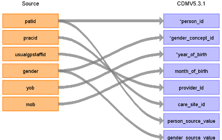

# CDM Table name: PERSON

## Reading from CPRD_Aurum.Patient

The patients in the CDM are restricted to the subset of all CPRD Aurum patients deemed to have reached certain quality standards as defined by the data providers. **Patients whose acceptable patient flag (patient.accept) is not equal to 1 will be removed (1=acceptable, 0=unacceptable)**. Also patients whose year of birth is prior to 1875, or who have an unknown gender will be removed.

| Destination Field | Source field | Logic | Comment field |
| --- | --- | :---: | --- |
| person_id | patid |  |  |
| gender_concept_id | gender | Map:  1 = 8507 2 = 8532  | Remove anyone with an unknown gender, meaning anyone with a CPRD gender code in (0,3,4) |
| year_of_birth | yob | | Remove any patients that are born before 1875 |
| month_of_birth | mob |  | If 0 set as NULL |
| day_of_birth |  |  |  |
| birth_datetime |  |  |  |
| race_concept_id |  | 0 |  |
| ethnicity_concept_id |  | 0 |  |
| location_id |  |  |  |
| provider_id | usualgpstaffid |  |  |
| care_site_id | pracid |  |  |
| person_source_value | patid |  |  |
| gender_source_value | gender | If 1 then 'M', if 2 then 'F' |  |
| gender_source_concept_id |  | 0 |  |
| race_source_value |  |  |  |
| race_source_concept_id |  | 0 |  |
| ethnicity_source_value |  |  |  |
| ethnicity_source_concept_id |  | 0 |  |
