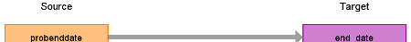

# CDM Table name: stem_table

The STEM table is a staging area where CPRD source codes like Read codes will first be mapped to concept_ids. The STEM table itself is an amalgamation of the OMOP event tables to facilitate record movement. This means that all fields present across the OMOP event tables are present in the STEM table. After a record is mapped and staged, the domain of the concept_id dictates which OMOP table (Condition_occurrence, Drug_exposure, Procedure_occurrence, Measurement, Observation, Device_exposure) the record will move to. Please see the STEM -> CDM mapping files for a description of which STEM fields move to which STEM tables. 

## Reading from CPRD.Problem

This table is used to give the enddate of a condition observed in the problem table. Join on obsid to find the probenddate, if there is one. In the below table, only the relevant STEM fields are shown. 

| Destination Field | Source field | Logic | Comment field |
| --- | --- | :---: | --- |
| id |  |  | Autogenerate |
| domain_id |  | This should be the domain_id of the standard concept in the concept_id field. |  |
| person_id | patid | Use patid to lookup Person_id |  |
| visit_occurrence_id | obsid | Lookup the visit_occurrence_id of the observation record in the visit_detail table |  |
| provider_id | consultation.staffid | Lookup the staffid in the consultation table using the consid.| |
| start_date | obsdate | If obsdate is 12-31-9999 then set to obs_period_start_date –1 day |  |
| end_date | probenddate | | | 

