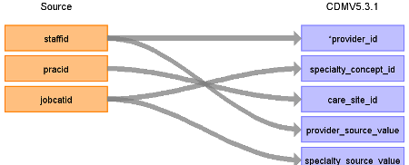

# CDM Table name: PROVIDER

## Reading from CPRD.Staff

Use the staff table to populate the provider table. In CPRD Aurum, the staffid field represents the unique identifier given to the practice staff member entering the data, it does not necessarily represent the provider.  

| Destination Field | Source field | Logic | Comment field |
| --- | --- | :---: | --- |
| provider_id | staffid |  |  |
| provider_name |  |  |  |
| npi |  |  |  |
| dea |  |  |  |
| specialty_concept_id | jobcatid | Join onto SOURCE_TO_CONCEPT_MAP, lookup the role in the source_code field using the [SOURCE_TO_STANDARD](https://github.com/OHDSI/ETL-LambdaBuilder/blob/master/docs/Standard%20Queries/SOURCE_TO_STANDARD.sql) query with the following filter:    WHERE SOURCE_VOCABULARY_ID = 'CPRD_JobCat'| Vocabulary located in docs folder at path docs/CPRD_Aurum/vocab updates |
| care_site_id | pracid |  |  |
| year_of_birth |  |  |  |
| gender_concept_id |  |  |  |
| provider_source_value | staffid |  |  |
| specialty_source_value | jobcatid | Left Join to lkpJobCategory on `staff.jobcatid = lkpJobCategory.jobcatid` and set specialty_source_value as lkpJobCategory.description. | If a staffed has a jobcatid without a description in the lkpJobCategory table, keep them and set specialty_source_value to NULL|
| specialty_source_concept_id |  |  | 0 |
| gender_source_value | gender |  |  |
| gender_source_concept_id |  |  | 0 |
