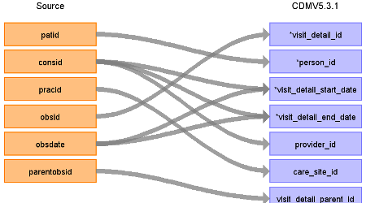
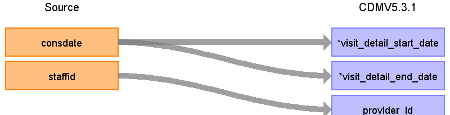

## Table of contents
{: .no_toc .text-delta }

1. TOC
{:toc}

---

# CDM Table name: VISIT_DETAIL

## Reading from CPRD_Aurum.Observation

| Destination Field | Source field | Logic | Comment field |
| --- | --- | --- | --- |
| visit_detail_id | obsid |  |  |
| person_id | patid |  |  |
| visit_detail_concept_id |  |  | 581477 – Office Visit |
| visit_detail_start_date | consid  obsdate| If an observation record has a consid, join to the consultation table and take the consdate as the visit_detail_start_date. If no consid, take the obsdate as the visit_detail_start_date.
If consdate is null take the obsdate instead.|  |
| visit_detail_start_datetime |  |  |  |
| visit_detail_end_date |  | Set as visit_detail_start_date  | |
| visit_detail_end_datetime |  |  |  |
| visit_detail_type_concept_id |  | Use **32827** - EHR encounter record |  |
| provider_id | staffid | If an observation record has a consid, lookup the staffid from the consultation record and then assign the associated provider_id |  |
| care_site_id | pracid |  |  |
| visit_detail_source_value |  |  |  |
| visit_detail_source_concept_id |  |  | 0 |
| admitting_source_concept_id |  |  |  |
| admitting_source_value |  |  | NULL |
| discharge_to_concept_id |  |  |  |
| discharge_to_source_value |  |  | NULL |
| preceding_visit_detail_id |  |  |  |
| visit_detail_parent_id | parentobsid |  |  |
| visit_occurrence_id |  | |  |

## Reading from CPRD_Aurum.Consultation

| Destination Field | Source field | Logic | Comment field |
| --- | --- | --- | --- |
| visit_detail_id | consid |  |  |
| person_id | patid |  |  |
| visit_detail_concept_id |  |  | 581477 – Office Visit |
| visit_detail_start_date | consdate | |  |
| visit_detail_start_datetime |  |  |  |
| visit_detail_end_date |  | Set as visit_detail_start_date  | |
| visit_detail_end_datetime |  |  |  |
| visit_detail_type_concept_id |  | Use **32827** - EHR encounter record |  |
| provider_id | staffid | |  |
| care_site_id | pracid |  |  |
| visit_detail_source_value |  |  |  |
| visit_detail_source_concept_id |  |  | 0 |
| admitting_source_concept_id |  |  |  |
| admitting_source_value |  |  | NULL |
| discharge_to_concept_id |  |  |  |
| discharge_to_source_value |  |  | NULL |
| preceding_visit_detail_id |  |  |  |
| visit_detail_parent_id |  |  |  |
| visit_occurrence_id |  | |  |