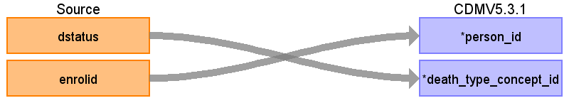

## Table name: **DEATH**

### Key conventions

* The Death table is designed to capture the time when a Person is deceased and cause of death. Death in IBM can be captured by discharge status in (20,40,41,42) (DSTATUS in **FACILITY_HEADER**, **INPATIENT_SERVICES**, and **INPATIENT_ADMISSIONS**).  IBM does not contain the cause of death.
*  Only one record will be kept for each patient.  If multiple lines of death records are captured, records with the latest date of death will be kept and the death captured by discharge status has higher priority than those captured by diagnosis codes.  If there is a discharge status selected over a diagnosis code, take that date. 
*  If there are health care visits after one month (32 days) of death date, delete this record.  Records written to the OBSERVATION table to capture health insurance coverage types should not eliminate death records (i.e. ENROLLMENT_DETAIL.MHSACOVG)

### Reading from **FACILITY_HEADER**

| Destination Field | Source field | Logic | Comment field |
| --- | --- | --- | --- |
| PERSON_ID | ENROLID | - | - |
| DEATH_DATE | VISIT_END_DATE | - | - |
| DEATH_DATETIME | - | - | - |
| DEATH_TYPE_CONCEPT_ID | DSTATUS | When dstatus is in (20,40,41,42) then death_type_concept_id = `38003566` for death captured by discharge status | - |
| CAUSE_CONCEPT_ID | - | 0 | - |
| CAUSE_SOURCE_VALUE | - | NULL | - |
| CAUSE_SOURCE_CONCEPT_ID | - | 0 | - |

  

### Reading from **INPATIENT_SERVICES**

| Destination Field | Source field | Logic | Comment field |
| --- | --- | --- | --- |
| PERSON_ID | ENROLID | - | - |
| DEATH_DATE | VISIT_END_DATE | - | - |
| DEATH_DATETIME | - | - | - |
| DEATH_TYPE_CONCEPT_ID | DSTATUS | When dstatus is in (20,40,41,42) then death_type_concept_id = `38003566` for death captured by discharge status | - |
| CAUSE_CONCEPT_ID | - | 0 | - |
| CAUSE_SOURCE_VALUE | - | NULL | - |
| CAUSE_SOURCE_CONCEPT_ID | - | 0 | - |

  

### Reading from **INPATIENT_ADMISSIONS**

| Destination Field | Source field | Logic | Comment field |
| --- | --- | --- | --- |
| PERSON_ID | ENROLID | - | - |
| DEATH_DATE | VISIT_END_DATE | - | - |
| DEATH_DATETIME | - | - | - |
| DEATH_TYPE_CONCEPT_ID | DSTATUS | When dstatus is in (20,40,41,42) then death_type_concept_id = `38003566` for death captured by discharge status | - |
| CAUSE_CONCEPT_ID | - | 0 | - |
| CAUSE_SOURCE_VALUE | - | NULL | - |
| CAUSE_SOURCE_CONCEPT_ID | - | 0 | - |

