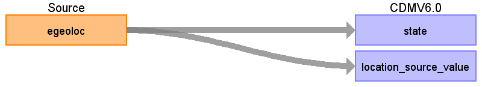

## Table name: **LOCATION**

### Key conventions
* MarketScan provides a lookup for GEOLOC that defines EGEOLOC (Geographic Location of Employee) that is used to map state.
* Remove duplicate records before assigning LOCATION_ID.     

### Reading from **ENROLLMENT_DETAIL**

| Destination Field | Source field | Logic | Comment field |
| --- | --- | --- | --- |
| LOCATION_ID | - | System generated | - |
| ADDRESS_1 | - | NULL | - |
| ADDRESS_2 | - | NULL | - |
| CITY | - | NULL | - |
| STATE | EGEOLOC | **LOCATION**.LOCATION_SOURCE_VALUE recode source values of EGEOLOC using **GEOLOC** lookup provided by vendor.  In **LOCATION**.STATE use **GEOLOC**.STATE. |  |
| ZIP | - | NULL | - |
| COUNTY | - | NULL | - |
| COUNTRY | - | NULL | - |
| LOCATION_SOURCE_VALUE | EGEOLOC | - | - |
| LATITUDE | - | NULL | - |
| LONGITUDE | - | - | - |
