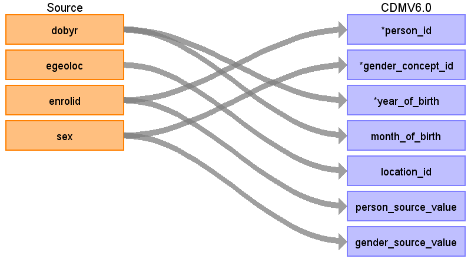

## Table name: **PERSON**

### Key conventions
* The **ENROLLMENT_DETAIL** table stores multiple records for each person, one for each month they are enrolled in a health plan.  However, the CDM will only store one record per person in the **PERSON** table.  
  * Only records where the person has prescription benefits (RX=1) are used.
* Start by evaluating all **ENROLLMENT_DETAIL** records and **remove** the following persons:
  * Individuals with two different, valid sex values (1 or 2) over different ENROLLMENT_DETAIL records
  * Individuals with max(DOBYR) &gt; min(DOBYR) +2 
* After defining persons to remove, then use the most recent record in **ENROLLMENT_DETAIL** to define demographic information in the CDM for the remaining persons
* After finding the latest record per person, delete the following:
  * Individuals whose DOBYR &lt; 1900 or &gt; the current year.
  * Individuals born &gt; 1 year after their first enrollment period.

* MONTH_OF_BIRTH and DAY_OF_BIRTH is assigned as follows:

Start with the person’s enrollment records
│
├─ Birth year
│  └─ Set YEAR_OF_BIRTH from DOBYR.
│     If multiple DOBYR values exist, validation and limited reconciliation
│     rules determine whether the person is retained.
│
└─ Birth month and day
   │
   ├─ Find the earliest retained date across:
   │  observation periods, claims, visits, procedures, conditions,
   │  drugs, measurements, observations, and devices.
   │
   ├─ Does that earliest date fall in YEAR_OF_BIRTH?
   │  │
   │  ├─ Yes → Set MONTH_OF_BIRTH and DAY_OF_BIRTH from that date.
   │  │         Birth date = earliest retained date.
   │  │
   │  └─ No  → Set MONTH_OF_BIRTH = 6 and DAY_OF_BIRTH = 1.
   │            Birth date = June 1 of YEAR_OF_BIRTH.
   │
   └─ Store BIRTH_DATETIME using the resulting year, month, and day.

### Reading from **ENROLLMENT_DETAIL**

| Destination Field | Source field | Logic | Comment field |
| --- | --- | --- | --- |
| PERSON_ID | ENROLID | - | - |
| GENDER_CONCEPT_ID | SEX | Map source values to  their associated CONCEPT_IDs:    1 	- 8507   2 	- 8532     If SEX is not 1 or 2 exclude that person. | The exclusion of a person by gender should happen on last enrollment record not just if they had one bad SEX record.   CONCEPT_IDs:  8507 = 'Male'  8532 = 'Female'|
| YEAR_OF_BIRTH | DOBYR | DOBYR needs to be > 1900 and <= current year.  If the DOBYR does not meet this criteria, drop the person. | - |
| MONTH_OF_BIRTH | DOBYR | If **PERSON**.YEAR_OF_BIRTH = MIN(YEAR(OBSERVATION_PERIOD_START_DATE)), then **PERSON**.MONTH_OF_BIRTH = MONTH(OBSERVATION_PERIOD_START_DATE) ) | Make sure to have Observation Periods generated before coming to this.  |
| DAY_OF_BIRTH | - | NULL | - |
| BIRTH_DATETIME | - | NULL | - |
| RACE_CONCEPT_ID | - | 0 | - |
| ETHNICITY_CONCEPT_ID | - | 0 | - |
| LOCATION_ID | EGEOLOC | Map EGEOLOC to LOCATION_SOURCE_VALUE in **LOCATION** table, then extract its associated LOCATION_ID |  |
| PROVIDER_ID | - | NULL | - |
| CARE_SITE_ID | - | NULL | - |
| PERSON_SOURCE_VALUE | ENROLID | - | - |
| GENDER_SOURCE_VALUE | SEX | - | - |
| GENDER_SOURCE_CONCEPT_ID | - | 0 | - |
| RACE_SOURCE_VALUE | - | NULL | - |
| RACE_SOURCE_CONCEPT_ID | - | 0 | - |
| ETHNICITY_SOURCE_VALUE | - | NULL | - |
| ETHNICITY_SOURCE_CONCEPT_ID | - | 0 | - |

