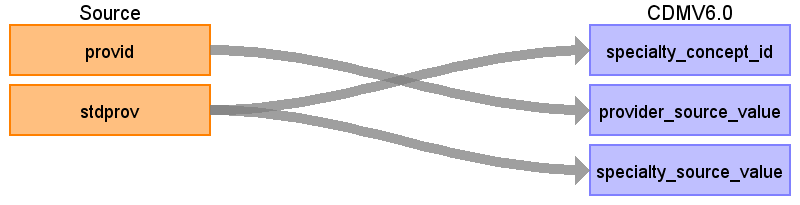

## Table name: **PROVIDER**

The PROVIDER table contains a list of uniquely identified health care providers (physicians).  IBM does have some provider information; however some of the providers listed by IBM may also be considered care sites or organizations.  Since there is no clear way to decipher between all items identified as providers by IBM, regardless of whether they are truly organizations or care sites, they will be added to this table.

### Key conventions
* To build this table it is essentially a distinct listing of the entire provider IDs with all their associated specialties. 

```sql
SELECT DISTINCT PROVID, STDPROV
FROM FACILITY_HEADER
UNION
SELECT DISTINCT PROVID, STDPROV
FROM OUTPATIENT_SERVICES
UNION
SELECT DISTINCT PROVID, STDPROV
FROM INPATIENT_SERVICES
UNION
SELECT DISTINCT PROVID, STDPROV
FROM LAB
```

* Provider Specialty (STDPROV) is available in MarketScan. We add mapping of MarketScan provider specialty to OMOP concept - VOCABULARY_ID = JNJ_TRU_P_SPCLTY. Since STDPROV is a 1-3 digit number it must be decoded before it can be mapped to Standard Concepts. Values for STDPROV can be found in the Marketscan data dictionary.
* Set SPECIALTY_CONCEPT_ID as 38004514 (Unknown Physician Specialty) if STDPROV is missing or can't be mapped.

### Reading from **FACILITY_HEADER**, **OUTPATIENT_SERVICES**, **INPATIENT_SERVICES**, & **LAB**



| Destination Field | Source field | Logic | Comment field |
| --- | --- | --- | --- |
| PROVIDER_ID |  | System generated. |  |
| PROVIDER_NAME |  | NULL |  |
| NPI |  | NULL |  |
| DEA |  | NULL |  |
| SPECIALTY_CONCEPT_ID | STDPROV | Use the code in [SOURCE_TO_STANDARD.sql](https://github.com/OHDSI/ETL-LambdaBuilder/blob/master/docs/Standard%20Queries/SOURCE_TO_STANDARD.sql). <br><br>Filters: ```WHERE SOURCE_VOCABULARY_ID IN ('JNJ_TRU_P_SPCLTY') AND TARGET_STANDARD_CONCEPT IS NOT NULL AND TARGET_INVALID_REASON IS NULL``` | Set SPECIALTY_CONCEPT_ID as 38004514 (Unknown Physician Specialty) if STDPROV is missing or cannot be mapped.<br> |
| CARE_SITE_ID | - | 0 | - |
| YEAR_OF_BIRTH | - | NULL | - |
| GENDER_CONCEPT_ID | - | 0 | - |
| PROVIDER_SOURCE_VALUE | PROVID | - | - |
| SPECIALTY_SOURCE_VALUE | STDPROV | - | - |
| SPECIALTY_SOURCE_CONCEPT_ID | - | 0 | - |
| GENDER_SOURCE_VALUE | - | NULL | - |
| GENDER_SOURCE_CONCEPT_ID | - | 0 | - |