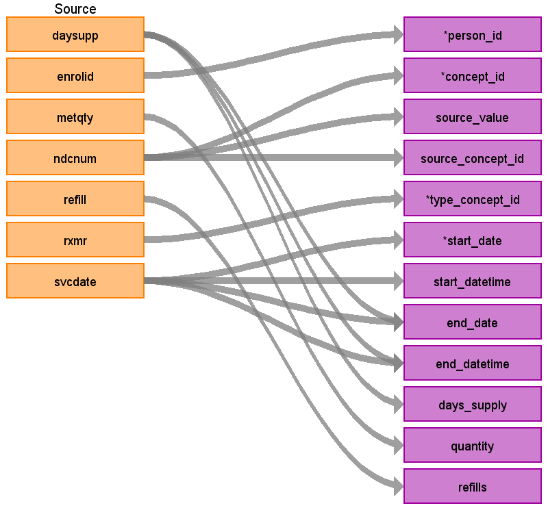

## Table name: **STEM_TABLE**

### Key conventions

* VISIT_DETAIL must be built before STEM (refer to [VISIT_DETAIL file](https://ohdsi.github.io/ETL-LambdaBuilder/IBM_CCAE_MDCR/CCAE_MDCR_visit_detail.html))

* For every record in STEM there should be 1 row record in VISIT_DETAIL (n:1 join).
  
* For every record in VISIT_DETAIL there may be 0 to n rows in STEM.

* Take the records from DRUG_CLAIMS and join them to VISIT_DETAIL based on the VISIT_DETAIL_ID that was assigned.

* NDC codes are date specific so there is an extra filter for the concept id mapping to make sure it falls during the time an NDC is valid.

* Some 11 digit NDC codes are invalid and instead need to mapped to the 9-digit version. To account for this map the 11-digit NDC code to SOURCE_CODE in OMOP vocab first. If no mapping is found, map the first 9 digits of NDC code to SOURCE_CODE.

* In the DRUG_CLAIMS table some values in DAYSUPP are invalid. Any value < 0 or > 365 should be updated using this logic:

```sql
    CASE
    WHEN DAYSUPP < 0 THEN 0
    WHEN DAYSUPP > 365 THEN 365
    WHEN DAYSUPP IS NULL THEN 0
    ELSE DAYSUPP
    END
```

### Reading from **DRUG_CLAIMS**



| Destination Field | Source field | Logic | Comment field |
| --- | --- | --- | --- |
| DOMAIN_ID | - | This should be the domain_id of the standard concept in the CONCEPT_ID field. If a code is mapped to CONCEPT_ID 0, put the domain_id as Observation | - |
| PERSON_ID | ENROLID | - | - |
| VISIT_OCCURRENCE_ID | **VISIT_DETAIL**<br>VISIT_OCCURRENCE_ID | NULL | - |
| VISIT_DETAIL_ID | **VISIT_DETAIL**<br>VISIT_DETAIL_ID | NULL | - |
| PROVIDER_ID | **VISIT_DETAIL**<br>PROVIDER_ID | NULL | - |
| ID | - | System generated. | - |
| CONCEPT_ID | NDCNUM | Use the <a href="https://ohdsi.github.io/CommonDataModel/sqlScripts.html">Source-to-Standard Query</a><BR />Use the filter:<BR />`WHERE SOURCE_VOCABULARY_ID IN ('NDC')`<br />`AND TARGET_STANDARD_CONCEPT = 'S'`<br />`AND TARGET_INVALID_REASON IS NULL`<br />`AND SVCDATE BETWEEN SOURCE_VALID_START_DATE AND SOURCE_VALID_END_DATE`<BR /><BR />NDCs are a date centric vocabulary, so we need to check that we are using the NDC from the right time. | - |
| SOURCE_VALUE | NDCNUM | - | - |
| SOURCE_CONCEPT_ID | NDCNUM | Use the <a href="https://ohdsi.github.io/CommonDataModel/sqlScripts.html">Source-to-Source Query</a><BR />Use the filter:<BR />`WHERE SOURCE_VOCABULARY_ID IN ('NDC')`<br />`AND TARGET_VOCABULARY_ID IN ('NDC')`<br />`AND SVCDATE BETWEEN SOURCE_VALID_START_DATE AND SOURCE_VALID_END_DATE` | - |
| TYPE_CONCEPT_ID | **VISIT_DETAIL**<br>VISIT_DETAIL_TYPE_CONCEPT_ID | - | - |
| START_DATE | SVCDATE | - | - |
| START_DATETIME | SVCDATE | SVCDATE + Midnight  | - |
| END_DATE | SVCDATE<br>DAYSUPP | DRUG_EXPOSURE_END_DATE = SVCDATE + SUM(DAYSUPP) - 1 <br><br> If DAYSUPP is NULL set to DRUG_EXPOSURE_START_DATE | - |
| END_DATETIME | DAYSUPP<br>SVCDATE | Date calculated for END_DATE + Midnight | - |
| VERBATIM_END_DATE | - | NULL | - |
| DAYS_SUPPLY | DAYSUPP | DAYSUPP | - |
| DOSE_UNIT_SOURCE_VALUE | - | NULL | - |
| LOT_NUMBER | - | NULL | - |
| MODIFIER_CONCEPT_ID | - | 0 | - |
| MODIFIER_SOURCE_VALUE | - | NULL | - |
| OPERATOR_CONCEPT_ID | - | 0 | - |
| QUANTITY | METQTY | METQTY | - |
| RANGE_HIGH | - | NULL | - |
| RANGE_LOW | - | NULL | - |
| REFILLS | REFILL | - | OMOP defines this column as the number of refills after the initial prescription.<BR>The initial prescription is not counted, values start with 0.<BR><BR>REFILL from **DRUG_CLAIM** is defined as a number indicating whether this is the original prescription (0) or the refill number (e.g. 1, 2, etc.). |
| ROUTE_CONCEPT_ID | 0 | - | -|
| ROUTE_SOURCE_VALUE | - | NULL | - |
| SIG | NULL | - | "Sig" is short for the Latin, signetur, or "let it be labeled." |
| STOP_REASON | - | NULL | - |
| UNIQUE_DEVICE_ID | - | NULL | - |
| UNIT_CONCEPT_ID | - | 0 | - |
| UNIT_SOURCE_VALUE | - | NULL | - |
| VALUE_AS_CONCEPT_ID | - | 0 | - |
| VALUE_AS_NUMBER | - | NULL | - |
| VALUE_AS_STRING | - | NULL | - |
| VALUE_SOURCE_VALUE | - | NULL | - |
| ANATOMIC_SITE_CONCEPT_ID | - | 0 | - |
| DISEASE_STATUS_CONCEPT_ID | - | 0 | - |
| SPECIMEN_SOURCE_ID | - | NULL | - |
| ANATOMIC_SITE_SOURCE_VALUE | - | NULL | - |
| DISEASE_STATUS_SOURCE_VALUE | - | NULL | - |
| CONDITION_STATUS_CONCEPT_ID | - | 0 | - |
| CONDITION_STATUS_SOURCE_VALUE | - | NULL | - |
| EVENT_ID | - | NULL | - |
| EVENT_FIELD_CONCEPT_ID | - | 0 | - |
| VALUE_AS_DATETIME | - | NULL | - |
| QUALIFIER_CONCEPT_ID | - | 0 | - |
| QUALIFIER_SOURCE_VALUE | - | NULL | - |

## Change Log

### June 8, 2021
* Removed aggregates from the mapping. Prior logic attempted to remove duplicates by finding distinct values and then adding quantities by NDC and date. This logic was removed to preserve record-level referential integrity with the source and to aid in cost analyses later.
* Added references to VISIT_DETAIL and VISIT_OCCURRENCE_ID 