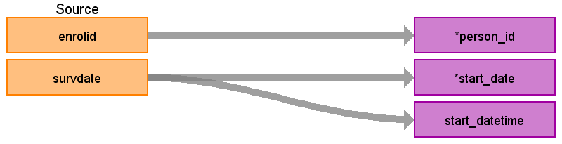

## Table name: **STEM_TABLE**

#### Key conventions
 * Medicare does not have HEALTH_RISK_ASSESSMENT (HRA) data
  
 * This data is in a wide format, meaning for a given patient and given date there are multiple column that represent conditions and obervations.  We pivot that data so that one row of HRA data can become many rows within the appropriate CDM tables.  The poster <a href='https://www.ohdsi.org/web/wiki/lib/exe/fetch.php?media=resources:using_the_omop_cdm_with_survey_and_registry_data_v6.0.pdf'>"Applying the OMOP Common Data Model to Survey Data"</a> provides an illustration of how we pivot and work with the data.
  
 * Keep all records with valid values no matter whether SURVDATE is within observation period or not.  
  
 * Keep all records even if some data moves to other domains, the OBSERVATION_CONCEPT_ID will be 0 for the records that moved elsewhere.

 * The following are list of HRA data variables, with character or numeric value.  However, the data for all surveys can be converted into numeric value. 

**Test\_Name**|**Missing\_Value**|**Value\_Type**
:-----:|:-----:|:-----:
ALCDYAMT|'-','9'|String
ALCWEEK|'-','9'|String
ALC\_AMT|'-','9'|String
CC\_ALLERGY|'-','9'|String
CC\_ARTHRITIS|'-','9'|String
CC\_ASTHMA|'-','9'|String
CC\_BACKPAIN|'-','9'|String
CC\_CHF|'-','9'|String
CC\_DEPRESS|'-','9'|String
CC\_DIAB|'-','9'|String
CC\_HEARTDIS|'-','9'|String
CC\_HIGHBP|'-','9'|String
CC\_HIGHCOL|'-','9'|String
CC\_HRTBURN|'-','9'|String
CC\_LUNGDIS|'-','9'|String
CC\_MIGRAINE|'-','9'|String
CC\_NONSKINCAN|'-','9'|String
CC\_OSTEOPO|'-','9'|String
CC\_SKINCAN|'-','9'|String
CGRAMT|'-','9'|String
CGRCURR|'-','9'|String
CGRDUR|'-','9'|String
CGRPREV|'-','9'|String
CGRQUIT|'-','9'|String
CGTAMT|'-','9'|String
CGTCURR|'-','9'|String
CGTDUR|'-','9'|String
CGTPKAMT|'-','9'|String
CGTPREV|'-','9'|String
CGTQTCAT|'-','9'|String
CGTQUIT|'-','9'|String
CHEWAMT|'-','9'|String
CHEWCURR|'-','9'|String
CHEWDUR|'-','9'|String
CHEWPREV|'-','9'|String
CHEWQUIT|'-','9'|String
COPESTRS|'-','9'|String
DIETFRT|'-','9'|String
DIETFRVG|'-','9'|String
DIETVEG|'-','9'|String
DRNKDRV|'-','9'|String
EDUC\_LVL|'-','9'|String
EXERMO|'-','9'|String
FAMABSCAT12|'-','9'|String
FIREEXT|'-','9'|String
FLU\_SHOT|'-','9'|String
HLTIMPCT|'-','9'|String
JOB\_SAT|'-','9'|String
LIFE\_SAT|'-','9'|String
LIFTWGT|'-','9'|String
MH\_FREQ|'-','9'|String
MH\_PROB|'-','9'|String
PIPEAMT|'-','9'|String
PIPECURR|'-','9'|String
PIPEDUR|'-','9'|String
PIPEPREV|'-','9'|String
PIPEQUIT|'-','9'|String
PLANALC|'-','9'|String
PLANDIET|'-','9'|String
PLANDRAD|'-','9'|String
PLANEXER|'-','9'|String
PLANSLP|'-','9'|String
PLANSTRS|'-','9'|String
PLANTOB|'-','9'|String
PLANWGT|'-','9'|String
PREV\_MAMMO|'-','9'|String
PREV\_PAPTEST|'-','9'|String
PREV\_PROSTEX|'-','9'|String
PREV\_SIGMOID|'-','9'|String
PRODABSCAT|'-','9'|String
RISK\_ALC|'-','9'|String
RISK\_BP|'-','9'|String
RISK\_CHOL|'-','9'|String
RISK\_EXER|'-','9'|String
RISK\_GLUC|'-','9'|String
RISK\_MH|'-','9'|String
RISK\_NUTR|'-','9'|String
RISK\_SAFE|'-','9'|String
RISK\_SLEEP|'-','9'|String
RISK\_SMOK|'-','9'|String
RISK\_WGT|'-','9'|String
SEATBELT|'-','9'|String
SELFHLTH|'-','9'|String
SLPAPNEA|'-','9'|String
SLPPROB|'-','9'|String
SMKDETECT|'-','9'|String
STRETCH|'-','9'|String
TOBCURR|'-','9'|String
TOBPREV|'-','9'|String
WRKABSCAT|'-','9'|String
WRKABSCAT12|'-','9'|String
BMI|NULL|Numeric
CGRQTYR|NULL|Numeric
CGTQTYR|NULL|Numeric
CHEWQTYR|NULL|Numeric
CHOLESTR|NULL|Numeric
DIAST\_BP|NULL|Numeric
EXERWEEK|NULL|Numeric
GLUCOSE|NULL|Numeric
HDL|NULL|Numeric
HEIGHT|NULL|Numeric
LDL|NULL|Numeric
PIPEQTYR|NULL|Numeric
SYSTO\_BP|NULL|Numeric
TRIGLYCD|NULL|Numeric
WEIGHT|NULL|Numeric
WORKABS|NULL|Numeric

### Reading from **HEALTH_RISK_ASSESSMENT**

| Destination Field | Source field | Logic | Comment field |
| --- | --- | --- | --- |
| DOMAIN_ID | - | - | - |
| PERSON_ID | ENROLID | - | - |
| VISIT_OCCURRENCE_ID | - | - | - |
| VISIT_DETAIL_ID | - | - | - |
| PROVIDER_ID | - | - | - |
| ID | - | System generated. | - |
| CONCEPT_ID | The test name or name of the column | Use the <a href="https://ohdsi.github.io/CommonDataModel/sqlScripts.html">Source-to-Standard Query</a>.   `WHERE SOURCE_VOCABULARY_ID IN ('JNJ_TRU_HRA_QUESTION')` `AND TARGET_INVALID_REASON IS NULL` | - |
| SOURCE_VALUE | The test name or name of the column | - | - |
| SOURCE_CONCEPT_ID | - | 0 | - |
| TYPE_CONCEPT_ID | - | `32850` (Health Risk Assessment) |
| START_DATE | SURVDATE | - | - |
| START_DATETIME | SURVDATE | start_date + midnight | - |
| END_DATE | - | NULL | - |
| END_DATETIME | - | NULL | - |
| VERBATIM_END_DATE | - | NULL | - |
| DAYS_SUPPLY | - | NULL | - |
| DOSE_UNIT_SOURCE_VALUE | - | NULL | - |
| LOT_NUMBER | - | NULL | - |
| MODIFIER_CONCEPT_ID | - | 0 | - |
| MODIFIER_SOURCE_VALUE | - | NULL | - |
| OPERATOR_CONCEPT_ID | - | 0 | - |
| QUANTITY | - | NULL | - |
| RANGE_HIGH | - | NULL | - |
| RANGE_LOW | - | NULL | - |
| REFILLS | - | NULL | - |
| ROUTE_CONCEPT_ID | - | 0 | - |
| ROUTE_SOURCE_VALUE | - | NULL | - |
| SIG | - | NULL | - |
| STOP_REASON | - | NULL | - |
| UNIQUE_DEVICE_ID | - | NULL | - |
| UNIT_CONCEPT_ID | - | 0 | - |
| UNIT_SOURCE_VALUE | - | NULL | - |
| VALUE_AS_CONCEPT_ID | - | 0 | - |
| VALUE_AS_NUMBER | - | If a question has a numeric result, put that answer here. | Use table above to help know if the value is numeric or categorical.|
| VALUE_AS_STRING | - | If a question has a string response, put that answer here. | Use table above to help know if the value is numeric or categorical. |
| value_source_value | The test name or name of the column | - | - |
| ANATOMIC_SITE_CONCEPT_ID | - | 0 | - |
| DISEASE_STATUS_CONCEPT_ID | - | 0 | - |
| SPECIMEN_SOURCE_ID | - | NULL | - |
| ANATOMIC_SITE_SOURCE_VALUE | - | NULL | - |
| DISEASE_STATUS_SOURCE_VALUE | - | NULL | - |
| CONDITION_STATUS_CONCEPT_ID | - | 0 | - |
| CONDITION_STATUS_SOURCE_VALUE | - | NULL | - |
| EVENT_ID | - | NULL | - |
| EVENT_FIELD_CONCEPT_ID | - | 0 | - |
| VALUE_AS_DATETIME | - | NULL | - |
| QUALIFIER_CONCEPT_ID | - | 0 | - |
| QUALIFIER_SOURCE_VALUE | - | NULL | - |

## Change Log

### June 8, 2021
* Changed the type concepts for HRA data