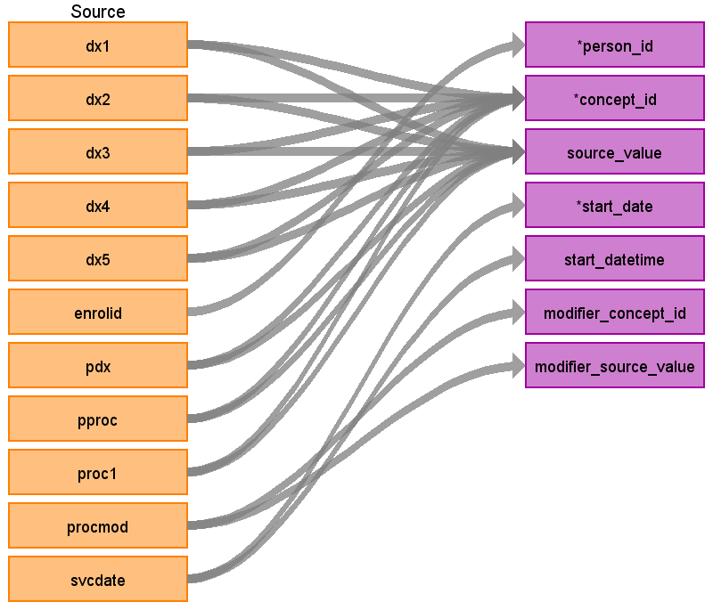

## Table name: **STEM_TABLE**

The STEM table is a staging area where source codes like ICD9 codes will first be mapped to concept_ids. The STEM table itself is an amalgamation of the OMOP event tables to facilitate record movement. This means that all fields present across the OMOP event tables are present in the STEM table. After a record is mapped and staged, the domain of the concept_id dictates which OMOP table (Condition_occurrence, Drug_exposure, Procedure_occurrence, Measurement, Observation, Device_exposure) the record will move to. Please see the STEM -> CDM mapping files for a description of which STEM fields move to which STEM tables.

## OHDSI Reproducibility Challenge

For the reproduciblity challenge you should use **IBM CCAE v1676**. This version of the database uses type concepts instead of the CONDITION_STATUS_CONCEPT_ID to denote primary diagnoses. Please use the below table to choose the correct CONDITION_TYPE_CONCEPT_ID.

|      Claim Type     |      Source                                              |      Position     |      CONDITION_TYPE     _CONCEPT_ID     |      CONCEPT_NAME                       |
|---------------------|----------------------------------------------------------|-------------------|-----------------------------------------|-----------------------------------------|
|     IP              |     INPATIENT_SERVICES and OUTPATIENT_SERVICES TABLES    |     1 (PDX)       |     38000183                            |     Inpatient detail – primary          |
|                     |                                                          |     2 (DX1)       |     38000184                            |     Inpatient detail – 1st position     |
|                     |                                                          |     3 (DX2)       |     38000185                            |     Inpatient detail - 2rd position     |
|                     |                                                          |     4 (DX3)       |     38000186                            |     Inpatient detail - 3th position     |
|                     |                                                          |     5 (DX4)       |     38000187                            |     Inpatient detail - 4th position     |
|                     |                                                          |     6 (DX5)       |     38000188                            |     Inpatient detail - 5th position     |
|                     |     INPATIENT_ADMISSIONS and FACILITY_HEADER TABLES      |     1 (PDX)       |     38000199                            |     Inpatient header - primary          |
|                     |                                                          |     2 (DX1)       |     38000200                            |     Inpatient header - 1st position     |
|                     |                                                          |     3 (DX2)       |     38000201                            |     Inpatient header - 2nd position     |
|                     |                                                          |     4 (DX3)       |     38000202                            |     Inpatient header - 3rd position     |
|                     |                                                          |     5 (DX4)       |     38000203                            |     Inpatient header - 4th position     |
|                     |                                                          |     6 (DX5)       |     38000204                            |     Inpatient header - 5th position     |
|                     |                                                          |     7 (DX6)       |     38000205                            |     Inpatient header - 6th position     |
|                     |                                                          |     8 (DX7)       |     38000206                            |     Inpatient header - 7th position     |
|                     |                                                          |     9 (DX8)       |     38000207                            |     Inpatient header - 8th position     |
|                     |                                                          |     10 (DX9)      |     38000208                            |     Inpatient header - 9th position     |
|                     |                                                          |     11 (DX10)     |     38000209                            |     Inpatient header - 10th position    |
|                     |                                                          |     12 (DX11)     |     38000210                            |     Inpatient header - 11th position    |
|                     |                                                          |     13 (DX12)     |     38000211                            |     Inpatient header - 12th position    |
|                     |                                                          |     14 (DX13)     |     38000212                            |     Inpatient header - 13th position    |
|                     |                                                          |     15 (DX14)     |     38000213                            |     Inpatient header - 14th position    |
|     ER or OP        |     INPATIENT_SERVICES and OUTPATIENT_SERVICES TABLES    |     1 (PDX)       |     38000215                            |     Outpatient detail - 1st position    |
|                     |                                                          |     2 (DX1)       |     38000215                            |     Outpatient detail - 1st position    |
|                     |                                                          |     3 (DX2)       |     38000216                            |     Outpatient detail - 2nd position    |
|                     |                                                          |     4 (DX3)       |     38000217                            |     Outpatient detail - 3rd position    |
|                     |                                                          |     5 (DX4)       |     38000218                            |     Outpatient detail - 4th position    |
|                     |                                                          |     6 (DX5)       |     38000219                            |     Outpatient detail - 5th position    |
|                     |     FACILITY_HEADER TABLES                               |     2 (DX1)       |     38000230                            |     Outpatient header - 1st position    |
|                     |                                                          |     3 (DX2)       |     38000231                            |     Outpatient header - 2nd position    |
|                     |                                                          |     4 (DX3)       |     38000232                            |     Outpatient header - 3rd position    |
|                     |                                                          |     5 (DX4)       |     38000233                            |     Outpatient header - 4th position    |
|                     |                                                          |     6 (DX5)       |     38000234                            |     Outpatient header - 5th position    |
|                     |                                                          |     7 (DX6)       |     38000235                            |     Outpatient header - 6th position    |
|                     |                                                          |     8 (DX7)       |     38000236                            |     Outpatient header - 7th position    |
|                     |                                                          |     9 (DX8)       |     38000237                            |     Outpatient header - 8th position    |
|                     |                                                          |     10 (DX9)      |     38000238                            |     Outpatient header - 9th position    |

### Key conventions

* VISIT_DETAIL must be built before STEM (refer to [VISIT_DETAIL file](https://ohdsi.github.io/ETL-LambdaBuilder/IBM_CCAE_MDCR/CCAE_MDCR_visit_detail.html))
  
* Referential integrity is maintained with VISIT_DETAIL.
For every record in STEM there should be 1 row record in VISIT_DETAIL (n:1 join).

* For every record in VISIT_DETAIL there may be 0 to n rows in STEM.

### Revenue Code Mappings
Records will be written from the INPATIENT_SERVICES table mapping the field REVCODE to STEM.CONCEPT_ID. Please see the table below for how this logic will be handled.

**NOTE** the revenue codes are mapped to concepts with the vocabulary_id “Revenue Code”. All these concepts have the domain of “Revenue Code” as well. Since there is no revenue table, all records coming from the REVCODE field should go to the OBSERVATION table.

### Reading from **INPATIENT_SERVICES**

| Destination Field | Source field | Logic | Comment field |
| --- | --- | --- | --- |
| DOMAIN_ID | - | - | This should be the domain_id of the standard concept in the CONCEPT_ID field. If a code is mapped to CONCEPT_ID 0, put the domain_id as Observation |
| PERSON_ID | ENROLID | - | - |
| VISIT_OCCURRENCE_ID | **VISIT_DETAIL** VISIT_OCCURRENCE_ID | Refer to logic in building VISIT_OCCURRENCE table for linking with VISIT_OCCURRENCE_ID. | - |
| VISIT_DETAIL_ID | **VISIT_DETAIL** VISIT_DETAIL_ID | Refer to logic in building VISIT_DETAIL table for linking with VISIT_DETAIL_ID. | - |
| PROVIDER_ID | **VISIT_DETAIL** PROVIDER_ID | - | - |
| ID | - | System generated. | - |
| CONCEPT_ID | PDX DX1-5 PPROC PROC1 REVCODE |  Use the <a href="https://ohdsi.github.io/CommonDataModel/sqlScripts.html">Source-to-Standard Query</a>.    If DXVER does not have a value, review to the "Key Conventions" under the "STEM Key Conventions and Lookup Files" page.  If no map is made, assign CONCEPT_ID to 0 and set DOMAIN_ID as OBSERVATION.  **[PDX, DX1-5]** If DXVER=9 use the filter:  `WHERE SOURCE_VOCABULARY_ID IN (‘ICD9CM’)` `AND TARGET_STANDARD_CONCEPT = 'S'` `AND TARGET_INVALID_REASON IS NULL`  If DXVER=0 use the filter: `WHERE SOURCE_VOCABULARY_ID IN (’ICD10CM’)` `AND TARGET_STANDARD_CONCEPT = 'S'` `AND TARGET_INVALID_REASON IS NULL`   **[PPROC, PROC1]** When PROCTYP <> 0:   `WHERE SOURCE_VOCABULARY_ID IN ('ICD9Proc','HCPCS','CPT4',’ICD10PCS’)` `AND TARGET_STANDARD_CONCEPT = 'S'` `AND TARGET_INVALID_REASON IS NULL`  **[REVCODE]**   `WHERE SOURCE_VOCABULARY_ID IN ('Revenue Code’)` `AND TARGET_STANDARD_CONCEPT = 'S'` `AND TARGET_INVALID_REASON IS NULL`  | The concepts in the Revenue Code vocabulary all have the domain “Revenue Code”. These should go to the OBSERVATION table.	  |
| SOURCE_VALUE | PDX DX1-5 PPROC PROC1 | - | - |
| SOURCE_CONCEPT_ID | PDX DX1-5 PPROC PROC1 |  Use the <a href="https://ohdsi.github.io/CommonDataModel/sqlScripts.html">Source-to-Source Query</a>.    If DXVER does not have a value, review to the "Key Conventions" under the "STEM Key Conventions and Lookup Files" page.  If no map is made, assign to 0.  **[PDX, DX1-5]** If DXVER=9 use the filter:  `WHERE SOURCE_VOCABULARY_ID IN (‘ICD9CM’)` `AND TARGET_VOCABULARY_ID IN (‘ICD9CM’)`  If DXVER=0 use the filter: `WHERE SOURCE_VOCABULARY_ID IN (’ICD10CM’)` `AND TARGET_VOCABULARY_ID IN (‘ICD10CM’)`   **[PPROC, PROC1]** When PROCTYP <> 0:   `WHERE SOURCE_VOCABULARY_ID IN ('ICD9Proc','HCPCS','CPT4',’ICD10PCS’)` `AND TARGET_VOCABULARY_ID IN ('ICD9Proc','HCPCS','CPT4',’ICD10PCS’)` | - |
| TYPE_CONCEPT_ID | - | Set all to `32854` (Inpatient claim detail) | - |
| START_DATE | **VISIT_DETAIL** VISIT_DETAIL_START_DATE | - | - |
| START_DATETIME | - | START_DATE + midnight | - |
| END_DATE | - | NULL | - |
| END_DATETIME | - | NULL | - |
| VERBATIM_END_DATE | - | NULL | - |
| DAYS_SUPPLY | - | NULL | - |
| DOSE_UNIT_SOURCE_VALUE | - | NULL | - |
| LOT_NUMBER | - | NULL | - |
| MODIFIER_CONCEPT_ID | PROCMOD | Use the <a href="https://ohdsi.github.io/CommonDataModel/sqlScripts.html">Source-to-Standard Query</a>.  `WHERE SOURCE_CONCEPT_CLASS_ID IN ('CPT4 Modifier')`  `AND TARGET_CONCEPT_CLASS_ID IN ('CPT4 Modifier')` | If PROCMOD is blank then leave this field blank as well |
| MODIFIER_SOURCE_VALUE | PROCMOD | - | - |
| OPERATOR_CONCEPT_ID | - | 0 | - |
| QUANTITY | QTY | NULL | - |
| RANGE_HIGH | - | NULL | - |
| RANGE_LOW | - | NULL | - |
| REFILLS | - | NULL | - |
| ROUTE_CONCEPT_ID | - | 0 | - |
| ROUTE_SOURCE_VALUE | - | NULL | - |
| SIG | - | NULL | "Sig" is short for the Latin, signetur, or "let it be labeled." |
| STOP_REASON | - | NULL | - |
| UNIQUE_DEVICE_ID | - | NULL | - |
| UNIT_CONCEPT_ID | - | 0 | - |
| UNIT_SOURCE_VALUE | - | NULL | - |
| VALUE_AS_CONCEPT_ID | - | 0 | - |
| VALUE_AS_NUMBER | - | NULL | - |
| VALUE_AS_STRING | - | NULL | - |
| VALUE_SOURCE_VALUE | - | NULL | - |
| ANATOMIC_SITE_CONCEPT_ID | - | 0 | - |
| DISEASE_STATUS_CONCEPT_ID | - | 0 | - |
| SPECIMEN_SOURCE_ID | - | NULL | - |
| ANATOMIC_SITE_SOURCE_VALUE | - | NULL | - |
| DISEASE_STATUS_SOURCE_VALUE | - | NULL | - |
| CONDITION_STATUS_CONCEPT_ID | PDX, DX1-DX9 | If the record is generated based on PDX or DX1 set to `32902` else if the record is based on DX2-DX9 set to `32908` | - | - |
| CONDITION_STATUS_SOURCE_VALUE | Use the name of the DX field. For example, if the record is generated based on DX1 put 'DX1' here | NULL | - |
| EVENT_ID | - | NULL | - |
| EVENT_FIELD_CONCEPT_ID | - | 0 | - |
| VALUE_AS_DATETIME | - | NULL | - |
| QUALIFIER_CONCEPT_ID | - | 0 | - |
| QUALIFIER_SOURCE_VALUE | - | NULL | - |

## Change Log

### June 11, 2021
* Added QTY to the table

### June 9, 2021
* Update type concept

* Added CONDITION_STATUS_CONCEPT_ID information

* Added information on how to map revenue codes
