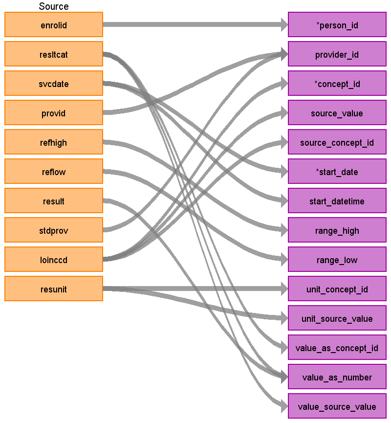

## Table name: stem_table

The STEM table is a staging area where source codes like ICD9 codes will first be mapped to concept_ids. The STEM table itself is an amalgamation of the OMOP event tables to facilitate record movement. This means that all fields present across the OMOP event tables are present in the STEM table. After a record is mapped and staged, the domain of the concept_id dictates which OMOP table (Condition_occurrence, Drug_exposure, Procedure_occurrence, Measurement, Observation, Device_exposure) the record will move to. Please see the STEM -> CDM mapping files for a description of which STEM fields move to which STEM tables.

### Key conventions

* Labs records are not considered visits so therefore all VISIT_DETAIL_ID and VISIT_OCCURRENCE_ID fields are NULL.

* Lab result in **LAB** is stored in three fields: ABNORMAL, RESULT (numeric) and RESLTCAT (character). Numeric results can be in both RESULT and RESLTCAT. RESULT usually has the following values if the lab result is string: 0 or large negative value (<-999999.99999).  ABNORMAL is the abnormal indicator set by the lab vendors: ‘A’ means “abnormal”, ‘N’ means “normal”, ‘H’ means “Above the normal range”, ‘L’ means “Below the normal range”, ‘+’ means “Positive” and ‘-’ means “Negative”.  
* Use the following to set VALUE_SOURCE_VALUE and VALUE_AS_CONCEPT_ID:<br>
```sql
/*Result as string*/
VALUE_AS_STRING = CATS(RESLTCAT);
/*Result as concept code*/
IF UPCASE(VALUE_AS_STRING) ='LOW' OR ABNORMAL ='L' 	
    THEN VALUE_AS_CONCEPT_ID = 4267416;
ELSE IF UPCASE(VALUE_AS_STRING) ='HIG' OR ABNORMAL ='H' 
    THEN VALUE_AS_CONCEPT_ID =4328749;
ELSE IF UPCASE(VALUE_AS_STRING) ='NRM' OR ABNORMAL ='N' 
    THEN VALUE_AS_CONCEPT_ID =4069590;
ELSE IF UPCASE(VALUE_AS_STRING) ='ABN' OR ABNORMAL ='A' 
    THEN VALUE_AS_CONCEPT_ID =4135493;
ELSE IF UPCASE(VALUE_AS_STRING) ='ABS' 
    THEN VALUE_AS_CONCEPT_ID =4132135;
ELSE IF UPCASE(VALUE_AS_STRING) ='PRS' 
    THEN VALUE_AS_CONCEPT_ID =4181412;
ELSE IF UPCASE(VALUE_AS_STRING) ='POS' OR ABNORMAL ='+' 
    THEN VALUE_AS_CONCEPT_ID =9191;
ELSE IF UPCASE(VALUE_AS_STRING) ='NEG' OR ABNORMAL ='-' 
    THEN VALUE_AS_CONCEPT_ID =9189;
ELSE IF UPCASE(VALUE_AS_STRING) IN ('FIN','FIR') 
    THEN VALUE_AS_CONCEPT_ID =9188;
ELSE IF UPCASE(VALUE_AS_STRING) ='NON' 
    THEN VALUE_AS_CONCEPT_ID =9190;
ELSE IF UPCASE(VALUE_AS_STRING) ='TRA' 
    THEN VALUE_AS_CONCEPT_ID = 9192;
IF RESULT > -999999.99999 THEN DO;
/*Result as number*/
    VALUE_AS_NUMBER = RESULT;END;
```


### Reading from **LAB**



| Destination Field | Source field | Logic | Comment field |
| --- | --- | --- | --- |
| DOMAIN_ID | - | - | This should be the domain_id of the standard concept in the CONCEPT_ID field. If a code is mapped to CONCEPT_ID 0, put the domain_id as Observation |
| PERSON_ID | ENROLID | - | - |
| VISIT_OCCURRENCE_ID | NULL | - | - |
| VISIT_DETAIL_ID | NULL | - | - |
| PROVIDER_ID | PROVID | - | - |
| ID | - | System generated. | - |
| CONCEPT_ID | LOINCCD | Use the <a href="https://ohdsi.github.io/CommonDataModel/sqlScripts.html">Source-to-Standard Query</a>.<br><br> `WHERE SOURCE_VOCABULARY_ID IN ('LOINC')`<br>`AND TARGET_STANDARD_CONCEPT = 'S'`<br>`AND TARGET_INVALID_REASON IS NULL` | - |
| SOURCE_VALUE | LOINCCD | The LOINCCD as it appears in the **LAB** table | - |
| SOURCE_CONCEPT_ID | LOINCCD | Use the <a href="https://ohdsi.github.io/CommonDataModel/sqlScripts.html">Source-to-Source Query</a>.<br><br> `WHERE SOURCE_VOCABULARY_ID IN (‘LOINC’)`<br>`AND TARGET_VOCABULARY_ID IN (‘LOINC’)` | - |
| TYPE_CONCEPT_ID | - | All rows will have CONCEPT_ID `32856` | `32856` = 'Lab' |
| START_DATE | SVCDATE | - | - |
| START_DATETIME | - | START_DATE + Midnight | - |
| END_DATE | - | NULL | - |
| END_DATETIME | - | NULL | - |
| VERBATIM_END_DATE | - | NULL | - |
| DAYS_SUPPLY | - | NULL | - |
| DOSE_UNIT_SOURCE_VALUE | - | NULL | - |
| LOT_NUMBER | - | NULL | - |
| MODIFIER_CONCEPT_ID | - | NULL | - |
| MODIFIER_SOURCE_VALUE | - | NULL | - |
| OPERATOR_CONCEPT_ID | - | 0 | - |
| QUANTITY | - | NULL | - |
| RANGE_HIGH | REFHIGH | - | - |
| RANGE_LOW | REFLOW | - | - |
| REFILLS | - | NULL | - |
| ROUTE_CONCEPT_ID | - | 0 | - |
| ROUTE_SOURCE_VALUE | - | NULL | - |
| SIG | - | NULL | - |
| STOP_REASON | - | NULL | - |
| UNIQUE_DEVICE_ID | - | NULL | - |
| UNIT_CONCEPT_ID | RESUNIT | Use the <a href="https://ohdsi.github.io/CommonDataModel/sqlScripts.html">Source-to-Standard Query</a>.<br><br> Filters:<br>`WHERE SOURCE_VOCABULARY_ID IN ('UCUM')`<br>  `AND TARGET_VOCABULARY_ID IN ('UCUM')`<br>`AND TARGET_INVALID_REASON IS NULL`<br><br>If you do not get a map from UCUM use the JNJ_UNIT vocabulary. | - |
| UNIT_SOURCE_VALUE | RESUNIT | RESUNIT as it appears in the **LAB** table | - |
| VALUE_AS_CONCEPT_ID | RESLTCAT <br> ABNORMAL | Refer to logic above for defining this field. | - |
| VALUE_AS_NUMBER | RESULT | Put any numerical values in the RESULT field here. All values in the RESULT field as they show up in the native will be present in VALUE_SOURCE_VALUE field of the CDM.<br><br>For the following LOINCs (3142-7, 29463-7, 3141-9) if the RESULT > 100000 and the last digits are 0000 and RESUNIT = ‘LBS’, trim the last four digits 0000. | - |
| VALUE_AS_STRING | RESULT<br>RESLTCAT | Refer to logic above for defining this field. | - |
| VALUE_SOURCE_VALUE | RESULT_RESLTCAT | If RESLTCAT is not NULL then concatenate RESULT and RESLTCAT with '_' between. If RESLTCAT is NULL then just put the value from RESULT as it appears in the **LAB** table. | - |
| ANATOMIC_SITE_CONCEPT_ID | - | 0 | - |
| DISEASE_STATUS_CONCEPT_ID | - | 0 | - |
| SPECIMIN_SOURCE_ID | - | NULL | - |
| ANATOMIC_SITE_SOURCE_VALUE | - | NULL | - |
| DISEASE_STATUS_SOURCE_VALUE | - | NULL | - |
| CONDITION_STATUS_CONCEPT_ID | - | 0 | - |
| CONDITION_STATUS_SOURCE_VALUE | - | NULL | - |
| EVENT_ID | - | NULL | - |
| EVENT_FIELD_CONCEPT_ID | - | 0 | - |
| VALUE_AS_DATETIME | - | NULL | - |
| QUALIFIER_CONCEPT_ID | - | 0 | - |
| QUALIFIER_SOURCE_VALUE | - | NULL | - |

## Change Log

### July 13, 2021
* Changed logic referring to how lab result source values should be represented in the CDM:
  * Removed decision to not show a RESULT of 0 in VALUE_AS_NUMBER. This was originally embedded in the sql statement showing how to assign VALUE_AS_CONCEPT_ID. The final line was `IF RESULT NE to 0 or RESULT > -999999.99999 THEN DO; VALUE_AS_NUMBER = RESULT;END;`. Instead, it now reads `IF RESULT > -999999.99999 THEN DO; VALUE_AS_NUMBER = RESULT;END;`
  * Introduced concatenation in **VALUE_SOURCE_VALUE**. The instructions now read: If RESLTCAT is not NULL then concatenate RESULT and RESLTCAT with '_' between. If RESLTCAT is NULL then just put the value from RESULT as it appears in the **LAB** table.
 
### June 10, 2021
* Labs will not create visits on their own so that logic was removed.

### June 9, 2021
* Updated type concept

* Removed the following logic:
  * LOINCs
      * Valid LOINC codes have the following layouts #-#, ##-#, ###-#, ####-#, and #####-# .
      * When mapping to valid LOINCs in the OMOP Vocabulary there are a few invalid LOINC codes.  Implementing a check for the second to last character is a ‘-‘ensures you pull a valid LOINC from the **VOCABULARY**.  
  * Only use records with SVCDATE that fall within an OBSERVATION_PERIOD available for this person.