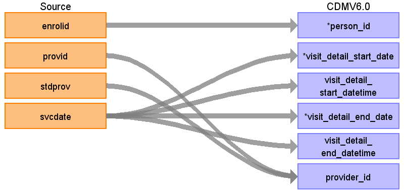

## Table name: **VISIT_DETAIL**

This table will be populated from six source tables, **FACILITY_HEADER**, **INPATIENT_ADMISSIONS**, **INPATIENT_SERVICES**, **OUTPATIENT_SERVICES**, **DRUG_CLAIMS**, and **LAB**.
  

### Record level referential integrity with source
Record level referential integrity is important for drug utilization and health economics analysis. Records from the source will be preserved to the best of our ability in the CDM. The records in the **INPATIENT_SERVICES**, **OUTPATIENT_SERVICES** tables are allowed to be duplicated (because there maybe multiple charges on a single claim line or there mabye multiple standard costs listed).

While creating records in the **VISIT_DETAIL** table the duplicate claim lines will not be consolidated. Any duplicate procedures or diagnoses resulting from the duplicated claim lines will not affect analysis. See the **PROCEDURE_OCCURRENCE** table for how to use procedure units. The charges and costs will be preserved in the COST table, creating a 1:many relationship between the COST table and the VISIT_DETAIL table. See logic below for details.

The **VISIT_DETAIL** table will have 1:1 record level referential integrity to **FACILITY_HEADER**, **INPATIENT_ADMISSIONS**, **INPATIENT_SERVICES**, **OUTPATIENT_SERVICES**, **DRUG_CLAIMS**, and **LAB** - except as noted below.
  

### Special notes
* **VISIT_DETAIL**.VISIT_OCCURRENCE_ID, a system generated primary key of the **VISIT_DETAIL** will be the fk to many OMOP tables including domain-tables (**CONDITION_OCCURRENCE**, **PROCEDURE_OCCURRENCE**, **OBSERVATION**, **MEASUREMENT**, **DRUG_EXPOSURE**, etc.) and to **COST** table **COST**.COST_EVENT_ID).
* **VISIT_OCCURRENCE** will be generated from **VISIT_DETAIL** table through an ‘era’ logic where inpatient records will be grouped together into continous non-overlapping periods, and all **VISIT_DETAIL** records (inpatient, outpatient, other) that are in that temporal non overlapping continous period will be considered one visit_occurrence_id record. For records outside this non-overlapping inpatient period, we will take all outpatient records and identify unique person-date combinations. For each unique person-date combination a visit_occurrence_id will be assigned and all visit_detail_id records temporally assocciated with that person-date combination will be assigned that visit_occurrence_id. (See documentation for **VISIT_OCCURRENCE**.visit_occurrence_id)
* Linkages across source tables should use the combination of ENROLID and HLTHPLAN.
  

### VISIT_DETAIL Logic
1. Remove persons not in **PERSON** table
2. Create a primary key to identify each record in the **FACILITY_HEADER**, **INPATIENT_ADMISSIONS**, **INPATIENT_SERVICES**, **OUTPATIENT_SERVICES**, **DRUG_CLAIMS**, and **LAB** tables. This primary key will become the VISIT_DETAIL_ID. Retain this information as a lookup table for later linkage of diagnoses and procedures. This system generated key may also be used to lookup records in source table i.e. maintain a lookup table that is able to link visit_detail_id to the records of **FACILITY_HEADER**, **INPATIENT_ADMISSIONS**, **INPATIENT_SERVICES**, **OUTPATIENT_SERVICES**, **DRUG_CLAIMS**, and **LAB**. tables (record level referential integerity).
  

### PROVIDER_ID Assignment Logic
* For records from **FACILITY_HEADER**, **INPATIENT_ADMISSIONS**, **INPATIENT_SERVICES**, **OUTPATIENT_SERVICES**, and **LAB**:
    * Each record has a provider value in the PROVID field. Use this value to link to PROVIDER_BRIDGE to find the PROV_UNIQUE id.
    * Use the PROV_UNIQUE value to find PROVIDER_ID by linking PROV_UNIQUE to PROVIDER.PROVIDER_SOURCE_VALUE. If PROV_UNIQUE does not have an associated PROVIDER_ID then set PROVIDER_ID to 0
* For records from **DRUG_CLAIMS**:
    * Records in **DRUG_CLAIMS** have provider values in the fields PRESCRIBING_PROV, NPI, and DEA.
    * Start with PRESCRIBING_PROV. If that is blank or NULL take the NPI and if that is blank or NULL take the DEA
    * Using the PROVIDER_BRIDGE table find PROV_UNIQUE by matching the PRESCRIBING_PROV value to the PROV field, NPI to NPI or DEA to DEA.
    * Use the PROV_UNIQUE value to find PROVIDER_ID by linking PROV_UNIQUE to PROVIDER.PROVIDER_SOURCE_VALUE. If PROV_UNIQUE does not have an associated PROVIDER_ID then set PROVIDER_ID to 0
      

## CARE_SITE_ID Assignment Logic
* For records from **FACILITY_HEADER**, **INPATIENT_ADMISSIONS**, **INPATIENT_SERVICES**, **OUTPATIENT_SERVICES**, **DRUG_CLAIMS**, and **LAB**:
    * Each record in **FACILITY_HEADER**, **INPATIENT_ADMISSIONS**, **INPATIENT_SERVICES**, **OUTPATIENT_SERVICES**, **DRUG_CLAIMS**, and **LAB** has a value in the field BILL_PROV. Use this value to link to PROVIDER_BRIDGE on BILL_PROV = PROV to find the PROV_UNIQUE id.
    * Use the PROV_UNIQUE value to find CARE_SITE_ID by linking PROV_UNIQUE to CARE_SITE.CARE_SITE_SOURCE_VALUE. If PROV_UNIQUE does not have an associated CARE_SITE_ID then set CARE_SITE_ID to 0
* For records from DRUG_CLAIMS:
    * Each record in **RX_CLAIMS** has a value in the field Pharm.
    * Link to **CARE_SITE** by linking Pharm to **CARE_SITE**.CARE_SITE_SOURCE_VALUE. If pharm does not have an associated CARE_SITE_ID then set PROVIDER_ID to 0
  

### Reading from **OUTPATIENT_SERVICES**

| Destination Field | Source field | Logic | Comment field |
| --- | --- | --- | --- |
| VISIT_DETAIL_ID | - | System generated. | - |
| PERSON_ID | ENROLID | - |  |
| VISIT_DETAIL_CONCEPT_ID | - | Map VISIT_SOURCE_VALUE to their associated CONCEPT_IDs |  `9201` = 'IP'   `9202` = 'OP'   `9203` = 'ER' |
| VISIT_DETAIL_START_DATE | SVCDATE | NULL | - |
| VISIT_DETAIL_START_DATETIME | SVCDATE | - | Set time to 00:00:00. |
| VISIT_DETAIL_END_DATE | SVCDATE | NULL | - |
| VISIT_DETAIL_END_DATETIME | SVCDATE | - | Set time to 00:00:00. |
| VISIT_DETAIL_TYPE_CONCEPT_ID | - | All rows will have the CONCEPT_ID `44818517` | `44818517` = ‘Visit derived from encounter on claim’ |
| PROVIDER_ID | PROVID STDPROV | Map PROVID and STDPROV to PROVIDER_SOURCE_VALUE and SPECIALTY_SOURCE_VALUE in **PROVIDER** table to extract Provider ID. | If there is no associated PROVIDER_ID this should be NULL, not 0 |
| CARE_SITE_ID | - | NULL | - |
| VISIT_DETAIL_SOURCE_VALUE | - | Use the logic mentioned above to define visit types, and value can be ‘IP’,’ER’,’OP’. | - |
| VISIT_DETAIL_SOURCE_CONCEPT_ID | - | 0 | - |
| ADMITTING_SOURCE_VALUE | - | NULL | - |
| ADMITTING_SOURCE_CONCEPT_ID | - | 0 | - |
| ADMITTED_FROM_SOURCE_VALUE | - | NULL | - |
| ADMITTED_FROM_CONCEPT_ID | - | 0 | - |
| PRECEDING_VISIT_DETAIL_ID | - | NULL | - |
| VISIT_DETAIL_PARENT_ID | - | NULL | - |
| VISIT_OCCURRENCE_ID | - | **VISIT_OCCURRENCE**.VISIT_OCCURRENCE_ID    This is the VISIT_OCCURRENCE_ID for the VISIT_OCCURRENCE record that is the parent for the VISIT_DETAIL record | - |

### Reading from **INPATIENT_SERVICES**

| Destination Field | Source field | Logic | Comment field |
| --- | --- | --- | --- |
| VISIT_DETAIL_ID | - |  System generated. | - |
| PERSON_ID | ENROLID | - | - |
| VISIT_DETAIL_CONCEPT_ID | - | Map VISIT_SOURCE_VALUE to their associated CONCEPT_IDs |  `9201` = 'IP'   `9202` = 'OP'   `9203` = 'ER' |
| VISIT_DETAIL_START_DATE | SVCDATE | NULL | - |
| VISIT_DETAIL_START_DATETIME | SVCDATE | - | Set time to 00:00:00. |
| VISIT_DETAIL_END_DATE | TSVCDAT | NULL | - |
| VISIT_DETAIL_END_DATETIME | TSVCDAT | - | Set time to 00:00:00. |
| VISIT_DETAIL_TYPE_CONCEPT_ID | - | All rows will have the CONCEPT_ID `44818517` | `44818517` = ‘Visit derived from encounter on claim’ |
| PROVIDER_ID | PROVID STDPROV | Map PROVID and STDPROV to PROVIDER_SOURCE_VALUE and   SPECIALTY_SOURCE_VALUE in Provider table to extract Provider ID. | If there is no associated PROVIDER_ID this should be NULL, not 0 |
| CARE_SITE_ID | - | NULL | - |
| VISIT_DETAIL_SOURCE_VALUE | - | Use the logic mentioned above to define visit types, and value can be ‘IP’,’ER’,’OP’. | - |
| VISIT_DETAIL_SOURCE_CONCEPT_ID | - | 0 | - |
| ADMITTING_SOURCE_VALUE | - | NULL | - |
| ADMITTING_SOURCE_CONCEPT_ID | - | 0 | - |
| ADMITTED_FROM_SOURCE_VALUE | - | NULL | - |
| ADMITTED_FROM_CONCEPT_ID | - | 0 | - |
| PRECEDING_VISIT_DETAIL_ID | - | NULL | - |
| VISIT_DETAIL_PARENT_ID | - | NULL | - |
| VISIT_OCCURRENCE_ID | - | **VISIT_OCCURRENCE**.VISIT_OCCURRENCE_ID    This is the VISIT_OCCURRENCE_ID for the VISIT_OCCURRENCE record that is the parent for the VISIT_DETAIL record | - |