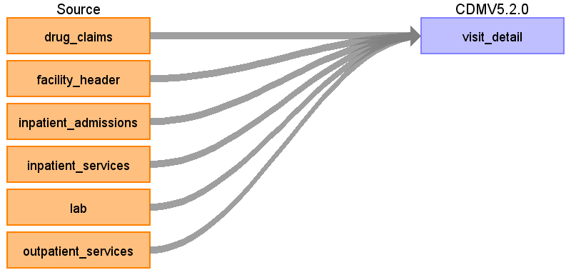
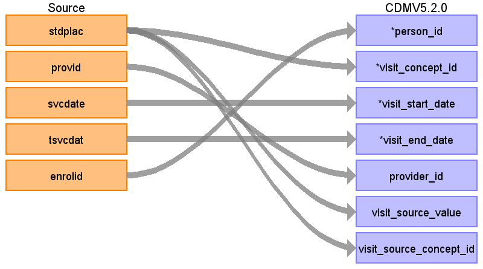
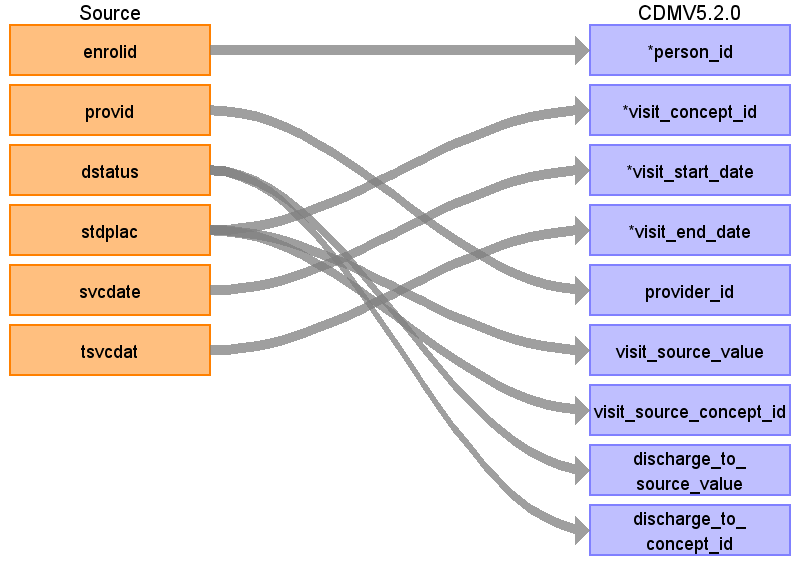
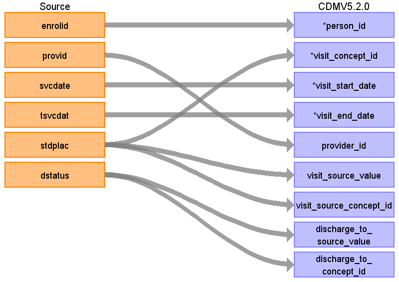
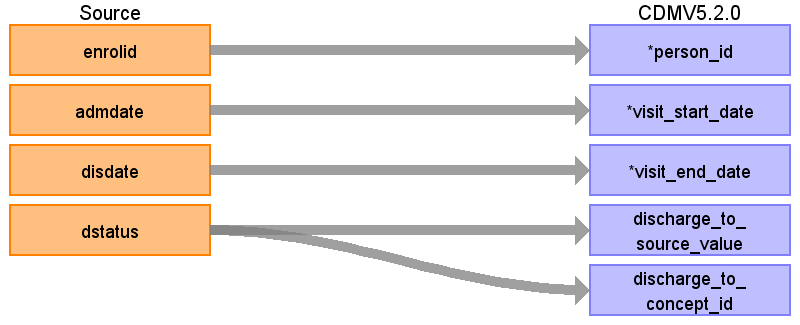
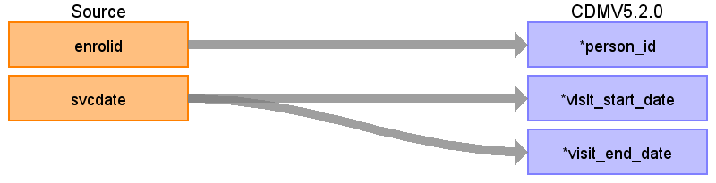
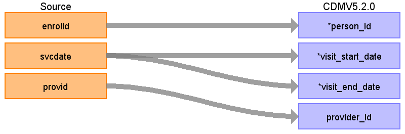

## Table name: **VISIT_DETAIL**

This table will be populated from six source tables, **FACILITY_HEADER**, **INPATIENT_ADMISSIONS**, **INPATIENT_SERVICES**, **OUTPATIENT_SERVICES**, **DRUG_CLAIMS**, and **LAB**.
  

### Record level referential integrity with source
Record level referential integrity is important for drug utilization and health economics analysis. Records from the source will be preserved to the best of our ability in the CDM. The records in the **INPATIENT_SERVICES**, **OUTPATIENT_SERVICES** tables are allowed to be duplicated (because there maybe multiple charges on a single claim line or there mabye multiple standard costs listed).

While creating records in the **VISIT_DETAIL** table the duplicate claim lines will not be consolidated. Any duplicate procedures or diagnoses resulting from the duplicated claim lines will not affect analysis. See the **PROCEDURE_OCCURRENCE** table for how to use procedure units. The charges and costs will be preserved in the COST table, creating a 1:many relationship between the COST table and the VISIT_DETAIL table. See logic below for details.

The **VISIT_DETAIL** table will have 1:1 record level referential integrity to **FACILITY_HEADER**, **INPATIENT_ADMISSIONS**, **INPATIENT_SERVICES**, **OUTPATIENT_SERVICES**, **DRUG_CLAIMS**, and **LAB** - except as noted below.
  

### Special notes
* **VISIT_DETAIL**.VISIT_OCCURRENCE_ID, a system generated primary key of the **VISIT_DETAIL** will be the fk to many OMOP tables including domain-tables (**CONDITION_OCCURRENCE**, **PROCEDURE_OCCURRENCE**, **OBSERVATION**, **MEASUREMENT**, **DRUG_EXPOSURE**, etc.) and to **COST** table **COST**.COST_EVENT_ID).
* **VISIT_OCCURRENCE** will be generated from **VISIT_DETAIL** table through an ‘era’ logic where inpatient records will be grouped together into continous non-overlapping periods, and all **VISIT_DETAIL** records (inpatient, outpatient, other) that are in that temporal non overlapping continous period will be considered one visit_occurrence_id record. For records outside this non-overlapping inpatient period, we will take all outpatient records and identify unique person-date combinations. For each unique person-date combination a visit_occurrence_id will be assigned and all visit_detail_id records temporally assocciated with that person-date combination will be assigned that visit_occurrence_id. (See documentation for **VISIT_OCCURRENCE**.visit_occurrence_id)
* Linkages across source tables should use the combination of ENROLID and HLTHPLAN.
  

### **VISIT_DETAIL** Logic
1. Remove persons not in **PERSON** table
2. Create a primary key to identify each record in the **FACILITY_HEADER**, **INPATIENT_ADMISSIONS**, **INPATIENT_SERVICES**, **OUTPATIENT_SERVICES**, **DRUG_CLAIMS**, and **LAB** tables. This primary key will become the VISIT_DETAIL_ID. Retain this information as a lookup table for later linkage of diagnoses and procedures. This system generated key may also be used to lookup records in source table i.e. maintain a lookup table that is able to link visit_detail_id to the records of **FACILITY_HEADER**, **INPATIENT_ADMISSIONS**, **INPATIENT_SERVICES**, **OUTPATIENT_SERVICES**, **DRUG_CLAIMS**, and **LAB**. tables (record level referential integerity).
3. "Patient with visit that starts before the observation period, start date trimmed to beginning of observation period.
  
<a href='https://github.com/OHDSI/ETL-LambdaBuilder/blob/master/docs/IBM_CCAE_MDCR/images/Defining_VISIT_DETAIL_Examples.xlsx'>This MS Excel file</a> provides two examples for defining **VISIT_DETAIL**.
  

### PROVIDER_ID Assignment Logic
* For records from **FACILITY_HEADER**, **INPATIENT_ADMISSIONS**, **INPATIENT_SERVICES**, **OUTPATIENT_SERVICES**, and **LAB**:
    * Each record has a provider value in the STDPROV field. Use this to look up the PROVIDER_ID from the PROVIDER table using STDPROV as the PROVIDER_SOURCE_VALUE.
      

### Reading from **OUTPATIENT_SERVICES**

| Destination Field | Source field | Logic | Comment field |
| --- | --- | --- | --- |
| VISIT_DETAIL_ID | - | System generated. | - |
| PERSON_ID | ENROLID | - |  |
| VISIT_DETAIL_CONCEPT_ID | STDPLAC | Use the <a href="https://ohdsi.github.io/CommonDataModel/sqlScripts.html">Source-to-Standard Query</a> with the filter     `WHERE SOURCE_VOCABULARY_ID IN ('CMS Place of Service’)` `AND TARGET_STANDARD_CONCEPT = 'S'`  If no map is made, assign to 0.|**NOTE:** The STDPLAC value in OUTPATIENT_SERVICES is only one digit for the numbers 1-9. In the OMOP Vocabulary these are two digits, presented as 01, 02, etc. Please add a leading zero prior to mapping to make sure they are not erroneously set to zero.|
| VISIT_DETAIL_START_DATE | SVCDATE | NULL | - |
| VISIT_DETAIL_START_DATETIME | SVCDATE | - | Set time to 00:00:00. |
| VISIT_DETAIL_END_DATE | TSVCDAT (See *Logic* column for exceptions)| If STDPLAC is blank, NULL, does not have a mapping or is equal to 11, 01, 95, 12, 20, 49, 60, 15, 81, 42, 41, 14, 04, 18, 09, 03 or 16 then set visit_detail_end_date equal to visit_detail_start_date.   If STDPLAC is equal to 23 or 22 and lst_dt - fst_dt > 1 then set visit_detail_end_date equal to visit_detail_start_date | - |
| VISIT_DETAIL_END_DATETIME | VISIT_DETAIL_END_DATE | - | Set time to 00:00:00. |
| VISIT_DETAIL_TYPE_CONCEPT_ID | - | Set all to `32860` (Outpatient claim detail) | - |
| PROVIDER_ID | PROVID | Map PROVID PROVIDER_SOURCE_VALUE in **PROVIDER** table to extract Provider ID. | If there is no associated PROVIDER_ID this should be NULL, not 0 |
| CARE_SITE_ID | - | NULL | - |
| VISIT_DETAIL_SOURCE_VALUE | STPLAC | | - |
| VISIT_DETAIL_SOURCE_CONCEPT_ID | STDPLAC | Use the <a href="https://ohdsi.github.io/CommonDataModel/sqlScripts.html">Source-to-Source Query</a> with the filter     `WHERE SOURCE_VOCABULARY_ID IN ('CMS Place of Service’)` `AND TARGET_VOCABULARY_ID IN ('CMS Place of Service’)`    If no map is made, assign to 0.| **NOTE:** The STDPLAC value in OUTPATIENT_SERVICES is only one digit for the numbers 1-9. In the OMOP Vocabulary these are two digits, presented as 01, 02, etc. Please add a leading zero prior to mapping to make sure they are not erroneously set to zero.|
| ADMITTING_SOURCE_VALUE | - | NULL | - |
| ADMITTING_SOURCE_CONCEPT_ID | - | 0 | - |
| DISCHARGE_TO_SOURCE_VALUE | - | NULL | - |
| DISCHARGE_TO_CONCEPT_ID | - | 0 | - |
| PRECEDING_VISIT_DETAIL_ID | - | NULL | - |
| VISIT_DETAIL_PARENT_ID | - | NULL | - |
| VISIT_OCCURRENCE_ID | - | **VISIT_OCCURRENCE**.VISIT_OCCURRENCE_ID    This is the VISIT_OCCURRENCE_ID for the VISIT_OCCURRENCE record that is the parent for the VISIT_DETAIL record | - |

### Reading from **INPATIENT_SERVICES**

| Destination Field | Source field | Logic | Comment field |
| --- | --- | --- | --- |
| VISIT_DETAIL_ID | - |  System generated. | - |
| PERSON_ID | ENROLID | - | - |
| VISIT_DETAIL_CONCEPT_ID | STDPLAC | Use the <a href="https://ohdsi.github.io/CommonDataModel/sqlScripts.html">Source-to-Standard Query</a> with the filter     `WHERE SOURCE_VOCABULARY_ID IN ('CMS Place of Service’)` `AND TARGET_STANDARD_CONCEPT = 'S'`  If no map is made, assign to 0.|**NOTE:** The STDPLAC value in INPATIENT_SERVICES is only one digit for the numbers 1-9. In the OMOP Vocabulary these are two digits, presented as 01, 02, etc. Please add a leading zero prior to mapping to make sure they are not erroneously set to zero.|
| VISIT_DETAIL_START_DATE | SVCDATE | NULL | - |
| VISIT_DETAIL_START_DATETIME | SVCDATE | - | Set time to 00:00:00. |
| VISIT_DETAIL_END_DATE | TSVCDAT (See *Logic* column for exceptions)| If STDPLAC is blank, NULL, does not have a mapping or is equal to 11, 01, 95, 12, 20, 49, 60, 15, 81, 42, 41, 14, 04, 18, 09, 03 or 16 then set visit_detail_end_date equal to visit_detail_start_date.   If STDPLAC is equal to 23 or 22 and lst_dt - fst_dt > 1 then set visit_detail_end_date equal to visit_detail_start_date | - |
| VISIT_DETAIL_END_DATETIME | VISIT_DETAIL_END_DATE | - | Set time to 00:00:00. |
| VISIT_DETAIL_TYPE_CONCEPT_ID | - | Set all to `32854` (Inpatient claim detail) | - |
| PROVIDER_ID | PROVID | Map PROVID PROVIDER_SOURCE_VALUE in Provider table to extract Provider ID. | If there is no associated PROVIDER_ID this should be NULL, not 0 |
| CARE_SITE_ID | - | NULL | - |
| VISIT_DETAIL_SOURCE_VALUE | STDPLAC |  | - |
| VISIT_DETAIL_SOURCE_CONCEPT_ID | STDPLAC |Use the <a href="https://ohdsi.github.io/CommonDataModel/sqlScripts.html">Source-to-Source Query</a> with the filter     `WHERE SOURCE_VOCABULARY_ID IN ('CMS Place of Service’)` `AND TARGET_VOCABULARY_ID IN ('CMS Place of Service’)`    If no map is made, assign to 0.| **NOTE:** The STDPLAC value in INPATIENT_SERVICES is only one digit for the numbers 1-9. In the OMOP Vocabulary these are two digits, presented as 01, 02, etc. Please add a leading zero prior to mapping to make sure they are not erroneously set to zero.|
| ADMITTING_SOURCE_VALUE | - | NULL | - |
| ADMITTING_SOURCE_CONCEPT_ID | - | 0 | - |
| DISCHARGE_TO_SOURCE_VALUE | DSTATUS |  | - |
| DISCHARGE_TO_CONCEPT_ID | DSTATUS | Use the <a href="https://ohdsi.github.io/CommonDataModel/sqlScripts.html">Source-to-Standard Query</a> with the filter     `WHERE SOURCE_VOCABULARY_ID IN ('UB04 Pt dis status’)` `AND TARGET_STANDARD_CONCEPT = 'S'`  If no map is made, assign to 0.|**NOTE:** The `UB04 Pt dis status` value in the OMOP Vocabulary is only one digit for the number 8 (though 1-7 and 9 are two digits). In the INPATIENT_SERVICES table these are all two digits, presented as 01, 02, etc. Please add a leading zero to 8 in the OMOP Vocabulary to make it 08 prior to mapping to make sure it is not erroneously set to zero.|
| PRECEDING_VISIT_DETAIL_ID | - | NULL | - |
| VISIT_DETAIL_PARENT_ID | - | NULL | - |
| VISIT_OCCURRENCE_ID | - | **VISIT_OCCURRENCE**.VISIT_OCCURRENCE_ID    This is the VISIT_OCCURRENCE_ID for the VISIT_OCCURRENCE record that is the parent for the VISIT_DETAIL record | - |

### Reading from **FACILITY_HEADER**

| Destination Field | Source field | Logic | Comment field |
| --- | --- | --- | --- |
| VISIT_DETAIL_ID | - | System generated. | - |
| PERSON_ID | ENROLID | - |  |
| VISIT_DETAIL_CONCEPT_ID | STDPLAC | Use the <a href="https://ohdsi.github.io/CommonDataModel/sqlScripts.html">Source-to-Standard Query</a> with the filter     `WHERE SOURCE_VOCABULARY_ID IN ('CMS Place of Service’)` `AND TARGET_STANDARD_CONCEPT = 'S'`  If no map is made, assign to 0.|**NOTE:** The STDPLAC value in OUTPATIENT_SERVICES is only one digit for the numbers 1-9. In the OMOP Vocabulary these are two digits, presented as 01, 02, etc. Please add a leading zero prior to mapping to make sure they are not erroneously set to zero.|
| VISIT_DETAIL_START_DATE | SVCDATE | NULL | - |
| VISIT_DETAIL_START_DATETIME | SVCDATE | - | Set time to 00:00:00. |
| VISIT_DETAIL_END_DATE | TSVCDAT (See *Logic* column for exceptions)| If STDPLAC is blank, NULL, does not have a mapping or is equal to 11, 01, 95, 12, 20, 49, 60, 15, 81, 42, 41, 14, 04, 18, 09, 03 or 16 then set visit_detail_end_date equal to visit_detail_start_date.   If STDPLAC is equal to 23 or 22 and lst_dt - fst_dt > 1 then set visit_detail_end_date equal to visit_detail_start_date  | - |
| VISIT_DETAIL_END_DATETIME | VISIT_DETAIL_END_DATE | - | Set time to 00:00:00. |
| VISIT_DETAIL_TYPE_CONCEPT_ID | - | Set all to `32846` (Facility Claim Header) | - |
| PROVIDER_ID | PROVID | Map PROVID PROVIDER_SOURCE_VALUE in **PROVIDER** table to extract Provider ID. | If there is no associated PROVIDER_ID this should be NULL, not 0 |
| CARE_SITE_ID | - | NULL | - |
| VISIT_DETAIL_SOURCE_VALUE | STPLAC | | - |
| VISIT_DETAIL_SOURCE_CONCEPT_ID | STDPLAC | Use the <a href="https://ohdsi.github.io/CommonDataModel/sqlScripts.html">Source-to-Source Query</a> with the filter     `WHERE SOURCE_VOCABULARY_ID IN ('CMS Place of Service’)` `AND TARGET_VOCABULARY_ID IN ('CMS Place of Service’)`    If no map is made, assign to 0.| **NOTE:** The STDPLAC value in OUTPATIENT_SERVICES is only one digit for the numbers 1-9. In the OMOP Vocabulary these are two digits, presented as 01, 02, etc. Please add a leading zero prior to mapping to make sure they are not erroneously set to zero.|
| ADMITTING_SOURCE_VALUE | - | NULL | - |
| ADMITTING_SOURCE_CONCEPT_ID | - | 0 | - |
| DISCHARGE_TO_SOURCE_VALUE | DSTATUS |  | - |
| DISCHARGE_TO_CONCEPT_ID | DSTATUS | Use the <a href="https://ohdsi.github.io/CommonDataModel/sqlScripts.html">Source-to-Standard Query</a> with the filter     `WHERE SOURCE_VOCABULARY_ID IN ('UB04 Pt dis status’)` `AND TARGET_STANDARD_CONCEPT = 'S'`  If no map is made, assign to 0.|**NOTE:** The `UB04 Pt dis status` value in the OMOP Vocabulary is only one digit for the number 8 (though 1-7 and 9 are two digits). In the FACILITY_HEADER table these are all two digits, presented as 01, 02, etc. Please add a leading zero to 8 in the OMOP Vocabulary to make it 08 prior to mapping to make sure it is not erroneously set to zero.|
| PRECEDING_VISIT_DETAIL_ID | - | NULL | - |
| VISIT_DETAIL_PARENT_ID | - | NULL | - |
| VISIT_OCCURRENCE_ID | - | **VISIT_OCCURRENCE**.VISIT_OCCURRENCE_ID    This is the VISIT_OCCURRENCE_ID for the VISIT_OCCURRENCE record that is the parent for the VISIT_DETAIL record | - |

### Reading from **INPATIENT_ADMISSIONS**

| Destination Field | Source field | Logic | Comment field |
| --- | --- | --- | --- |
| VISIT_DETAIL_ID | - |  System generated. | - |
| PERSON_ID | ENROLID | - | - |
| VISIT_DETAIL_CONCEPT_ID | - | Set to `9201` (IP) for all records| |
| VISIT_DETAIL_START_DATE | ADMDATE | NULL | - |
| VISIT_DETAIL_START_DATETIME | ADMDATE | - | Set time to 00:00:00. |
| VISIT_DETAIL_END_DATE | DISDATE | NULL | - |
| VISIT_DETAIL_END_DATETIME | DISDATE | - | Set time to 00:00:00. |
| VISIT_DETAIL_TYPE_CONCEPT_ID | - | Set all to `32855` (Inpatient claim header) | - |
| PROVIDER_ID | NULL | - |
| CARE_SITE_ID | - | NULL | - |
| VISIT_DETAIL_SOURCE_VALUE | - | Set all to 'IP' | - |
| VISIT_DETAIL_SOURCE_CONCEPT_ID | - | Set all to 0| - |
| ADMITTING_SOURCE_VALUE | - | NULL | - |
| ADMITTING_SOURCE_CONCEPT_ID | - | 0 | - |
| DISCHARGE_TO_SOURCE_VALUE | DSTATUS |  | - |
| DISCHARGE_TO_CONCEPT_ID | DSTATUS | Use the <a href="https://ohdsi.github.io/CommonDataModel/sqlScripts.html">Source-to-Standard Query</a> with the filter     `WHERE SOURCE_VOCABULARY_ID IN ('UB04 Pt dis status’)` `AND TARGET_STANDARD_CONCEPT = 'S'`  If no map is made, assign to 0.|**NOTE:** The `UB04 Pt dis status` value in the OMOP Vocabulary is only one digit for the number 8 (though 1-7 and 9 are two digits). In the INPATIENT_SERVICES table these are all two digits, presented as 01, 02, etc. Please add a leading zero to 8 in the OMOP Vocabulary to make it 08 prior to mapping to make sure it is not erroneously set to zero.|
| PRECEDING_VISIT_DETAIL_ID | - | NULL | - |
| VISIT_DETAIL_PARENT_ID | - | NULL | - |
| VISIT_OCCURRENCE_ID | - | **VISIT_OCCURRENCE**.VISIT_OCCURRENCE_ID    This is the VISIT_OCCURRENCE_ID for the VISIT_OCCURRENCE record that is the parent for the VISIT_DETAIL record | - |

## Reading from **DRUG_CLAIMS**

| Destination Field | Source field | Logic | Comment field |
| --- | --- | --- | --- |
| VISIT_DETAIL_ID | - |  System generated. | - |
| PERSON_ID | ENROLID | - | - |
| VISIT_DETAIL_CONCEPT_ID | RXMR | When 1 (Retail) Or NULL Or ‘ ’ set to `581458` (Pharmacy)  When 2 then `32857` (Mail order record)| |
| VISIT_DETAIL_START_DATE | SVCDATE | NULL | - |
| VISIT_DETAIL_START_DATETIME | SVCDATE | - | Set time to 00:00:00. |
| VISIT_DETAIL_END_DATE | SVCDATE | NULL | - |
| VISIT_DETAIL_END_DATETIME | SVCDATE | - | Set time to 00:00:00. |
| VISIT_DETAIL_TYPE_CONCEPT_ID | - | Set all to `32869` (Pharmacy claim) | - |
| PROVIDER_ID | NULL | - |
| CARE_SITE_ID | - | NULL | - |
| VISIT_DETAIL_SOURCE_VALUE | - | Set all to 'Pharmacy' | - |
| VISIT_DETAIL_SOURCE_CONCEPT_ID | - | Set all to 0| - |
| ADMITTING_SOURCE_VALUE | - | NULL | - |
| ADMITTING_SOURCE_CONCEPT_ID | - | 0 | - |
| DISCHARGE_TO_SOURCE_VALUE | - | NULL | - |
| DISCHARGE_TO_CONCEPT_ID | - | 0 | - |
| PRECEDING_VISIT_DETAIL_ID | - | NULL | - |
| VISIT_DETAIL_PARENT_ID | - | NULL | - |
| VISIT_OCCURRENCE_ID | - | **VISIT_OCCURRENCE**.VISIT_OCCURRENCE_ID    This is the VISIT_OCCURRENCE_ID for the VISIT_OCCURRENCE record that is the parent for the VISIT_DETAIL record | - |

## Reading from **LAB**

| Destination Field | Source field | Logic | Comment field |
| --- | --- | --- | --- |
| VISIT_DETAIL_ID | - |  System generated. | - |
| PERSON_ID | ENROLID | - | - |
| VISIT_DETAIL_CONCEPT_ID | - | Set to `32036` (Laboratory Visit) for all records| |
| VISIT_DETAIL_START_DATE | SVCDATE | NULL | - |
| VISIT_DETAIL_START_DATETIME | SVCDATE | - | Set time to 00:00:00. |
| VISIT_DETAIL_END_DATE | SVCDATE | NULL | - |
| VISIT_DETAIL_END_DATETIME | SVCDATE | - | Set time to 00:00:00. |
| VISIT_DETAIL_TYPE_CONCEPT_ID | - | All rows will have CONCEPT_ID `32856` (Lab) | - |
| PROVIDER_ID | PROVID | Map PROVID PROVIDER_SOURCE_VALUE in **PROVIDER** table to extract Provider ID. | If there is no associated PROVIDER_ID this should be NULL, not 0 |
| CARE_SITE_ID | - | NULL | - |
| VISIT_DETAIL_SOURCE_VALUE | - | Set all to 'Pharmacy' | - |
| VISIT_DETAIL_SOURCE_CONCEPT_ID | - | Set all to 0| - |
| ADMITTING_SOURCE_VALUE | - | NULL | - |
| ADMITTING_SOURCE_CONCEPT_ID | - | 0 | - |
| DISCHARGE_TO_SOURCE_VALUE | - | NULL | - |
| DISCHARGE_TO_CONCEPT_ID | - | 0 | - |
| PRECEDING_VISIT_DETAIL_ID | - | NULL | - |
| VISIT_DETAIL_PARENT_ID | - | NULL | - |
| VISIT_OCCURRENCE_ID | - | **VISIT_OCCURRENCE**.VISIT_OCCURRENCE_ID    This is the VISIT_OCCURRENCE_ID for the VISIT_OCCURRENCE record that is the parent for the VISIT_DETAIL record | - |

## Change Log

### June 8, 2021
* Fully updated the VISIT_DETAIL logic to include all claim lines from all pertinent tables. 

* Fixed all type concepts

* Added VISIT_DETAIL_END_DATE logic to get rid of Outpatient visits > 1 day