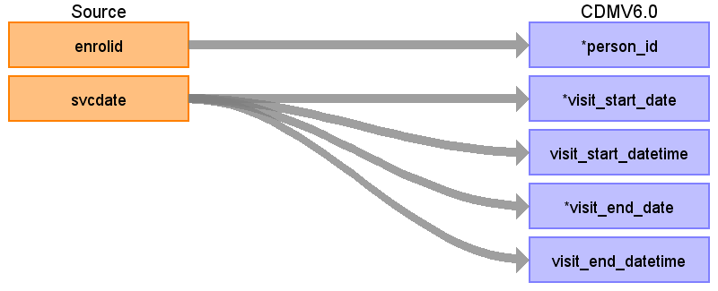
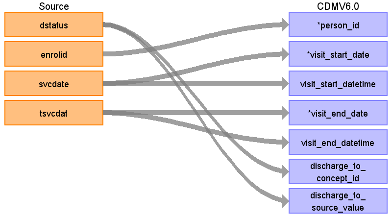

## Table name: **VISIT_OCCURRENCE**

Even though MarketScan has defined inpatient visits, some inpatient visits still exist in **OUTPATIENT_SERVICES** table.  We kept those inpatient visits defined by MarketScan, and also applied the logic derived to define inpatient visits versus emergency room visits from the following reference: 
*Scerbo, M., C. Dickstein, and A. Wilson, Health Care Data and SAS. 2001, Cary, NC: SAS Institute Inc.*

### Key conventions
* Visits are only generated off the **OUTPATIENT_SERVICES** and **INPATIENT_SERVICES** tables, **FACILITY_HEADER** and **INPATIENT_ADMISSIONS** tables are not used. 
* Extract records within observation periods where a person has both prescription benefits and medical benefits from **INPATIENT_SERVICES** and **OUTPATIENT_SERVICES** tables.
* Set Source Flag: To retain the knowledge for later, set this flag to ‘I’ for all **INPATIENT_SERVICES** records and ‘O’ to all **OUTPATIENT_SERVICES** records.
* Generate **VISIT_OCCURRENCE**:
    * For claim type = ‘IP’
        * Sort data in ascending order by ENROLID, START_DATE, END_DATE, PROVID, and STDPROV.
        * Then by ENROLID, collapse lines of claim as long as the time between the END_DATE of one line and the START_DATE of the next is <=1.
        * Then each consolidated inpatient claim is considered as one inpatient visit, set 
            * MIN(START_DATE) as VISIT_START_DATE
            * MAX(END_DATE) as VISIT_END_DATE
            * ‘IP’ as PLACE_OF_SERVICE_SOURCE_VALUE
        * As you are collapsing records take the PROVID and STDPROV from the first claim line of each visit as VISIT_PROVID and VISIT_PROVSTD, this will be used later to assign providers associated to a visit.
    * See if any ‘OP’ or ‘ER’ records occur during an ‘IP’ visit.  These should be consolidated into that ‘IP’ visit, unless it is an ‘ER’ visit that starts and ends on the first day of the ‘IP’ visit.
    * For claim type = ‘ER’
        * Sort data in ascending order by ENROLID, START_DATE, END_DATE, PROVID, and STDPROV.
        * Then by ENROLID, collapse all ‘ER’ claims that start on the same day as one ER visit, then take START_DATE as VISIT_START_DATE, MAX (END_DATE) as VISIT_END_DATE, and ‘ER’ as PLACE_OF_SERVICE_SOURCE_VALUE.
        * As you are collapsing records take the PROVID and STDPROV from the first claim line of each visit as VISIT_PROVID and VISIT_PROVSTD, this will be used later to assign providers associated to a visit.
    * For claim type = ‘OP’
        * Sort data in ascending order by ENROLID, START_DATE, PROVID, END_DATE, and STDPROV. 
        * Then by ENROLID and START_DATE, collapse all ‘OP’ claims that have the same PROVID as one OP visit, then take START_DATE as VISIT_START_DATE, MAX (END_DATE) as VISIT_END_DATE, and ‘OP’ as PLACE_OF_SERVICE_SOURCE_VALUE.
        * As you are collapsing records take the PROVID and STDPROV from the first claim line of each visit as VISIT_PROVID and VISIT_PROVSTD, this will be used later to assign providers associated to a visit.
    * Two examples for defining **VISIT_OCCURRENCE** can be found here:

### Reading from **OUTPATIENT_SERVICES**

| Destination Field | Source field | Logic | Comment field |
| --- | --- | --- | --- |
| VISIT_OCCURRENCE_ID | - | System generated. | - |
| PERSON_ID | ENROLID | - | - |
| VISIT_CONCEPT_ID | - | These CONCEPT_IDs fall under VOCABULARY_ID = Visit in **CONCEPT** table. Map VISIT_SOURCE_VALUE to their associated CONCEPT_IDs | `9201` = 'IP'   `9202` = 'OP'   `9203` = 'ER' |
| VISIT_START_DATE | SVCDATE | Min(SVCDATE) |  |
| VISIT_START_DATETIME | SVCDATE | Min(SVCDATE) + Midnight | - |
| VISIT_END_DATE | SVCDATE | Max(SVCDATE) | - |
| VISIT_END_DATETIME | SVCDATE | Max(SVCDATE) + Midnight | - |
| VISIT_TYPE_CONCEPT_ID | - | All rows will have the CONCEPT_ID `44818517` | `44818517` = ‘Visit derived from encounter on claim’ |
| PROVIDER_ID | - | Refer to logic above for assigning VISIT_PROVID and VISIT_PROVSTD, and map them to PROVIDER_SOURCE_VALUE and   SPECIALTY_SOURCE_VALUE in **PROVIDER** table to extract Provider ID.   If there is no associated PROVIDER_ID this should be NULL, not 0.| - |
| CARE_SITE_ID | - | NULL | - |
| VISIT_SOURCE_VALUE | - | Use the logic mentioned above to define visit types, and value can be ‘IP’,’ER’,’OP’. | - |
| VISIT_SOURCE_CONCEPT_ID | - | 0 | - |
| ADMITTED_FROM_CONCEPT_ID | - | 0 | - |
| ADMITTED_FROM_SOURCE_VALUE | - | NULL | - |
| DISCHARGE_TO_CONCEPT_ID | - | 0 | - |
| DISCHARGE_TO_SOURCE_VALUE | - | NULL |  |
| PRECEDING_VISIT_OCCURRENCE_ID | - | For a given person, find the previous visit and reference.    A foreign key to the **VISIT_OCCURRENCE** table of the visit immediately preceding this visit. | - |

### Reading from **INPATIENT_SERVICES**

| Destination Field | Source field | Logic | Comment field |
| --- | --- | --- | --- |
| VISIT_OCCURRENCE_ID | - | System generated. | - |
| PERSON_ID | ENROLID | - | - |
| VISIT_CONCEPT_ID | - | These CONCEPT_IDs fall under VOCABULARY_ID = Visit in **CONCEPT** table. Map VISIT_SOURCE_VALUE to their associated CONCEPT_IDs| `9201` = 'IP'   `9202` = 'OP'   `9203` = 'ER' |
| VISIT_START_DATE | SVCDATE | Min(SVCDATE) | - |
| VISIT_START_DATETIME | SVCDATE | Min(SVCDATE) + Midnight | - |
| VISIT_END_DATE | TSVCDAT | Max(TSVCDAT) | - |
| VISIT_END_DATETIME | TSVCDAT | Max(TSVCDAT) + Midnight |  |
| VISIT_TYPE_CONCEPT_ID | - |All rows will have the CONCEPT_ID `44818517` | `44818517` = ‘Visit derived from encounter on claim’ |
| PROVIDER_ID | - | Refer to logic above for assigning VISIT_PROVID and VISIT_PROVSTD, and map them to PROVIDER_SOURCE_VALUE and   SPECIALTY_SOURCE_VALUE in **PROVIDER** table to extract Provider ID.   If there is no associated PROVIDER_ID this should be NULL, not 0. |
| CARE_SITE_ID | - | NULL | - |
| VISIT_SOURCE_VALUE | - | Use the logic mentioned above to define visit types, and value can be ‘IP’,’ER’,’OP’. | - |
| VISIT_SOURCE_CONCEPT_ID | - | 0 | - |
| ADMITTED_FROM_CONCEPT_ID | - | 0 | - |
| ADMITTED_FROM_SOURCE_VALUE | - | NULL | - |
| DISCHARGE_TO_CONCEPT_ID | DSTATUS | Use the <a href="https://ohdsi.github.io/CommonDataModel/sqlScripts.html">Source-to-Standard Query</a>.   Filters:   `WHERE SOURCE_VOCABULARY_ID IN ('JNJ_TRU_DPOS')` `AND TARGET_STANDARD_CONCEPT IS NOT NULL` `AND TARGET_INVALID_REASON IS NULL`  Else set to 0. | - |
| DISCHARGE_TO_SOURCE_VALUE | DSTATUS | - | - |
| PRECEDING_VISIT_OCCURRENCE_ID | - | For a given person, find the previous visit and reference. A foreign key to the **VISIT_OCCURRENCE** table of the visit immediately preceding this visit | - |
