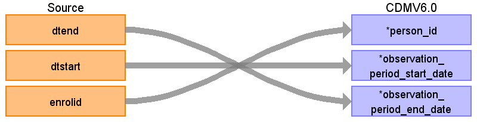

## Table name: **OBSERVATION_PERIOD**

**ENROLLMENT_DETAIL** table includes records that indicate a person’s enrollment for *each month* for the period covered by the claims data.

Enrollment entries are consolidated by combining records that indicate continuous enrollment over a period.  Consolidation is done through the following steps:
* **ENROLLMENT_DETAIL** records for each person are sorted in ascending order by DTSTART and DTEND.
* Periods of continuous enrollment are consolidated by combining monthly records as long as the time between the end of one enrollment period and the start of the next is 32 days or less (<=32).

### Key conventions
* Only use records where the person has prescription benefits (RX=1).
* The gap between observation periods needs to be 32 days or less (<=32).
* Remove duplicate records before assigning OBSERVATION_PERIOD_ID.  
* When a person has a death recorded then we truncate the OBSERVATION_PERIOD_END_DATE to reflect the corresponding DEATH_DATE from the **DEATH** table.   

### Reading from **ENROLLMENT_DETAIL**

| Destination Field | Source field | Logic | Comment field |
| --- | --- | --- | --- |
| OBSERVATION_PERIOD_ID | - | System generated. | - |
| PERSON_ID | ENROLID | - | - |
| OBSERVATION_PERIOD_START_DATE | DTSTART | Minimum start date of a contiguous enrollment period. | - |
| OBSERVATION_PERIOD_END_DATE | DTEND | Maximum end date of a contiguous enrollment period. |  |
| PERIOD_TYPE_CONCEPT_ID | - | - | `44814722` - Period while enrolled in insurance |

