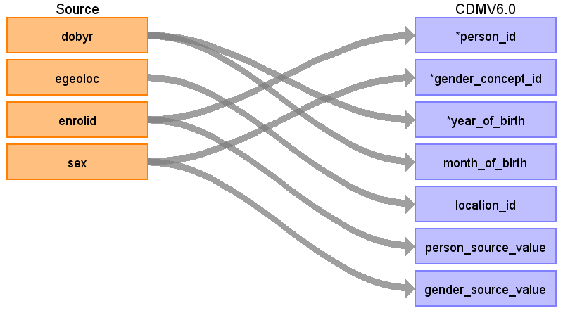

## Table name: **PERSON**

### Key conventions
* Delete the following members:  Gender changed over different enrollment period or max(DOBYR) &gt; min(DOBYR) +2
* Only use records where the person has prescription benefits (RX=1).
* If the person's other information changes (e.g. location), the last known record is used
* Delete individuals whose DOBYR &lt; 1900 or &gt; the current year.
* After defining the patient’s DOBYR (the one on their last record), exclude any individual who was born &gt; 1 year after their first enrollment period.
* The **ENROLLMENT_DETAIL** table may store multiple records for each person.  However, the CDM will only store one record per person in the **PERSON** table.  
* For MONTH_OF_BIRTH, the **OBSERVATION_PERIOD** table will need to be generated first. Then, the value can be derived from using YEAR_OF_BIRTH and OBSERVATION_PERIOD_START_DATE only if the year of birth is equal to the year of the first OBSERVATION_PERIOD_START_DATE.

### Reading from **ENROLLMENT_DETAIL**

| Destination Field | Source field | Logic | Comment field |
| --- | --- | --- | --- |
| PERSON_ID | ENROLID | - | - |
| GENDER_CONCEPT_ID | SEX | Map source values to  their associated CONCEPT_IDs:    1 	- 8507   2 	- 8532     If SEX is not 1 or 2 exclude that person. | The exclusion of a person by gender should happen on last enrollment record not just if they had one bad SEX record.   CONCEPT_IDs:  8507 = 'Male'  8532 = 'Female'|
| YEAR_OF_BIRTH | DOBYR | DOBYR needs to be > 1900 and <= current year.  If the DOBYR does not meet this criteria, drop the person. | - |
| MONTH_OF_BIRTH | - | NULL |  |
| DAY_OF_BIRTH | - | NULL | - |
| BIRTH_DATETIME | - | NULL | - |
| DEATH_DATETIME | - | <<REVISIT FOR CDM 6.0>> | - |
| RACE_CONCEPT_ID | STDRACE | Map values of STDRACE to  their associated CONCEPT_IDs:   `CASE`   `WHEN STDRACE ='1' THEN 8527 (White)`  `WHEN STDRACE ='2' THEN 8516 (Black)`   `ELSE 0 (OTHER)`   `END AS RACE_CONCEPT_ID`| Codes from MDCD:    1: White    2: Black    4: Hispanic    9: Other`|
| ETHNICITY_CONCEPT_ID | STDRACE | Map values of STDRACE to  their associated CONCEPT_IDs:   `CASE`  ` WHEN STDRACE ='4' THEN 38003563 (Hispanic or Latino)`   `ELSE 0 (OTHER)`   `END AS ETHNICITY_CONCEPT_ID` | - |
| LOCATION_ID | - | NULL | - |
| PROVIDER_ID | - | NULL | - |
| CARE_SITE_ID | - | NULL | - |
| PERSON_SOURCE_VALUE | ENROLID | - | - |
| GENDER_SOURCE_VALUE | SEX | - | - |
| GENDER_SOURCE_CONCEPT_ID | - | 0 | - |
| RACE_SOURCE_VALUE | STDRACE |  | - |
| RACE_SOURCE_CONCEPT_ID | - | 0 | - |
| ETHNICITY_SOURCE_VALUE | STDRACE |  | - |
| ETHNICITY_SOURCE_CONCEPT_ID | - | 0 | - |

