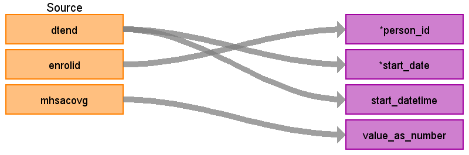

## Table name: **STEM_TABLE**

### Key conventions
* Records written to the **OBSERVATION** table to capture health insurance coverage types should not eliminate death records (i.e. **ENROLLMENT_DETAIL**.MHSACOVG)
* Additionally we add a Mental Health and Substance Abuse flags to the **OBSERVATION** table.  In the **ENROLLMENT_DETAIL** table there is information about when an individual will have this type of coverage.  We will add a 1 to VALUE_AS_NUMBER when the coverage exists and else a 0.  Make sure to take distinct records per ENROLID, DTEND, MHSACOVG.  

### Reading from **ENROLLMENT_DETAIL**

| Destination Field | Source field | Logic | Comment field |
| --- | --- | --- | --- |
| DOMAIN_ID | - | `Observation` | - |
| PERSON_ID | ENROLID | - | - |
| VISIT_OCCURRENCE_ID | - | NULL | - |
| VISIT_DETAIL_ID | - | NULL | - |
| PROVIDER_ID | - | NULL | -  |
| ID | - | System generated. | - |
| CONCEPT_ID | - | 0 | - |
| SOURCE_VALUE | - | NULL | - |
| SOURCE_CONCEPT_ID | - | 0 | - |
| TYPE_CONCEPT_ID | - | `900000009`- Mental Health Substance Abuse Coverage Indicator | - |
| START_DATE | DTEND | - | - |
| START_DATETIME | DTEND | START_DATE + Midnight | - |
| END_DATE | - | NULL | - |
| END_DATETIME | - | NULL | - |
| VERBATIM_END_DATE | - | NULL | - |
| DAYS_SUPPLY | - | NULL | - |
| DOSE_UNIT_SOURCE_VALUE | - | NULL | - |
| LOT_NUMBER | - | NULL | - |
| MODIFIER_CONCEPT_ID  | - | 0 | - |
| MODIFIER_SOURCE_VALUE | - | NULL | - |
| OPERATOR_CONCEPT_ID | - | 0 | - |
| QUANTITY | - | NULL | - |
| RANGE_HIGH | - | NULL | - |
| RANGE_LOW | - | NULL | - |
| REFILLS | - | NULL | - |
| ROUTE_CONCEPT_ID | - | 0 | - |
| ROUTE_SOURCE_VALUE | - | NULL | - |
| SIG | - | NULL | - |
| STOP_REASON | - | NULL | - |
| UNIQUE_DEVICE_ID | - | NULL | - |
| UNIT_CONCEPT_ID | - | 0 | - |
| UNIT_SOURCE_VALUE | - | NULL | - |
| VALUE_AS_CONCEPT_ID | - | 0 | - |
| VALUE_AS_NUMBER | MHSACOVG | `CASE WHEN MHSACOVG IS NULL THEN 0 ELSE MHSACOVG END` | Result from each survey  |
| VALUE_AS_STRING | - | NULL | - |
| VALUE_SOURCE_VALUE | - | NULL | - |
| ANATOMIC_SITE_CONCEPT_ID | - | 0 | - |
| DISEASE_STATUS_CONCEPT_ID | - | 0 | - |
| SPECIMEN_SOURCE_ID | - | NULL | - |
| ANATOMIC_SITE_SOURCE_VALUE | - | NULL | - |
| DISEASE_STATUS_SOURCE_VALUE | - | NULL | - |
| CONDITION_STATUS_CONCEPT_ID | - | 0 | - |
| CONDITION_STATUS_SOURCE_VALUE | - | NULL | - |
| EVENT_ID | - | NULL | - |
| EVENT_FIELD_CONCEPT_ID | - | 0 | - |
| VALUE_AS_DATETIME |  | NULL | - |
| QUALIFIER_CONCEPT_ID | - | 0 | - |
| QUALIFIER_SOURCE_VALUE | - | NULL | - |
