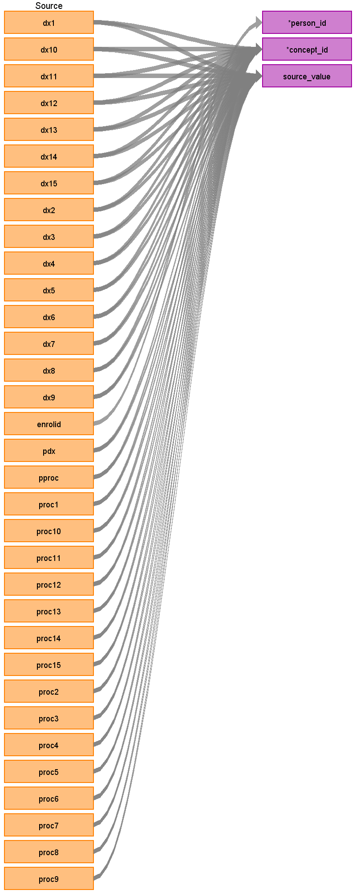

## Table name: **STEM_TABLE**

The STEM table is a staging area where source codes like ICD9 codes will first be mapped to concept_ids. The STEM table itself is an amalgamation of the OMOP event tables to facilitate record movement. This means that all fields present across the OMOP event tables are present in the STEM table. After a record is mapped and staged, the domain of the concept_id dictates which OMOP table (Condition_occurrence, Drug_exposure, Procedure_occurrence, Measurement, Observation, Device_exposure) the record will move to. Please see the STEM -> CDM mapping files for a description of which STEM fields move to which STEM tables.

### Key conventions

* VISIT_DETAIL must be built before STEM (refer to [VISIT_DETAIL file](https://ohdsi.github.io/ETL-LambdaBuilder/IBM_MDCD/MDCD_visit_detail.html))
  
* Referential integrity is maintained with VISIT_DETAIL.
For every record in STEM there should be 1 row record in VISIT_DETAIL (n:1 join).

* For every record in VISIT_DETAIL there may be 0 to n rows in STEM.

### Reading from **INPATIENT_ADMISSIONS**

| Destination Field | Source field | Logic | Comment field |
| --- | --- | --- | --- |
| DOMAIN_ID | - | - | This should be the domain_id of the standard concept in the CONCEPT_ID field. If a code is mapped to CONCEPT_ID 0, put the domain_id as Observation |
| PERSON_ID | ENROLID | NULL | - |
| VISIT_OCCURRENCE_ID | **VISIT_DETAIL** VISIT_OCCURRENCE_ID | Refer to logic in building VISIT_DETAIL table for linking with VISIT_OCCURRENCE_ID.| - |
| VISIT_DETAIL_ID | **VISIT_DETAIL** VISIT_DETAIL_ID | - | - |
| PROVIDER_ID | **VISIT_DETAIL** PROVIDER_ID | - | - |
| ID | - | System generated. | - |
| CONCEPT_ID | PDX DX1-15 PPROC PROC1-15 | Use the <a href="https://ohdsi.github.io/CommonDataModel/sqlScripts.html">Source-to-Standard Query</a>.  If DXVER does not have a value, review to the "Key Conventions" under the "STEM Key Conventions and Lookup Files" page.  If no map is made, assign a CONCEPT_ID of zero and DOMAIN_ID of OBSERVATION.  **[PDX, DX1-15]** If DXVER=9 use the filter:  `WHERE SOURCE_VOCABULARY_ID IN (‘ICD9CM’)` `AND TARGET_STANDARD_CONCEPT = 'S'` `AND TARGET_INVALID_REASON IS NULL`  If DXVER=0 use the filter: `WHERE SOURCE_VOCABULARY_ID IN (’ICD10CM’)` `AND TARGET_STANDARD_CONCEPT = 'S'` `AND TARGET_INVALID_REASON IS NULL`   **[PPROC, PROC1-15]** When PROCTYP <> 0:  `WHERE SOURCE_VOCABULARY_ID IN ('ICD9Proc','HCPCS','CPT4',’ICD10PCS’)` `AND TARGET_STANDARD_CONCEPT = 'S'` `AND TARGET_INVALID_REASON IS NULL` | |
| SOURCE_VALUE | PDX DX1-15 PPROC PROC1-15 | - | - |
| SOURCE_CONCEPT_ID | - | Use the <a href="https://ohdsi.github.io/CommonDataModel/sqlScripts.html">Source-to-Source Query</a>.  If no map is made, assign to 0.  **[PDX, DX1-15]** If DXVER=9 use the filter:  `WHERE SOURCE_VOCABULARY_ID IN (‘ICD9CM’)  AND TARGET_VOCABULARY_ID IN (‘ICD9CM’)`  If DXVER=0 use the filter: `WHERE SOURCE_VOCABULARY_ID IN (’ICD10CM’)  AND TARGET_VOCABULARY_ID IN (’ICD10CM’)`   **[PPROC, PROC1-15]** When PROCTYP <> 0:  `WHERE SOURCE_VOCABULARY_ID IN ('ICD9Proc','HCPCS','CPT4',’ICD10PCS’)  AND TARGET_VOCABULARY_ID IN ('ICD9Proc','HCPCS','CPT4',’ICD10PCS’)  AND TARGET_CONCEPT_CLASS_ID NOT IN ('HCPCS Modifier','CPT4 Modifier',’CPT4 Hierarchy’,’ICD10PCS Hierarchy’)` | - |
| TYPE_CONCEPT_ID | - | Set all to `32855` (Inpatient claim header) | - |
| START_DATE | **VISIT_DETAIL** VISIT_DETAIL_START_DATE | - | - |
| START_DATETIME | - | START_DATE + midnight  | - |
| END_DATE | - | NULL | - |
| END_DATETIME | - | NULL | - |
| VERBATIM_END_DATE | - | NULL | - |
| DAYS_SUPPLY | - | NULL | - |
| DOSE_UNIT_SOURCE_VALUE | - | NULL | - |
| LOT_NUMBER | - | NULL | - |
| MODIFIER_CONCEPT_ID | - | 0 | - |
| MODIFIER_SOURCE_VALUE | - | NULL | - |
| OPERATOR_CONCEPT_ID | - | 0 | - |
| QUANTITY | - | NULL | - |
| RANGE_HIGH | - | NULL | - |
| RANGE_LOW | - | NULL | - |
| REFILLS | - | NULL | - |
| ROUTE_CONCEPT_ID | - | 0 | - |
| ROUTE_SOURCE_VALUE | - | NULL | - |
| SIG | - | NULL | "Sig" is short for the Latin, signetur, or "let it be labeled." |
| STOP_REASON | - | NULL | - |
| UNIQUE_DEVICE_ID | - | NULL | - |
| UNIT_CONCEPT_ID | - | 0 | - |
| UNIT_SOURCE_VALUE | - | NULL | - |
| VALUE_AS_CONCEPT_ID | PDX DX1-15 PPROC PROC1-15 | TARGET_VALUE_AS_CONCEPT_ID from the Source_to_Standard Query (resulting from  **'Maps to value'** relationsip);  See SOURCE_CONCEPT_ID field logic of how to define SOURCE_CONCEPT_ID being mapped  | - |
| VALUE_AS_NUMBER | - | NULL | - |
| VALUE_AS_STRING | - | NULL | - |
| VALUE_SOURCE_VALUE | - | NULL | - |
| ANATOMIC_SITE_CONCEPT_ID | - | 0 | - |
| DISEASE_STATUS_CONCEPT_ID | - | 0 | - |
| SPECIMEN_SOURCE_ID | - | NULL | - |
| ANATOMIC_SITE_SOURCE_VALUE | - | NULL | - |
| DISEASE_STATUS_SOURCE_VALUE | - | NULL | - |
| CONDITION_STATUS_CONCEPT_ID | PDX, DX1-DX9 | If the record is generated based on PDX set to `32902` else if the record is based on DX1-DX9 set to `32908` | - | - |
| CONDITION_STATUS_SOURCE_VALUE | Use the name of the DX field. For example, if the record is generated based on DX1 put 'DX1' here | NULL | - |
| EVENT_ID | - | NULL | - |
| EVENT_FIELD_CONCEPT_ID | - | 0 | - |
| VALUE_AS_DATETIME | - | NULL | - |
| QUALIFIER_CONCEPT_ID | - | 0 | - |
| QUALIFIER_SOURCE_VALUE | - | NULL | - |

## Change Log

### November 1, 2021
* Update CONDITION_STATUS_CONCEPT_ID so that only primary diagnoses and not DX1 are set to `32902`

### June 9, 2021
* Updated type concepts and CONDITION_STATUS_CONCEPT_ID

* Removed the following logic:
  * Any code with a domain of ‘Procedure’ should be added, regardless if it is a diagnosis (DX) field or procedure (PROC) field. PPROC appears in both IBM **INPATIENT_SERVICES** and **INPATIENT_ADMISSIONS** tables. To avoid duplicates, extract PPROC only from the **INPATIENT_ADMISSIONS** table. 
  * Each record with a value in PROC1 in this table will be kept as one line in the **COST** table, and assign SVCDATE as PROCEDURE_DATE
  * PDX appears in both **INPATIENT_SERVICES** and **INPATIENT_ADMISSIONS** tables.  To avoid duplicates, extract PDX only from the **INPATIENT_ADMISSIONS** table. The **INPATIENT_SERVICES** should still be added, but as DX1.
  * For data coming from a DX or PROC field in **INPATIENT_ADMISSIONS** with the DOMAIN_ID ‘Observation’: 
    * Remove any duplicate records 
    * Set VISIT_PROVID and VISIT_PROVSTD as PPROV and PROVCAT
  * As data is being assigned a CONCEPT_ID check the domain, this tells you what domain table the data should land.  If the CONCEPT = 0 the PDX, DX1-15 rows should land in **CONDITION_OCCURRENCE** and the PPROC, PROC1-15 should land in the **PROCEDURE_OCCURRENCE** table. 
    * Instead any code without a mapping is assigned a CONCEPT_ID of zero and a DOMAIN_ID of OBSERVATION.

 ### Aug-01-2023
 - Added 'Maps to value' logic