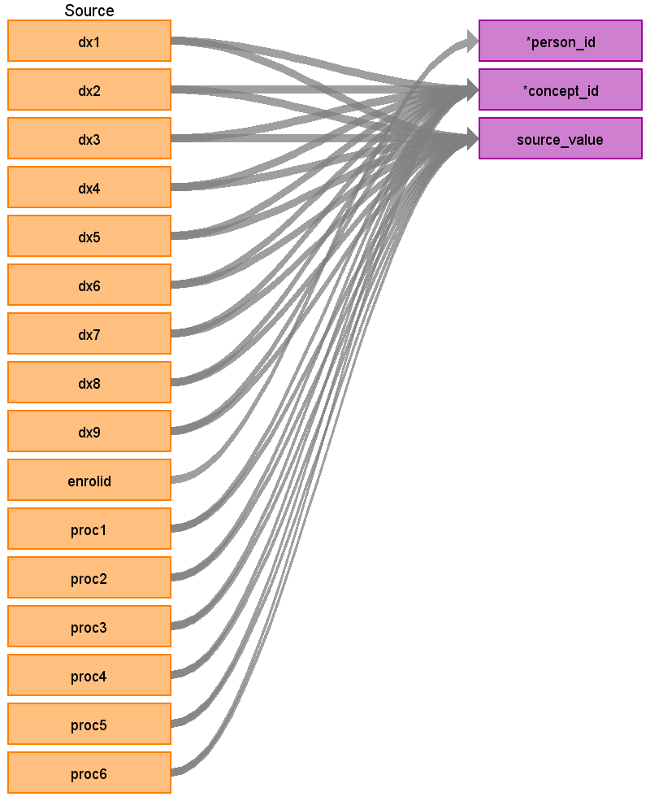

## Table name: **STEM_TABLE**

The STEM table is a staging area where source codes like ICD9 codes will first be mapped to concept_ids. The STEM table itself is an amalgamation of the OMOP event tables to facilitate record movement. This means that all fields present across the OMOP event tables are present in the STEM table. After a record is mapped and staged, the domain of the concept_id dictates which OMOP table (Condition_occurrence, Drug_exposure, Procedure_occurrence, Measurement, Observation, Device_exposure) the record will move to. Please see the STEM -> CDM mapping files for a description of which STEM fields move to which STEM tables.

### Key conventions

* VISIT_DETAIL must be built before STEM (refer to [VISIT_DETAIL file](https://ohdsi.github.io/ETL-LambdaBuilder/IBM_MDCD/MDCD_visit_detail.html))
  
* Referential integrity is maintained with VISIT_DETAIL.
For every record in STEM there should be 1 row record in VISIT_DETAIL (n:1 join).

* For every record in VISIT_DETAIL there may be 0 to n rows in STEM.

### Reading from **LONG_TERM_CARE**

| Destination Field | Source field | Logic | Comment field |
| --- | --- | --- | --- |
| DOMAIN_ID | - | This should be the domain_id of the standard concept in the CONCEPT_ID field. If a code is mapped to CONCEPT_ID 0, put the domain_id as Observation | - |
| PERSON_ID | ENROLID | - | - |
| VISIT_OCCURRENCE_ID | **VISIT_DETAIL** VISIT_OCCURRENCE_ID | - | - |
| VISIT_DETAIL_ID | **VISIT_DETAIL** VISIT_DETAIL_ID | - | - |
| PROVIDER_ID | **VISIT_DETAIL** PROVIDER_ID | - | - |
| ID | - | System generated. | - |
| CONCEPT_ID | DX1-4  PROC1 | Use the <a href="https://ohdsi.github.io/CommonDataModel/sqlScripts.html">Source-to-Standard Query</a>  When a code comes from a proc field: `WHERE SOURCE_VOCABULARY_ID IN (‘ICD9Proc’,’HCPCS’,’CPT4’,’ICD10PCS’)  AND TARGET_STANDARD_CONCEPT = 'S' AND TARGET_INVALID_REASON IS NULL AND TARGET_CONCEPT_CLASS_ID NOT IN (‘HCPCS Modifier’,’CPT4 Modifier’,’CPT4 Hierarchy’, ‘ICD10PCS Hierarchy’)`  From a code comes from a dx field:  If DXVER=9 use the filter: `WHERE SOURCE_VOCABULARY_ID IN (‘ICD9CM’) AND TARGET_STANDARD_CONCEPT = 'S' AND TARGET_INVALID_REASON IS NULL`  If DXVER=0 use the filter: `WHERE SOURCE_VOCABULARY_ID IN (’ICD10CM’) AND TARGET_STANDARD_CONCEPT = 'S' AND TARGET_INVALID_REASON IS NULL` See STEM Key Conventions if DXVER does not exist. |
| SOURCE_VALUE | DX1-4 PROC1 | - | - |
| TYPE_CONCEPT_ID | - | Set all to `32844` (Facility Claim) | |
| START_DATE | - | For conditions:  If a date is not defined, use VISIT_START_DATE.   For procedures:  If a date is not defined, use VISIT_END_DATE of the associated visit. | - |
| START_DATETIME | - | START_DATE + Midnight | - |
| END_DATE | - | NULL | - |
| END_DATETIME | - | NULL | - |
| VERBATIM_END_DATE | - | NULL | - |
| DAYS_SUPPLY | - | NULL | - |
| DOSE_UNIT_SOURCE_VALUE | - | NULL | - |
| LOT_NUMBER | - | NULL | - |
| MODIFIER_CONCEPT_ID | PROCMOD | Use the <a href="https://ohdsi.github.io/CommonDataModel/sqlScripts.html">Source-to-Standard Query</a>  When a code comes from a proc field: `WHERE SOURCE_VOCABULARY_ID IN (‘ICD9Proc’,’HCPCS’,’CPT4’,’ICD10PCS’)  AND TARGET_STANDARD_CONCEPT = 'S' AND TARGET_INVALID_REASON IS NULL AND TARGET_CONCEPT_CLASS_IN ('HCPCS Modifier','CPT4 Modifier')`   If PROCMOD is blank then set to 0 | - |
| MODIFIER_SOURCE_VALUE | - | NULL | - |
| OPERATOR_CONCEPT_ID | - | 0 | - |
| QUANTITY | QTY | NULL | - |
| RANGE_HIGH | - | NULL | - |
| RANGE_LOW | - | NULL | - |
| REFILLS | - | NULL | - |
| ROUTE_CONCEPT_ID | - | 0 | - |
| ROUTE_SOURCE_VALUE | - | NULL | - |
| SIG | - | NULL | "Sig" is short for the Latin, signetur, or "let it be labeled." |
| STOP_REASON | - | NULL | - |
| UNIQUE_DEVICE_ID | - | NULL | - |
| UNIT_CONCEPT_ID | - | 0 | - |
| UNIT_SOURCE_VALUE | - | NULL | - |
| VALUE_AS_CONCEPT_ID | - | 0 | - |
| VALUE_AS_NUMBER | - | NULL | - |
| VALUE_AS_STRING | - | NULL | - |
| VALUE_SOURCE_VALUE | - | NULL | - |
| ANATOMIC_SITE_CONCEPT_ID | - | 0 | - |
| DISEASE_STATUS_CONCEPT_ID | - | 0 | - |
| SPECIMEN_SOURCE_ID | - | NULL | - |
| ANATOMIC_SITE_SOURCE_VALUE | - | NULL | - |
| DISEASE_STATUS_SOURCE_VALUE | - | NULL | - |
| CONDITION_STATUS_CONCEPT_ID |  DX1-DX4 | If the record is generated based on DX1 set to `32902` else if the record is based on DX2-DX9 set to `32908`| - |
| CONDITION_STATUS_SOURCE_VALUE | Use the name of the DX field. For example, if the record is generated based on DX1 put 'DX1' here | - | - |
| EVENT_ID | - | NULL | - |
| EVENT_FIELD_CONCEPT_ID | - | 0 | - |
| VALUE_AS_DATETIME | - | NULL | - |
| QUALIFIER_CONCEPT_ID | - | 0 | - |
| QUALIFIER_SOURCE_VALUE | - | NULL | - |

## Change Log

### June 11, 2021
* Added QTY to the STEM table

### June 8, 2021
* Update type concept

* Added CONDITION_STATUS_CONCEPT_ID information