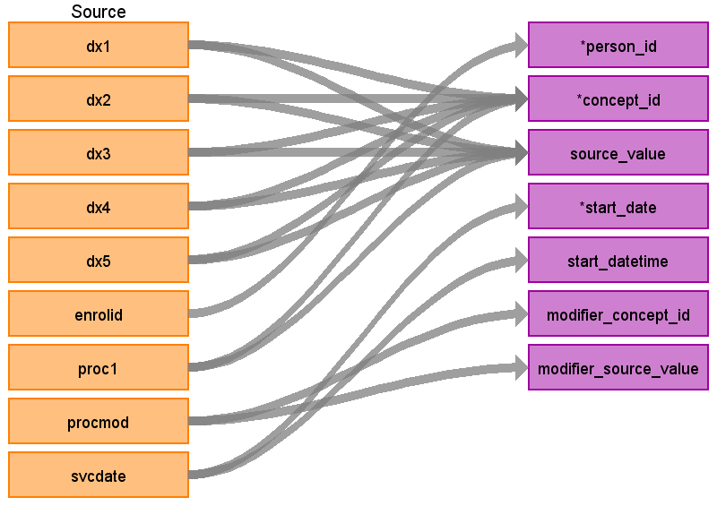

## Table name: **STEM_TABLE**

### Key conventions

* VISIT_DETAIL must be built before STEM (refer to [VISIT_DETAIL file](https://ohdsi.github.io/ETL-LambdaBuilder/IBM_MDCD/MDCD_visit_detail.html))
  
* Referential integrity is maintained with VISIT_DETAIL.
For every record in STEM there should be 1 row record in VISIT_DETAIL (n:1 join).

* For every record in VISIT_DETAIL there may be 0 to n rows in STEM.

### Revenue Code Mappings
Records will be written from the OUTPATIENT_SERVICES table mapping the field REVCODE to STEM.CONCEPT_ID. Please see the table below for how this logic will be handled.

**NOTE** the revenue codes are mapped to concepts with the vocabulary_id “Revenue Code”. All these concepts have the domain of “Revenue Code” as well. Since there is no revenue table, all records coming from the REVCODE field should go to the OBSERVATION table.

### Reading from **OUTPATIENT_SERVICES**

| Destination Field | Source field | Logic | Comment field |
| --- | --- | --- | --- |
| DOMAIN_ID | - | - | This should be the domain_id of the standard concept in the CONCEPT_ID field. If a code is mapped to CONCEPT_ID 0, put the domain_id as Observation |
| PERSON_ID | ENROLID | - | - |
| VISIT_OCCURRENCE_ID | **VISIT_DETAIL** VISIT_OCCURRENCE_ID  | Refer to logic in building VISIT_OCCURRENCE table for linking with VISIT_OCCURRENCE_ID. | - |
| VISIT_DETAIL_ID | **VISIT_DETAIL** VISIT_DETAIL_ID  | Refer to logic in building VISIT_DETAIL table for linking with VISIT_DETAIL_ID. | - |
| PROVIDER_ID | **VISIT_DETAIL** PROVIDER_ID  | - | -|
| ID | - | System generated. | - |
| CONCEPT_ID | DX1-5 PROC1 | Use the <a href="https://ohdsi.github.io/CommonDataModel/sqlScripts.html">Source-to-Standard Query</a>.    If DXVER does not have a value, review to the "Key Conventions" under the "STEM Key Conventions and Lookup Files" page.  If no map is made, assign CONCEPT_ID to 0 and DOMAIN_ID to OBSERVATION.  **[DX1-5]** If DXVER=9 use the filter:  `WHERE SOURCE_VOCABULARY_ID IN (‘ICD9CM’)` `AND TARGET_STANDARD_CONCEPT = 'S'` `AND TARGET_INVALID_REASON IS NULL`  If DXVER=0 use the filter: `WHERE SOURCE_VOCABULARY_ID IN (’ICD10CM’)` `AND TARGET_STANDARD_CONCEPT = 'S'` `AND TARGET_INVALID_REASON IS NULL`   **[PROC1]** When PROCTYP <> 0:   `WHERE SOURCE_VOCABULARY_ID IN ('ICD9Proc','HCPCS','CPT4',’ICD10PCS’)` `AND TARGET_STANDARD_CONCEPT = 'S'` `AND TARGET_INVALID_REASON IS NULL`   **[REVCODE]**   `WHERE SOURCE_VOCABULARY_ID IN ('Revenue Code’)` `AND TARGET_STANDARD_CONCEPT = 'S'` `AND TARGET_INVALID_REASON IS NULL`  | The concepts in the Revenue Code vocabulary all have the domain “Revenue Code”. These should go to the OBSERVATION table.	  |
| SOURCE_VALUE | DX1-5 PROC1 | - | - |
| SOURCE_CONCEPT_ID | DX1-5 PROC1 | Use the <a href="https://ohdsi.github.io/CommonDataModel/sqlScripts.html">Source-to-Source Query</a>.    If DXVER does not have a value, review to the "Key Conventions" under the "STEM Key Conventions and Lookup Files" page.  If no map is made, assign to 0.  **[DX1-5]** If DXVER=9 use the filter:  `WHERE SOURCE_VOCABULARY_ID IN (‘ICD9CM’)` `AND TARGET_VOCABULARY_ID IN (‘ICD9CM’)`  If DXVER=0 use the filter: `WHERE SOURCE_VOCABULARY_ID IN (’ICD10CM’)` `AND TARGET_VOCABULARY_ID IN (’ICD10CM’)`   **[PROC1]** When PROCTYP <> 0:   `WHERE SOURCE_VOCABULARY_ID IN ('ICD9Proc','HCPCS','CPT4',’ICD10PCS’)` `AND TARGET_VOCABULARY_ID IN ('ICD9Proc','HCPCS','CPT4',’ICD10PCS’)`| - |
| TYPE_CONCEPT_ID | - | Set all to `32860` (Outpatient claim detail)| - |
| START_DATE | **VISIT_DETAIL** VISIT_DETAIL_START_DATE | - | - |
| START_DATETIME | - | START_DATE + midnight | - |
| END_DATE | - | NULL | - |
| END_DATETIME | - | NULL | - |
| VERBATIM_END_DATE | - | NULL | - |
| DAYS_SUPPLY | - | NULL | - |
| DOSE_UNIT_SOURCE_VALUE | - | NULL | - |
| LOT_NUMBER | - | NULL | - |
| MODIFIER_CONCEPT_ID | PROCMOD | Use the <a href="https://ohdsi.github.io/CommonDataModel/sqlScripts.html">Source-to-Standard Query</a>.  `WHERE SOURCE_CONCEPT_CLASS_ID IN ('CPT4 Modifier')`  `AND TARGET_CONCEPT_CLASS_ID IN ('CPT4 Modifier')` | If PROCMOD is blank then leave this field blank as well |
| MODIFIER_SOURCE_VALUE | PROCMOD | - | - |
| OPERATOR_CONCEPT_ID | - | 0 | - |
| QUANTITY | QTY | NULL | - |
| RANGE_HIGH | - | NULL | - |
| RANGE_LOW | - | NULL | - |
| REFILLS | - | NULL | - |
| ROUTE_CONCEPT_ID | - | 0 | - |
| ROUTE_SOURCE_VALUE | - | NULL | - |
| SIG | - | NULL | "Sig" is short for the Latin, signetur, or "let it be labeled." |
| STOP_REASON | - | NULL | - |
| UNIQUE_DEVICE_ID | - | NULL | - |
| UNIT_CONCEPT_ID | - | 0 | - |
| UNIT_SOURCE_VALUE | - | NULL | - |
| VALUE_AS_CONCEPT_ID | - | 0 | - |
| VALUE_AS_NUMBER | - | NULL | - |
| VALUE_AS_STRING | - | NULL | - |
| VALUE_SOURCE_VALUE | - | NULL | - |
| ANATOMIC_SITE_CONCEPT_ID | - | 0 | - |
| DISEASE_STATUS_CONCEPT_ID | - | 0 | - |
| SPECIMEN_SOURCE_ID | - | NULL | - |
| ANATOMIC_SITE_SOURCE_VALUE | - | NULL | - |
| DISEASE STATUS_SOURCE_VALUE | - | NULL | - |
| CONDITION_STATUS_CONCEPT_ID | DX1-DX9 | If the record is generated based on DX1 set to `32902` else if the record is based on DX2-DX9 set to `32908` | - | - |
| CONDITION_STATUS_SOURCE_VALUE | Use the name of the DX field. For example, if the record is generated based on DX1 put 'DX1' here | NULL | - |
| EVENT_ID | - | NULL | - |
| EVENT_FIELD_CONCEPT_ID | - | 0 | - |
| VALUE_AS_DATETIME | - | NULL | - |
| QUALIFIER_CONCEPT_ID | - | 0 | - |
| QUALIFIER_SOURCE_VALUE | - | NULL | - |

## Change Log

### June 11, 2021
* Added QTY to table

### June 9, 2021
* Update type concept

* Added CONDITION_STATUS_CONCEPT_ID information

* Added logic to map revenue codes