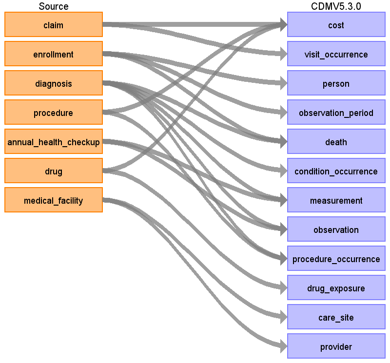

# Japan Medical Data Center (JMDC) ETL Documentation

This document reflects the requirements, assumptions, business rules and transformations for the Japan Medical Data Center (JMDC) implementation of the Common Data Model Version 5.3.1 (CDM) as implemented by Johnson & Johnson. This document assumes JMDC follows the structure and conventions used in 2020 onwards, which may be a different structure than the one used previously.

The purpose of this document is to describe the ETL mapping of the licensed data from JMDC into the OMOP Common Data Model. 

Japanese universal multi-payer health-care system covering virtually all citizens was started in 1961.  Currently, there are more than 3000 insurers in Japan which may be divided into several main groups.  The government‐managed health insurance (kyo-kai-kenpo) consisting of a single (largest) insurer (central government) covers about 35 million people who are workers in small and medium-size enterprises and their dependents.   Area-basis public health insurances (koku-min-ken-ko-ho-ken) run by 1,881 municipal governments (e.g., cities, towns and villages) cover 38 million people.  Eighty five cooperative insurances (kyo-sai-kumi-a-i) cover 9 million who are mainly civil servants and their dependents.  A total of 1,431 Society-Managed Health Insurances (kumi-a-i-sho-kan-ken-ko-ho-ken) cover 29 million who are workers in relatively large enterprises and their dependents.  A new scheme starting from 2008 called as “Medical Care System for People Aged 75 and over” run by 47 prefectures covers 15 million old people aged 75 or older.

JMDC database consists of data from 60 Society-Managed Health Insurances covering workers aged 18 to 65 and their dependents (children younger than 18 years old and elderly people older than 65 years old).  The old people (particularly those aged 66 or older) are less representative as compared with whole population in the nation.  When estimated among the people who are younger than 66 years old, the proportion of children younger than 18 years old in JMDC is approximately the same as the proportion in the whole nation.  JMDC data includes data on membership status of the insured people and claims data provided by insurers under contract.  Claims data are derived from monthly claims issued by clinics, hospitals and community pharmacies.  The number of claims issued and added to JMDC database is about 800,000 per month.  The size of JMDC population is 1.9 million, 1.5% of about 120 million people in the whole nation.  A total of 60 insurances may be classified by data period as follows:

|data period|      N of insurances|       Start year|
|---|---|---|
|10 years| 	4	|2005|
|7 years|	5	|2008|
|6 years|	16	|2009|
|5 years|	7	|2010|
|4 years|	11	|2009 or 2011|
|3 years|	7	|2009 or 2012|
|2 years|	4	|2009 to 2013|
|1 year	|5	|2009 (one year)|

This document is based on the OMOP ETL Specifications. General information that is covered by the OMOP ETL Specification will not be covered in this document, but a detailed discussion of the JMDC specific aspects of mapping and converting data to the standard CDM is provided. The intended audience for this document will include both researchers that want to use the experience and learning in order to incorporate them into their own CDM construction.

The figure below represents the general approach to mapping the source data tables that are available in JMDC to the CDM data schema.  The orange boxes represent the input tables in JMDC and the blue boxes represent the resulting CDM tables.

 