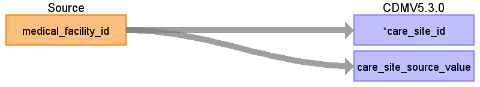

# CDM Table name: CARE_SITE

## Reading from JMDC.Medical_Facility

| Destination   Field         | Source   Field      | Logic             | Comment Field |
|-----------------------------|---------------------|-------------------|---------------|
| care_site_id                | medical_facility_id | Remove ‘F’ prefix |               |
| care_site_source_value      | medical_facility_id |                   |               |
| care_site_name              |                     |                   |               |
| place_of_service_concept_id |                     |                   |               |
| location_id                 |                     |                   |               |