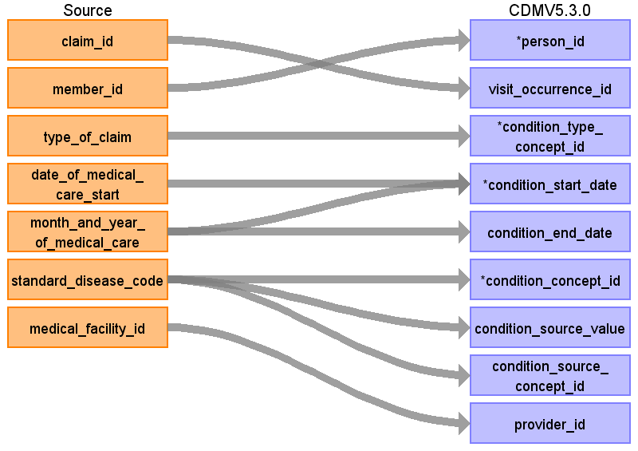

# CDM Table name: CONDITION_OCCURRENCE

Two types of conditions will be captured in JMDC: (1) ICD-10 diagnoses with start dates of the associated visit (see visit_occurrence section for how these are determined), and (2) ICD-10 diagnoses with start dates of the “date_of_medical_care_start”.  This second type of condition record can be considered to be a ‘condition era’ type record, as the condition start date will in some cases be the actual start of the condition as opposed to a service date related to the condition.  See mapping table below for specific logic.

This condition-era type record is possible because in Japanese claims, the “date_of_medical_care_start” is specified for almost all conditions and is the first day when that hospital/clinic started to provide health-care service for that condition. This date can be very old (e.g., decades ago).

The “date_of_medical_care_start” is often the date of true occurrence of the condition though the date can be later than the true occurrence date as a new start date will be created if the patient is referred to a different clinic/hospital.  Even in the same clinic/hospital, a new start date may be given to the same condition of the same patient because of several reasons.  For instance, if the patient had an acute condition again after the recovery from the previous same acute condition, a new start date may be created as two episodes were judged independent.  Even for the chronic condition, a new start date may be created if the service has not been given for certain period (e.g., more than several months).  The latter may occur according to the policy of handling patient’s conditions which may differ between clinics/hospitals.  A new start date may also be created from an administrative view (e.g., the service fee for a new condition is a little higher than that for an old condition).

## Reading from JMDC.Diagnosis

When an ICD10 code in the diagnosis table maps to a concept in the Condition domain a record should be created in the condition_occurrence table, except when the field ‘Suspicion flag’ equals 1.

 

|     Destination Field    |     Source   Field    |     Logic    |     Comment   Field    |
|-|-|-|-|
|     condition_occurrence_id    |          |          |          |
|     person_id    |     member_id    |     Remove 'M' prefix    |          |
|     visit_occurrence_id    |     claim_id    |     Remove ‘C’ prefix    |          |
|     condition_type_concept_id    |     type_of_claim    |     Outpatient: **32859** (Outpatient claim)    Inpatient or DPC: **32853** (Inpatient claim)       condition-era type record 38000246 (Condition era - 0 days   persistence window)    |          |
|     condition_start_date    |     month_and_year_of_medical_care     date_of_medical_care_start    |     Use start of visit.           Create additional condition occurrences (condition 'eras')   if date_of_medical_care_start is earlier than the start of month_and_year   of_medical_care. If date_of_medical_care_start precedes the   observation_period_start date, set start to observation_period_start_date.    |          |
|     condition_end_date    |     month_and_year_of_medical_care    |     For condition era type records, the end date should be the   end of the last diagnosis for that patient that has the specific   date_of_medical_care_start, medical_facility_id, and standard_disease_code.           For all other records set to null.    |          |
|     condition_concept_id    |     standard_disease_code    |          |     Lookup icd10_level4_code in diagnosis_master table, and   use vocab to map to standard concept. Remove '-' prior to mapping (e.g.   'I50-' should map to 'I50'), and ignore period (e.g. 'I500' should map to   'I50.0')    |
|     condition_source_value    |     standard_disease_code    |          |     Lookup icd10_level4_code in diagnosis_master table |
|     condition_source_concept_id    |     standard_disease_code    |          |     Lookup icd10_level4_code in diagnosis_master table, and   use vocab to map to source concept. Remove '-' prior to mapping (e.g. 'I50-'   should map to 'I50'), and ignore period (e.g. 'I500' should map to 'I50.0')     Lookup icd10_level4_code    |
|     provider_id    |     medical_facility_id    |          |     Use dummy provider corresponding to the institute    |
|     condition_start_datetime    |          |          |          |
|     condition_end_datetime    |          |          |          |
|     stop_reason    |          |          |          |
|     visit_detail_id    |          |          |          |
|     condition_status_source_value    |  main_disease_flag    |     |          |
|     condition_status_concept_id    |  main_disease_flag  | If main_disease_flag = 1 set to `32902` (primary condition) , else set to `32908` (secondary condition)        |          |
|     preceding_visit_occurrence_id    |          |          |          |

## Reading from Annual_Health_Checkup

The **annual_health_checkup** table is a wide table with one row per date and many columns representing individual values like BMI, fasting blood sugar, and sleep quality. These columns are mapped to standard concepts as detailed in the mapping file [here](https://github.com/OHDSI/ETL-LambdaBuilder/blob/master/docs/JMDC/Vocab%20Updates/Annual_Health_Checkup_Mapping.xlsx). Some variable-value pairs are mapped to condition concept

|     Destination Field    |     Source   Field    |     Logic    |     Comment   Field    |
|-|-|-|-|
|     condition_occurrence_id    |          |          |          |
|     person_id    |     member_id    |     Remove 'M' prefix    |          |
|     visit_occurrence_id    |     claim_id    |     Remove ‘C’ prefix    |          |
|     condition_type_concept_id    |     type_of_claim    |     32836 (EHR physical examination)   |          |
|     condition_start_date    |     date_of_health_checkup    |        |          |
|     condition_end_date    |     NULL    |        |          |
|     condition_concept_id    |     mapped concept    |          |     See the mappings for these columns in the manual mapping file   |
|     condition_source_value    |     column name from annual_health_checkup    |          |      |
|     condition_source_concept_id    |   0     |          |        |
|     provider_id    |        |          |   |
|     condition_start_datetime    |          |          |          |
|     condition_end_datetime    |          |          |          |
|     stop_reason    |          |          |          |
|     visit_detail_id    |          |          |          |
|     condition_status_source_value    |      |     |          |
|     condition_status_concept_id    |    |        |          |
|     preceding_visit_occurrence_id    |   

## Change Log

### April 6, 2022
- Added logic to map CONDITION_STATUS_CONCEPT_ID from **main_disease_flag** in diagnosis

### Aug 10, 2023
- Added reading from Annual_Health_Checkup