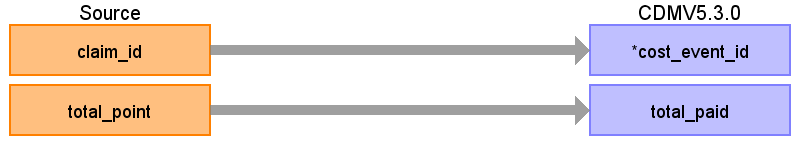
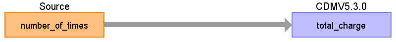
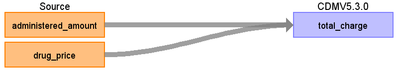

# CDM Table name: COST

## Reading from JMDC.Claim

|     Destination Field    |     Source   Field    |     Logic    |     Comment    |
|-|-|-|-|
|     cost_id    |          |          |     Auto generate    |
|     cost_event_id    |     claim_id    |          |     From claim: use claim_id, remove ‘C’ prefix (=   visit_occurrence_id).     |
|     cost_domain_id    |          |          |     Visit    |
|     cost_type_concept_id    |          |          |     5031 (Amount paid by the patient or reimbursed by the   payer)    |
|     currency_concept_id    |          |          |     44818592 (Japanese yen)    |
|     total_charge    |          |          |          |
|     total_cost    |          |          |          |
|     total_paid    |     total_point    |          |     Amount = point * 10 Yen    |
|     paid_by_payer    |          |          |          |
|     paid_by_patient    |          |          |          |
|     paid_patient_copay    |          |          |          |
|     paid_patient_coinsurance    |          |          |          |
|     paid_patient_deductible    |          |          |          |
|     paid_by_primary    |          |          |          |
|     paid_ingredient_cost    |          |          |          |
|     paid_dispensing_fee    |          |          |          |
|     payer_plan_period_id    |          |          |          |
|     amount_allowed    |          |          |          |
|     revenue_code_concept_id    |          |          |          |
|     revenue_code_source_value    |          |          |          |
|     drg_concept_id    |          |          |          |
|     drg_source_value    |          |          |          |

## Reading from JMDC.Procedure

|     Destination Field    |     Source   Field    |     Logic    |     Comment    |
|-|-|-|-|
|     cost_id    |          |          |     Auto generate    |
|     cost_event_id    |          |          |     From procedure: use procedure_occurrence_id.    |
|     cost_domain_id    |          |          |     Procedure    |
|     cost_type_concept_id    |          |          |     5032 (Amount charged to the patient or the payer by the   provider, list price)    |
|     currency_concept_id    |          |          |     44818592 (Japanese yen)    |
|     total_charge    |     number_of_times    |          |     total_charge = number_of_times * 10 *   procedure_standard_point. (Join to procedure_master table on both   standardized_procedure_id and standardized_procedure_version)    |
|     total_cost    |          |          |          |
|     total_paid    |          |          |     Amount = point * 10 Yen    |
|     paid_by_payer    |          |          |          |
|     paid_by_patient    |          |          |          |
|     paid_patient_copay    |          |          |          |
|     paid_patient_coinsurance    |          |          |          |
|     paid_patient_deductible    |          |          |          |
|     paid_by_primary    |          |          |          |
|     paid_ingredient_cost    |          |          |          |
|     paid_dispensing_fee    |          |          |          |
|     payer_plan_period_id    |          |          |          |
|     amount_allowed    |          |          |          |
|     revenue_code_concept_id    |          |          |          |
|     revenue_code_source_value    |          |          |          |
|     drg_concept_id    |          |          |          |
|     drg_source_value    |          |          |          |

## Reading from JMDC.Drug

|     Destination Field    |     Source   Field    |     Logic    |     Comment    |
|-|-|-|-|
|     cost_id    |          |          |     Auto generate    |
|     cost_event_id    |          |          |     From drug: use drug_exposure_id.    |
|     cost_domain_id    |          |          |     Drug    |
|     cost_type_concept_id    |          |          |     5032 (Amount charged to the patient or the payer by the   provider, list price)    |
|     currency_concept_id    |          |          |     44818592 (Japanese yen)    |
|     total_charge    |     drug_price     administered_amount    |          |     total_charge = drug_price * administered_amount    |
|     total_cost    |          |          |          |
|     total_paid    |          |          |     Amount = point * 10 Yen    |
|     paid_by_payer    |          |          |          |
|     paid_by_patient    |          |          |          |
|     paid_patient_copay    |          |          |          |
|     paid_patient_coinsurance    |          |          |          |
|     paid_patient_deductible    |          |          |          |
|     paid_by_primary    |          |          |          |
|     paid_ingredient_cost    |          |          |          |
|     paid_dispensing_fee    |          |          |          |
|     payer_plan_period_id    |          |          |          |
|     amount_allowed    |          |          |          |
|     revenue_code_concept_id    |          |          |          |
|     revenue_code_source_value    |          |          |          |
|     drg_concept_id    |          |          |          |
|     drg_source_value    |          |          |          |