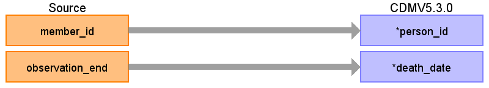
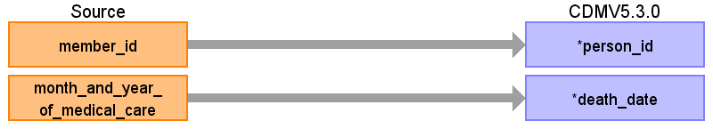

# CDM Table name: DEATH

There are two sources of death status: enrollment and the diagnosis table. Death is coded as ‘outcome = 3 when type_of_claim !='DPC' or outcome in (6,7) when type_of_claim ='DPC'’ in the diagnosis table, and as ‘withdrawal_death_flag = true’ in the enrollment table. To make sure we have at most one death per person, when there are multiple death records per person, we will take the latest from diagnose if available, else the date from enrollment. The reason for this is that the date from diagnosis might be specific to date, whereas the information from enrollment status is always at the month level and therefore assumed to be at the end of the month.

## Reading from JMDC.Enrollment

|     Destination Field    |     Source   Field    |     Logic    |     Comment    |
|-|-|-|-|
|     person_id    |     member_id    |     Remove 'M' prefix    |          |
|     death_date    |     observation_end    |          |          |
|     death_datetime    |          |          |          |
|     death_type_concept_id    |          |          |     From enrollment: `32815` (Death certificate) From diagnosis: `32812` (Claim discharge record)    |
|     cause_concept_id    |          |          |          |
|     cause_source_value    |          |          |          |
|     cause_source_concept_id    |          |          |          |

## Reading from JMDC.Diagnosis

|     Destination Field    |     Source   Field    |     Logic    |     Comment    |
|-|-|-|-|
|     person_id    |     member_id    |     Remove 'M' prefix    |          |
|     death_date    |     month_and_year_of_medical_care    |     Use end of visit/claim date    |          |
|     death_datetime    |          |          |          |
|     death_type_concept_id    |          |          |     From enrollment: `32815` (Death certificate) From diagnosis: `32812` (Claim discharge record)    |
|     cause_concept_id    |          |          |          |
|     cause_source_value    |          |          |          |
|     cause_source_concept_id    |          |          |          |

## Change Log

### July 27, 2023
- Changed Death status logic: In Diagnosis table it's encoded not just as ‘outcome = 3’, but ‘outcome = 3 when type_of_claim !='DPC' or ‘outcome in (6,7) when type_of_claim ='DPC'’