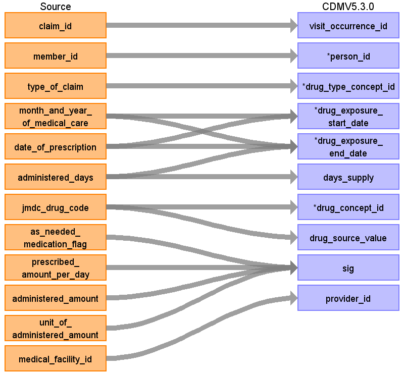

# CDM Table name: DRUG_EXPOSURE

## Reading from JMDC.Drug

|     Destination Field    |     Source   Field    |     Logic    |     Comment    |
|-|-|-|-|
|     drug_exposure_id    |          |          |          |
|     visit_occurrence_id    |     claim_id    |     Remove ‘C’ prefix    |          |
|     person_id    |     member_id    |     Remove 'M' prefix    |          |
|     drug_type_concept_id    |     type_of_claim    |     Pharmacy, Outpatient: 32869 (Pharmacy claim)  Inpatient or DPC: 32818   (EHR administration record)    |          |
|     drug_exposure_start_date    |     date_of_prescription     month_and_year_of_medical_care    |     Use date of prescription if available, otherwise set to   start of visit.    |          |
|     drug_exposure_end_date    |     month_and_year_of_medical_care     date_of_prescription     administered_days    |     Drug_exposure_end_date = drug_exposure_start_date +   min(administered_days,180)    |          |
|     days_supply    |     administered_days    |     If value > 180, set to 180 (occurs in 74 prescriptions)    |          |
|     drug_concept_id    |     jmdc_drug_code    | Map to standard concepts using the <a href="https://ohdsi.github.io/CommonDataModel/sqlScripts.html">Source-to-Standard Query</a> where source_vocabulary_id = 'JMDC'.          |         |
|     drug_source_value    |     jmdc_drug_code    |          |          |
|     sig    |     as_needed_medication_flag     prescribed_amount_per_day     administered_amount     unit_of_administered_amount    |     <prescribed_amount_per_day>   <administered_amount> per day (<as_needed_medication_flag     >?as needed, <administered_amount> <   unit_of_administered_amount> total                            |     Combine the four fields to create a sig string:          |
|     provider_id    |     medical_facility_id    |          |     Use the dummy providers we created per institution.    |
|     quantity    |          |          |          |
|     dose_unit_source_value    |          |          |          |
|     drug_source_concept_id    |   jmdc_drug_code       |    Use the <a href="https://ohdsi.github.io/CommonDataModel/sqlScripts.html">Source-to-Source Query</a> where source_vocabulary_id = 'JMDC'      |          |
|     drug_exposure_end_datetime    |          |          |          |
|     verbatim_end_date    |          |          |          |
|     stop_reason    |          |          |          |
|     refills    |          |          |          |
|     drug_exposure_start_datetime    |          |          |          |
|     route_concept_id    |          |          |          |
|     lot_number    |          |          |          |
|     visit_detail_id    |          |          |          |
|     route_source_value    |          |          |          |

## Change Log

### April 6, 2022
- The drug mapping table has now been integrated in the Vocabulary (before it was a separate mapping file).The codes in the jmdc_drug_code field can be linked to the concept_code of the concepts in the 'JMDC' vocabulary in the concept table. 