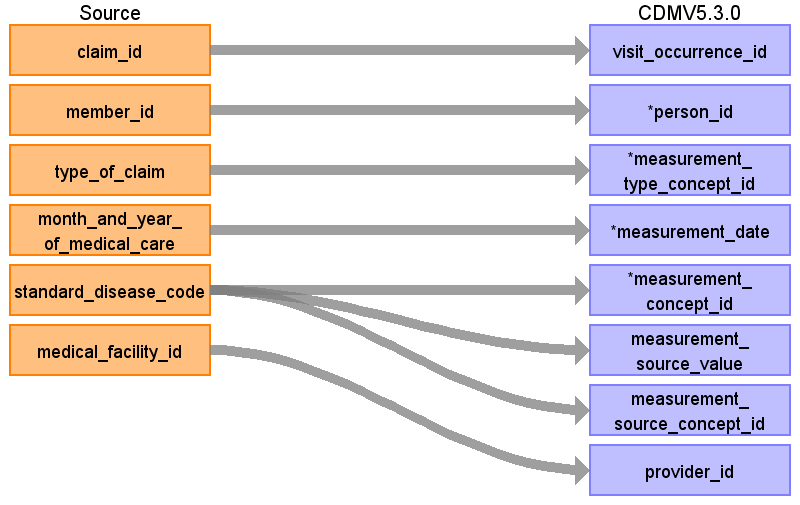
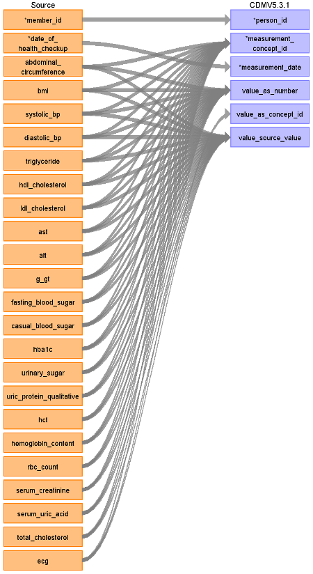

# CDM Table name: MEASUREMENT

When an ICD10 code in the **diagnosis** table maps to a concept in the Measurement domain a record should be created in the measurement table. Measurements are also found in the **annual_health_checkup** table. These values are mapped manually using the file located [here](). 

## Reading from JMDC.Diagnosis

|     Destination Field    |     Source   Field    |     Logic    |     Comment    |
|-|-|-|-|
|     measurement_id    |          |          |          |
|     visit_occurrence_id    |     claim_id    |     Remove ‘C’ prefix    |          |
|     person_id    |     member_id    |     Remove 'M' prefix    |          |
|     measurement_type_concept_id    |     type_of_claim    |     Outpatient: **32859** (Outpatient claim)    InPatient or DPC: **32853** (Inpatient claim)     |     Coming from the **annual_health_checkup** table set to 32836 (EHR physical examination)    |
|     measurement_date    |     month_and_year_of_medical_care    |     Use derived visit_start_date    |          |
|     measurement_concept_id    |     standard_disease_code    |          |     Lookup icd10_level4_code in diagnosis_master table, and   use vocab to map to standard concept.    |
|     measurement_source_value    |     standard_disease_code    |          |     Lookup icd10_level4_code in diagnosis_master table    |
|     measurement_source_concept_id    |     standard_disease_code    |          |     Lookup icd10_level4_code in diagnosis_master table, and   use vocab to map to source concept.    |
|     provider_id    |     medical_facility_id    |     Use dummy provider corresponding to the institute    |     Use dummy provider corresponding to the institute    |
|     measurement_datetime    |          |          |          |
|     operator_concept_id    |          |          |          |
|     value_as_number    |          |          |          |
|     value_as_concept_id    |          |          |     From Health checkups: from mapping table. Else 4181412   (Present)    |
|     unit_concept_id    |          |     Set UNIT_CONCEPT_ID = NULL when the source unit value is NULL; Set UNIT_CONCEPT_ID = 0 when source unit value is not NULL but doesn't have a mapping     |     From mapping table    |
|     range_low    |          |          |     From Health checkups: take from reference file    |
|     range_high    |          |          |     From Health checkups: take from reference file    |
|     visit_detail_id    |          |          |          |
|     unit_source_value    |          |          |     From mapping table    |

## Reading from Annual_Health_Checkup

The **annual_health_checkup** table is a wide table with one row per date and many columns representing individual values like BMI, fasting blood sugar, and sleep quality. These columns are mapped to standard concepts as detailed in the mapping file [here](https://github.com/OHDSI/ETL-LambdaBuilder/blob/master/docs/JMDC/Vocab%20Updates/Annual_Health_Checkup_Mapping.xlsx). Some columns have numeric values which will be stored in value as number and some columns have categorical values which will be stored in value_as_concept_id. 

|     Destination Field    |     Source   Field    |     Logic    |     Comment    |
|-|-|-|-|
|     measurement_id    |          |          |          |
|     visit_occurrence_id    |     claim_id    |     Remove ‘C’ prefix    |          |
|     person_id    |     member_id    |     Remove 'M' prefix    |          |
|     measurement_type_concept_id    |     type_of_claim    |      |     Coming from the **annual_health_checkup** table set to 32836 (EHR physical examination)    |
|     measurement_date    |     date_of_health_checkup    |         |          |
|     measurement_concept_id    | bmi  abdominal_circumference systolic_bp diastolic_bp triglyceride hdl_cholesterol ldl_cholesterol ast alt g_gt fasting_blood_sugar casual_blood_sugar hba1c urinary_sugar uric_protein_qualitative hct hemoglobin_content rbc_count serum_creatinine serum_uric_acid total_cholesterol ecg    |          |     See the mappings for these columns in the manual mapping file [here](https://github.com/OHDSI/ETL-LambdaBuilder/blob/master/docs/JMDC/Vocab%20Updates/Annual_Health_Checkup_Mapping.xlsx)   |
|     measurement_source_value    |     column name from **annual_health_checkup**    |          |     Lookup icd10_level4_code in diagnosis_master table    |
|     measurement_source_concept_id    |       |          |       |
|     provider_id    |         |         |         |
|     measurement_datetime    |          |          |          |
|     operator_concept_id    |          |          |          |
|     value_as_number    |          | Put the numeric values from the columns here         |          |
|     value_as_concept_id    |    See mapping table for mapping the categorical answers    |          |         |
|     unit_concept_id    |          |     Set UNIT_CONCEPT_ID = NULL when the source unit value is NULL; Set UNIT_CONCEPT_ID = 0 when source unit value is not NULL but doesn't have a mapping     |     From mapping table    |
|     range_low    |          |          |         |
|     range_high    |          |          |        |
|     visit_detail_id    |          |          |          |
|     unit_source_value    |          |          |     From mapping table    |

## Change Log

### April 6, 2022
- Added more text around how to handle records from the annual_health_checkup table.
