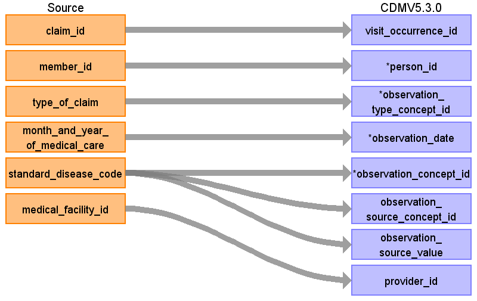
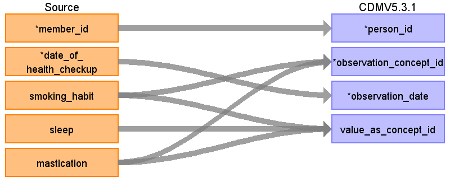

# CDM Table name: OBSERVATION

When an ICD10 code in the diagnosis table maps to a concept in the Observation domain a record should be created in the observation table.

## Reading from JMDC.Diagnosis

|     Destination Field    |     Source   Field    |     Logic    |     Comment    |
|-|-|-|-|
|     observation_id    |          |          |          |
|     visit_occurrence_id    |     claim_id    |     Remove ‘C’ prefix    |          |
|     person_id    |     member_id    |     Remove 'M' prefix    |          |
|     observation_type_concept_id    |     type_of_claim    |     Outpatient: **32859** (Outpatient claim)    InPatient or DPC: **32853** (Inpatient claim)     |          |
|     observation_date    |     month_and_year_of_medical_care    |     Use visit_start_date    |          |
|     observation_concept_id    |     standard_disease_code    |          |     Lookup icd10_level4_code in diagnosis_master table, and   use vocab to map to standard concept. Remove '-' prior to mapping (e.g.   'I50-' should map to 'I50'), and ignore period (e.g. 'I500' should map to   'I50.0')    |
|     observation_source_concept_id    |     standard_disease_code    |          |     Lookup icd10_level4_code in diagnosis_master table, and   use vocab to map to source concept. Remove '-' prior to mapping (e.g. 'I50-'   should map to 'I50'), and ignore period (e.g. 'I500' should map to 'I50.0')    |
|     observation_source_value    |     standard_disease_code    |          |     Lookup icd10_level4_code in diagnosis_master table    |
|     provider_id    |     medical_facility_id    |          |     Use dummy provider corresponding to the institute    |
|     observation_datetime    |          |          |          |
|     value_as_number    |          |          |          |
|     value_as_string    |          |          |          |
|     value_as_concept_id    |          |          |     TARGET_VALUE_AS_CONCEPT_ID from the Source_to_Standard Query (resulting from  **'Maps to value'** relationsip);  See SOURCE_CONCEPT_ID field logic of how to define SOURCE_CONCEPT_ID being mapped|
|     qualifier_concept_id    |          |          |          |
|     unit_concept_id    |          |          |          |
|     visit_detail_id    |          |          |          |
|     unit_source_value    |          |          |          |
|     qualifier_source_value    |          |          |          |

## Reading from JMDC.Annual_Health_Checkup

The **annual_health_checkup** table is a wide table with one row per date and many columns representing individual values like BMI, fasting blood sugar, and sleep quality. These columns are mapped to standard concepts as detailed in the mapping file [here](https://github.com/OHDSI/ETL-LambdaBuilder/blob/master/docs/JMDC/Vocab%20Updates/Annual_Health_Checkup_Mapping.xlsx). Some columns have numeric values which will be stored in value as number and some columns have categorical values which will be stored in value_as_concept_id. 

|     Destination Field    |     Source   Field    |     Logic    |     Comment    |
|-|-|-|-|
|     observation_id    |          |          |          |
|     visit_occurrence_id    |          |          |          |
|     person_id    |     member_id    |     Remove 'M' prefix    |          |
|     observation_type_concept_id    |          |          Coming from the **annual_health_checkup** table set to 32836 (EHR physical examination)         |
|     observation_date    |     date_of_health_checkup    |          |          |
|     observation_concept_id    |    smoking_habit mastication sleep ecg      |          |  See the mapping file [here]([Vocab Updates/Annual_Health_Checkup_Mapping.xlsx](https://github.com/OHDSI/ETL-LambdaBuilder/blob/master/docs/JMDC/Vocab%20Updates/Annual_Health_Checkup_Mapping.xlsx)) for how to map these columns to standard concepts        |
|     observation_source_concept_id    |          |       Set to 0     |
|     observation_source_value    |          |          |          |
|     provider_id    |          |          |          |
|     observation_datetime    |          |          |          |
|     value_as_number    |   Put the numeric value of the column here.        |          |          |
|     value_as_string    |          |          |          |
|     value_as_concept_id    |        | If the source categorical value is null, set  value_as_concept_id  to NULL  | See the mapping file [here](https://github.com/OHDSI/ETL-LambdaBuilder/blob/master/docs/JMDC/Vocab%20Updates/Annual_Health_Checkup_Mapping.xlsx) for how to map the categorical values to concept ids.        |
|     qualifier_concept_id    |          |          |          |
|     unit_concept_id    |          |   See the mapping file [here](https://github.com/OHDSI/ETL-LambdaBuilder/blob/master/docs/JMDC/Vocab%20Updates/Annual_Health_Checkup_Mapping.xlsx) for what the correct unit_concept_id should be.   |          |
|     visit_detail_id    |          |          |          |
|     unit_source_value    |          |          |          |
|     qualifier_source_value    |          |          |          |

## Change Log

### October 16, 2024
- Added ecg mappings
### April 6, 2022
- Added more text around how to handle records from the annual_health_checkup table.
### July 30, 2023
- fixed Maps to value logic