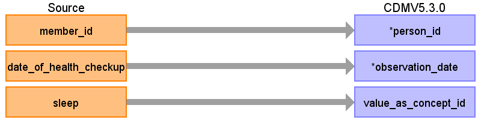

# CDM Table name: OBSERVATION

When an ICD10 code in the diagnosis table maps to a concept in the Observation domain a record should be created in the observation table.

## Reading from JMDC.Diagnosis

|     Destination Field    |     Source   Field    |     Logic    |     Comment    |
|-|-|-|-|
|     observation_id    |          |          |          |
|     visit_occurrence_id    |     claim_id    |     Remove ‘C’ prefix    |          |
|     person_id    |     member_id    |     Remove 'M' prefix    |          |
|     observation_type_concept_id    |     type_of_claim    |     Outpatient: **32859** (Outpatient claim)    InPatient or DPC: **32853** (Inpatient claim)     |          |
|     observation_date    |     month_and_year_of_medical_care    |     Use visit_start_date    |          |
|     observation_concept_id    |     standard_disease_code    |          |     Lookup icd10_level4_code in diagnosis_master table, and   use vocab to map to standard concept. Remove '-' prior to mapping (e.g.   'I50-' should map to 'I50'), and ignore period (e.g. 'I500' should map to   'I50.0')    |
|     observation_source_concept_id    |     standard_disease_code    |          |     Lookup icd10_level4_code in diagnosis_master table, and   use vocab to map to source concept. Remove '-' prior to mapping (e.g. 'I50-'   should map to 'I50'), and ignore period (e.g. 'I500' should map to 'I50.0')    |
|     observation_source_value    |     standard_disease_code    |          |     Lookup icd10_level4_code in diagnosis_master table    |
|     provider_id    |     medical_facility_id    |          |     Use dummy provider corresponding to the institute    |
|     observation_datetime    |          |          |          |
|     value_as_number    |          |          |          |
|     value_as_string    |          |          |          |
|     value_as_concept_id    |          |          |     From diagnoses:value from “Maps to value” relationship or   else 4181412 (present)    |
|     qualifier_concept_id    |          |          |          |
|     unit_concept_id    |          |          |          |
|     visit_detail_id    |          |          |          |
|     unit_source_value    |          |          |          |
|     qualifier_source_value    |          |          |          |

## Reading from JMDC.Annual_Health_Checkup

Information in the sleeping field should go to the observation table, as well as information in fields that are not mapped to specific concepts.

|     Destination Field    |     Source   Field    |     Logic    |     Comment    |
|-|-|-|-|
|     observation_id    |          |          |          |
|     visit_occurrence_id    |          |          |          |
|     person_id    |     member_id    |     Remove 'M' prefix    |          |
|     observation_type_concept_id    |          |          |          |
|     observation_date    |     date_of_health_checkup    |          |          |
|     observation_concept_id    |          |          |          |
|     observation_source_concept_id    |          |          |          |
|     observation_source_value    |          |          |          |
|     provider_id    |          |          |          |
|     observation_datetime    |          |          |          |
|     value_as_number    |          |          |          |
|     value_as_string    |          |          |          |
|     value_as_concept_id    |     sleep    |     1 = 4188539 (yes), 2 = 4188540 (no)    |     From diagnoses:value from “Maps to value” relationship or   else 4181412 (present)    |
|     qualifier_concept_id    |          |          |          |
|     unit_concept_id    |          |          |          |
|     visit_detail_id    |          |          |          |
|     unit_source_value    |          |          |          |
|     qualifier_source_value    |          |          |          |