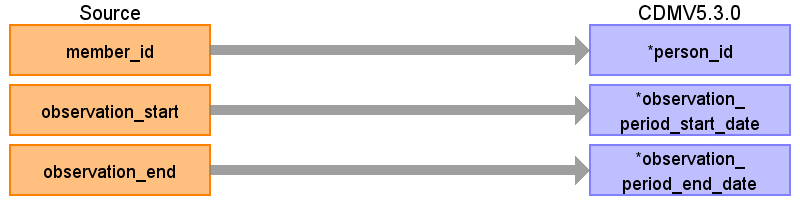

# CDM Table name: OBSERVATION_PERIOD

## Reading from JMDC.Enrollment

| Destination   Field   | Source   Field    | Logic   | Comment   Field  |
|-------------------------------|-------------------|-------------------------------------------------------------------------|-----------------------------------------------|
| observation_period_id         |   | |  |
| person_id    | member_id       | Remove 'M' prefix  |    |
| observation_period_start_date | observation_start | Set to first of month (E.g.   '200802' becomes 1st of February 2008)    |     |
| observation_period_end_date   | observation_end   | Set to last day of month (E.g.   '200801' becomes 31st of January 2008) |     |
| period_type_concept_id     |  |   | 44814722 Period while enrolled in   insurance |