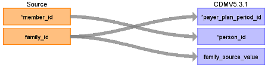

# CDM Table name: PAYER_PLAN_PERIOD

The enrollment table has a new field 'family_id'. This can be used to link persons of the same family together. For every record in the enrollment table, a new record in the payer_plan_period must be created, using the member_id to populate the person_id field (as usual), and the family_id to populate the payer_plan_period_id (after removing the leading "M" to turn the family_id into an integer). The source value of family_id should go into the family_source_value field of the payer_plan_period table.

## Reading from JMDC.Enrollment

 

**Destination Field**|**Source Field**|**Logic**|**Comment**
:-----|-----:|:-----:|:-----:
payer\_plan\_period\_id|family\_id|use the family\_id by removing the "M" and convert into an integer| 
person\_id|member\_id| | 
payer\_plan\_period\_start\_date|observation_start | | 
payer\_plan\_period\_end\_date| observation_end | |
payer\_concept\_id| type_of_insurance | Map using the following logic:  4 (National health insurance scheme) = 32725(National Health Insurance Program)    1 (Association/union administered health insurance) = 0     2 (Mutual aid association insurance) = 0     5 (Advanced elderly medical service system) = 0   | 
payer\_source\_value| type_of_insurance| | 
payer\_source\_concept\_id| 0 | | 
plan\_concept\_id| | | 
plan\_source\_value| | | 
plan\_source\_concept\_id| | | 
sponsor\_concept\_id| | | 
sponsor\_source\_value| | | 
sponsor\_source\_concept\_id| | | 
family\_source\_value|family\_id| | 
stop\_reason\_concept\_id| | | 
stop\_reason\_source\_value| | | 
stop\_reason\_source\_concept\_id| | | 

## Change Log

### March 7, 2025
- Update logic to map type_of_insurance and add in payer start/end dates