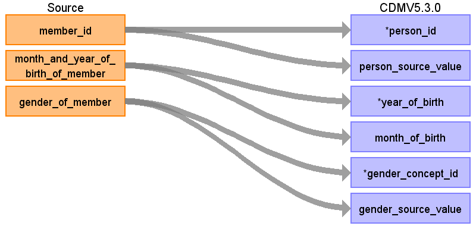

# CDM Table name: PERSON

## Reading from JMDC.Enrollment

| Destination Field | Source field | Logic | Comment field |
| --- | --- | :---: | --- |
| person_id | member_id | Remove 'M' prefix |  |
| gender_concept_id | gender_of_member | Map:  Male = 8507 Female = 8532  |  |
| year_of_birth | month_and_year_of_birth_of_member	| Take first 4 digits  | |
| month_of_birth | month_and_year_of_birth_of_member | Take last 2 digits (01 is January) |  |
| day_of_birth |  |  |  |
| birth_datetime |  |  |  |
| race_concept_id |  | 0 |  |
| ethnicity_concept_id |  | 0 |  |
| location_id |  |  |  |
| provider_id |  |  |  |
| care_site_id | | |  |
| person_source_value | member_id |  |  |
| gender_source_value | gender_of_member |  |  |
| gender_source_concept_id |  | 0 |  |
| race_source_value |  |  |  |
| race_source_concept_id |  | 0 |  |
| ethnicity_source_value |  |  |  |
| ethnicity_source_concept_id |  | 0 |  |