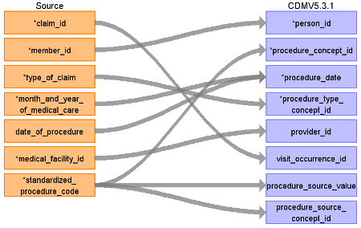

# CDM Table name: PROCEDURE_OCCURRENCE

## Reading from JMDC.Diagnosis
When an ICD10 code in the diagnosis table maps to a concept in the Procedure domain a record should be created in the procedure_occurrence table.

 

|     Destination Field    |     Source   Field    |     Logic    |     Comment    |
|-|-|-|-|
|     procedure_occurrence_id    |          |          |          |
|     visit_occurrence_id    |     claim_id    |     Remove ‘C’ prefix    |          |
|     person_id    |     member_id    |     Remove 'M' prefix    |          |
|     procedure_type_concept_id    |     type_of_claim    |     Outpatient: **32859** (Outpatient claim)    InPatient or DPC: **32853** (Inpatient claim)      |          |
|     procedure_date    |     month_and_year_of_medical_care    |     Use visit_start_date    |          |
|     procedure_concept_id    |     standard_disease_code    |          |     Lookup icd10_level4_code in diagnosis_master table, and   use vocab to map to standard concept. Remove '-' prior to mapping (e.g.   'I50-' should map to 'I50'), and ignore period (e.g. 'I500' should map to   'I50.0')    |
|     procedure_source_concept_id    |     standard_disease_code    |          |     Lookup icd10_level4_code in diagnosis_master table, and   use vocab to map to source concept. Remove '-' prior to mapping (e.g. 'I50-'   should map to 'I50'), and ignore period (e.g. 'I500' should map to 'I50.0')    |
|     procedure_source_value    |     standard_disease_code    |          |     Lookup icd10_level4_code in diagnosis_master table    |
|     provider_id    |     medical_facility_id    |          |     Use dummy provider corresponding to the institute    |
|     procedure_datetime    |          |          |          |
|     modifier_concept_id    |          |          |          |
|     quantity    |          |          |          |
|     visit_detail_id    |          |          |          |
|     modifier_source_value    |          |          |          |

## Reading from JMDC.Procedure

 

|     Destination Field    |     Source   Field    |     Logic    |     Comment    |
|-|-|-|-|
|     procedure_occurrence_id    |          |          |          |
|     visit_occurrence_id    |     claim_id    |     Remove ‘C’ prefix    |          |
|     person_id    |     member_id    |     Remove 'M' prefix    |          |
|     procedure_type_concept_id    |     type_of_claim    |     Outpatient: **32859** (Outpatient claim)    Inpatient or DPC: **32853** (Inpatient claim)     |          |
|     procedure_date    |     month_and_year_of_medical_care     date_of_procedure    |     Use date of procedure when populated, otherwise use start   of visit    |          |
|     procedure_concept_id    |     standardized_procedure_code    |Lookup the standardized_procedure_code in the procedure_master table to obtain the corresponding ICD9Proc code in the **icd9cm_level1** field and then map to a standard concept using the <a href="https://ohdsi.github.io/CommonDataModel/sqlScripts.html">Source-to-Standard Query</a> where source_vocabulary_id = 'ICD9Proc', ignoring the decimal.    For standardized_procedure_codes that do not have a corresponding icd9cm_level1, map them directly to standard concepts using the <a href="https://ohdsi.github.io/CommonDataModel/sqlScripts.html">Source-to-Standard Query</a>  where source_vocabulary_id = 'JNJ_JMDC_PROCEDURES'     |          |
|     procedure_source_concept_id    |        |  If the procedure_concept_id is mapped from the icd9cm_level1 code in the procedure_master table, put the concept_id that corresponds with that code here. Otherwise set to 0        |          |
|     procedure_source_value    |    procedure_master.icd9cm_level1, standardized_procedure_code           |   If the procedure_concept_id is mapped from the icd9cm_level1 code in the procedure_master table, put that value here.Otherwise set to standardized_procedure_code        |
|     provider_id    |     medical_facility_id    |          |     Use dummy provider corresponding to the institute    |
|     procedure_datetime    |          |          |          |
|     modifier_concept_id    |          |          |          |
|     quantity    |          |          |          |
|     visit_detail_id    |          |          |          |
|     modifier_source_value    |          |          |          |

## Change Log

### April 6, 2022
- In the native schema the  standardized_procedure_id field in the procedure and procedure_master tables has been renamed to 'standardized_procedure_code'. All CDM fields that reference standardized_procedure_id were changed. Additional mapping instructions for the standardized_procedure_code field were added to describe how to find the corresponding standard concepts. 