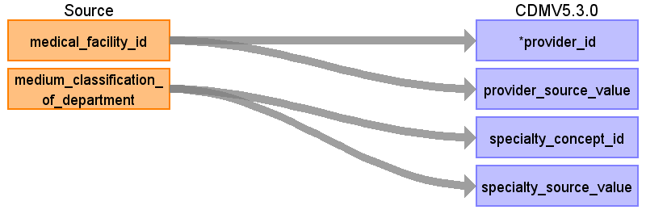

# CDM Table name: PROVIDER

## Reading from JMDC.Medical_Facility

We create a dummy provider for every institution, so we can at least capture specialty for diagnoses and procedures (which are mapped to institution, but not to physician).

| Destination   Field    | Source   Field                      | Logic             | Comment   Field   |
|------------------------|-------------------------------------|-------------------|-------------------|
| provider_id            | medical_facility_id                 | Remove ‘F’ prefix |                   |
| provider_source_value  | medical_facility_id                 |                   |                   |
| specialty_concept_id   | medium_classification_of_department |                   | Use mapping table |
| specialty_source_value | medium_classification_of_department |                   |                   |
| provider_name          |                                     |                   |                   |