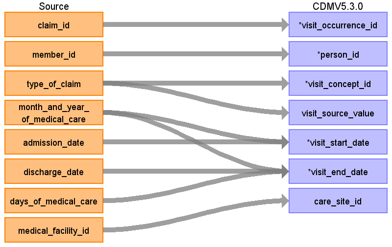

# CDM Table name: VISIT_OCCURRENCE

## Reading from JMDC.Claim

Each unique claim id for a patient will be assigned to a visit, except for pharmacy claims. In claims only the year + month is provided, day information is not available. However, oftentimes a claim will be associated with a piece of information that does have a specific date.  Specific dates can come from prescription date, procedure date, admission date, discharge date, or the start of medical care date.  This information will be used to infer the visit date with more precision. (e.g. if it’s a 2 day visit, and it has a procedure taking place on the 20th, we might assume the visit starts on the 20th).  If no specific date is available, we will assume the visit start and any events associated with the visit fall on the 15th of the month.  We choose the middle of the month because accidental reversal of temporality (where the order of events is switched because one piece of information did have a date, and another didn’t) is just as likely to occur in one direction as the other.

 

|     Destination   Field    |     Source   Field    |     Logic    |     Comment   Field    |
|-|-|-|-|
|     visit_occurrence_id    |     claim_id    |     Remove ‘C’ prefix    |          |
|     person_id    |     member_id    |     Remove 'M' prefix    |          |
|     visit_concept_id    |     type_of_claim    |     DPC and inpatient 9201 Outpatient and Pharmacy 9202    |          |
|     visit_source_value    |     type_of_claim    |          |          |
|     visit_start_date    |     month_and_year_of_medical_care     admission_date    |     If the claim is associated with a diagnosis, and (1) that   Diagnosis.date_of_medical_care_start falls within the   Month_and_year_of_medical_care and (2) there is no other diagnoses with the same   level 4 ICD-10 code from the same institution for the same member with the   same Diagnosis.date_of_medical_care_start, then the   Diagnosis.date_of_medical_care_start is used as the visit_start_date.           If a claim has an admission date, and the admission date falls   within the Month_and_year_of_medical_care , set the visit_start_date to the   admission date.           If a claim has an admission date, and the admission date   falls before the Month_and_year_of_medical_care , set the visit_start_date to   the 1st day of Month_and_year_of_medical_care.           If the claim is associated with a Drug.prescription_date   or Procedure.procedure_date, use the minimum of those dates and the   visit_start_date so far. (if no date was established so far, just take the   minimum of the procedure and prescription dates).           If no visit_start_date has been identified at that point,   set it to the 15th of the    Month_and_year_of_medical_care.           |          |
|     visit_end_date    |     month_and_year_of_medical_care     days_of_medical_care     discharge_date    |     Start by setting the visit_end_date to the   visit_start_date + days_of_medical_care.           If the discharge_date is specified, use the discharge_date   as the visit_start_date.           Take the minimum of the visit_start_date so far and the   end of the month_and_year_of_medical care.    |          |
|     care_site_id    |     medical_facility_id    |          |          |
|     visit_start_datetime    |          |          |          |
|     visit_end_datetime    |          |          |          |
|     visit_type_concept_id    |          |          |          |
|     provider_id    |          |          |          |
|     visit_source_concept_id    |          |          |          |
|     admitting_source_concept_id    |          |          |          |
|     admitting_source_value    |          |          |          |
|     discharge_to_concept_id    |          |          |          |
|     discharge_to_source_value    |          |          |          |
|     preceding_visit_occurrence_id    |          |          |          |