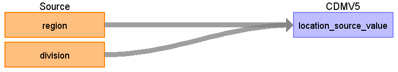

# CDM Table name: LOCATION

## Reading from OPTUM_EHR.Patient

|     Destination Field    |     Source Field    |     Logic    |     Comment    |
|-|-|-|-|
|     location_id    |          |          |     Autogen    |
|     address_1    |          |          |          |
|     address_2    |          |          |          |
|     city    |          |          |          |
|     state    |          |          |          |
|     zip    |          |          |          |
|     county    |          |          |          |
|     location_source_value    |     division     region    |     {region}_{division}    |     Concatenate   region_division region to create unique location_id    |