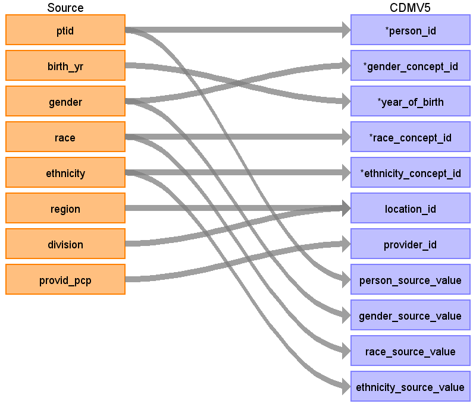

# CDM Table name: PERSON

The Optum EHR Patient table contains an indicator that denotes whether the paient is part of an integrated delivery network, which means that there is a higher likelihood of complete capture of medical events. An integrated delivery network is an organization or group of hospitals and health care providers that aligns local facilities, managing them as one. To keep track of this, for each person in the Patient table with **idn_indicator** = 1, create a record in the OBSERVATION table where OBSERVATION_DATE = OBSERVATION_PERIOD_START_DATE, OBSERVATION_CONCEPT_ID = 44804235 and VALUE_AS_NUMBER = 1, OBSERVATION_SOURCE_VALUE = 'IDN' and OBSERVATION_TYPE_CONCEPT_ID = 32817 (EHR). 

Do not populate if person doesn't have Observation period

### Race and Ethnicity

Unlike Optum Extended Clinformatics data, the race and ethnicity in Optum EHR are self-reported and not derived.

### Insured vs Uninsured population

The table below compares the proportion of patients based on their insurance type between the patients in Optum EHR and the overall United States.

|**ins_type**|	**% of EHR Population**	|**United States**|
|-|-|-|
|Commercial|	44.7%|	50.3%|
|Uninsured|	15.3%	|8.6%|
|Medicaid|	13.3%|	17.8%|
|Medicare|	12.4%	|15.6%|

## Reading from OPTUM_EHR.Patient

|     Destination Field    |     Source Field    |     Logic    |     Comment    |
|-|-|-|-|
|     person_id    |     ptid    |          |     Remove ‘PT’   prefix: cast(replace(ptid, 'PT','') as bigint)    |
|     gender_concept_id    |     gender    |     If gender = ‘Unknown’ then remove     Else if   gender = 'Male' then 8507     else if   gender = 'Female' then 8532    |          |
|     year_of_birth    |     birth_yr    |     if birth_yr == 'Unknown' or *NULL* then remove      else if   birth_yr <> 'Unknown' then      if birth_yr   = '1927 and earlier' then 1927     else   birth_yr    |          |
|     month_of_birth    |          |          |          |
|     day_of_birth    |          |          |          |
|     birth_datetime    |          |          |          |
|     race_concept_id    |     race    |     if   'Caucasian' then 8527     else if   'African American' then 8516     else if   'Asian' then 8515     else 0    |          |
|     ethnicity_concept_id    |     ethnicity    |     if   'Hispanic' then 38003563    if 'Not Hispanic' then 38003564     else 0    |          |
|     location_id    |     region     division    |     Look up from   Location table    |          |
|     provider_id    |     provid_pcp    |     Look up   from Provider table. In the case when the value is “” in the source, set the   provider_id to NULL.    |          |
|     care_site_id    |          |          |          |
|     person_source_value    |     ptid    |          |          |
|     gender_source_value    |     gender    |          |          |
|     gender_source_concept_id    |          |          |          |
|     race_source_value    |     race    |          |          |
|     race_source_concept_id    |          |          |          |
|     ethnicity_source_value    |     ethnicity    |          |          |
|     ethnicity_source_concept_id    |          |          |          |

## Change Log

- Added logic *if birth_yr is NULL*
- Added logic to map *Not Hispanic ethnicity*
- added logic *if observation period is not populated*