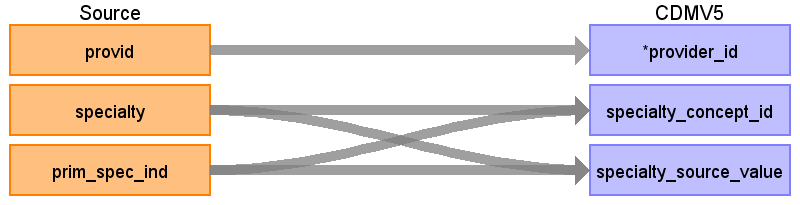

# CDM Table name: PROVIDER

## Reading from OPTUM_EHR.Provider



Use the following query to select the specialty to associate with each provider id.

```sql
SELECT provid, specialty 
FROM (
 select provid, specialty, prim_spec_ind, row_number() over (partition by provid, specialty order by prim_spec_ind desc) ordinal
from native.provider
) P 
WHERE P.ordinal = 1
```

|     Destination Field    |     Source Field    |     Logic    |     Comment    |
|-|-|-|-|
|     provider_id    |     provid    |          |          |
|     provider_name    |          |          |          |
|     npi    |          |          |          |
|     dea    |          |          |          |
|     specialty_concept_id    |     specialty    |          |  Use the SOURCE_TO_STANDARD query with the filter: <br> ```Where source_vocabulary_id = 'JNJ_OPTUM_EHR_SPCLTY' and Target_standard_concept = 'S'  and target_invalid_reason is NULL```    |
|     care_site_id    |          |          |          |
|     year_of_birth    |          |          |          |
|     gender_concept_id    |          |          |          |
|     provider_source_value    |          |          |          |
|     specialty_source_value    |     specialty    |          |          |
|     specialty_source_concept_id    |     specialty    |          |     Use the SOURCE_TO_SOURCE query with the filter: <br> ```Where source_vocabulary_id = 'JNJ_OPTUM_EHR_SPCLTY'```   |
|     gender_source_value    |          |          |          |
|     gender_source_concept_id    |          |          |          |

## Change Log

- Changed the specialty_concept_id reference from a csv file to the correct vocabulary_id in the source_to_concept_map table. 