# OPTUM EHR Oncology Module ETL documentation


# Background

The Optum® Enriched Oncology Data set is a group of tables that can supplement the Optum® de-identified Electronic Health Record dataset. It contains additional cancer-specific information on a subset of the EHR population that has at least one solid or non-solid tumor diagnosis. In addition to structured data obtained from medical records, the enriched oncology tables provide clinical information extracted from provider notes using natural language processing (NLP) machine learning models (for example, tumor progression, histology, etc.).

Optum oncology data initiatives include enriching Optum EHR data by extracting essential information from the oncology patient’s medical records and making it usable for researchers. Specific oncology concepts important for understanding the progression of the disease are often not available in structured formats, particularly the tumor, node, and metastasis (TNM) values, stage information and biomarkers.

As of 2022, there are approximately 1.9 million patients with at least one solid tumor ICD-9 or ICD-10 diagnosis included in the data set. Given the potential for research, the dataset was converted to the OMOP CDM to allow integration with standard OHDSI methods and tools.


# How to run this conversion

This conversion is run after the main corpus of the data is converted, then the results are inserted in CDM tables.


# Overall logic – linkage between source and CDM tables


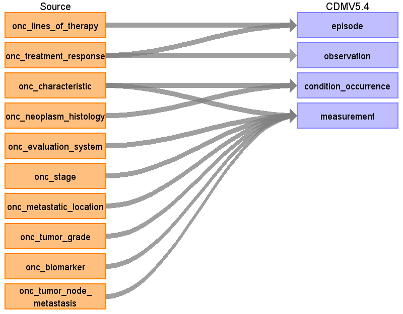


# Table name: condition_occurrence


## Reading from onc_neoplasm_histology, Onc_characteristic

Onc_neoplasm_histology contains neoplasm type (topography) and histology, which are the typical axes for the OMOP cancer diagnosis, it also has ‘direction’ field corresponding to the laterality which is a part of diagnosis in SNOMED as well.

Onc_characteristic table has neoplasm_characteristic and histology_characteristic fields that mostly describe typical cancer modifiers but also have 'in situ', 'malignant', 'benign' values that are a part of a diagnosis in OMOP.

**If onc_characteristic.histology_characteristic = ‘in situ’ and at the same day onc_characteristic.histology_characteristic = ‘invasive’, do not use these onc_characteristic entries in the ETL.**

Thus, Condition concept is a result of a precordination of 5 columns:

Onc_neoplasm_histology.neoplasm_type \
Onc_neoplasm_histology.histology \
Onc_neoplasm_histology.direction \
Onc_characteristic.neoplasm_characteristic \
Onc_characteristic.histology_characteristic

We put only positive actual values into OMOP CDM:

Read from onc_neoplasm_histology where (neoplasm_temporal_status  ='current' OR  histology_temporal_status  ='current')

AND (neoplasm_qualifier ='actual' OR histology_qualifier ='actual')

Read from the Onc_characteristic where (ch.neoplasm_char_temporal_status ='current' OR histology_char_temporal_status ='current')

Note, one of the histology or neoplasm column can have empty value, but the other one is always filled, so we use OR in these cases.

**Once table is generated, de-dup it by** (condition_source_value, person_id , condition_start_date)

You also have to create a crosswalk between condition_occurrence_id to neoplasm_histology_key with 1:1 to 1:M  condition_occurrence_id: neoplasm_histology_key

**Direction with o'clock goes to measurement**

**Direction with laterality goes to Condition**

**onc_neoplasm_histology diagram**


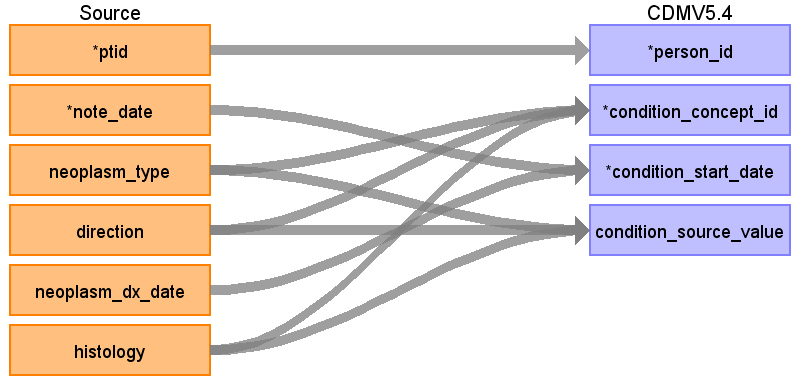


**onc_characteristic diagram**


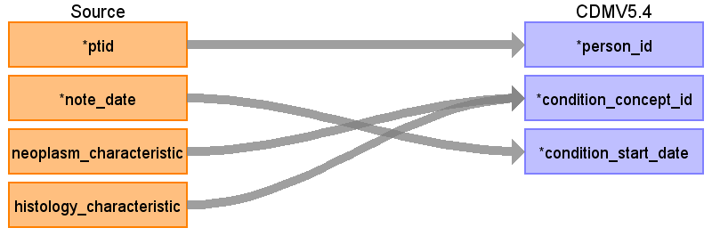


<table>
  <tbody><tr>
   <td>Destination Field
   </td>
   <td>Source Field
   </td>
   <td>Logic
   </td>
   <td>Comment
   </td>
  </tr>
  <tr>
   <td>condition_occurrence_id
   </td>
   <td>
   </td>
   <td>
   </td>
   <td>
   </td>
  </tr>
  <tr>
   <td>person_id
   </td>
   <td>ptid
   </td>
   <td>
   </td>
   <td>
   </td>
  </tr>
  <tr>
   <td>condition_concept_id
   </td>
   <td>Precoordination of
<p>
onc_neoplasm_histology:
neoplasm_type<br>
direction<br>
histology
</p><p>
+ onc_characteristic: neoplasm_characteristic
histology_characteristic
</p><p>
See the <a href="#heading=h.gjdgxs">script</a> how to put them together
   </p></td>
   <td>Mapping of the output of <a href="#heading=h.gjdgxs">the script</a> that concatenates these 5 fields and get rid of duplicates. Same logic is used to map the source data.
<p>
Note, for now not merge only histology or only neoplasm entries using a <a href="#heading=h.1fob9te">query</a><span> because several cancers can be presents at one day</span>
</p><p>
Use the&nbsp;<a href="https://github.com/OHDSI/ETL-LambdaBuilder/blob/master/docs/Standard%20Queries/SOURCE_TO_STANDARD.sql">SOURCE_TO_STANDARD</a>&nbsp;query to map the code to standard concept(s) with the following filters:
</p><p>Where source_vocabulary_id = ‘JNJ_OPTUM_EHR_ONCNHC’ and Target_standard_concept = ‘S’ and target_invalid_reason is NULL
If there is no mapping available, set concept_id to zero</p>
   </td>
   <td>
   </td>
  </tr>
  <tr>
   <td>condition_start_date
   </td>
   <td>onc_neoplasm_histology .note_date
<p>
onc_neoplasm_histology .neoplasm_dx_date
   </p></td>
   <td>When <code>neoplasm_dx_date</code> =’exact’ then to_date (neoplasm_dx_date, ‘yyyyMMdd’)
<p>
When <code>neoplasm_dx_date</code> =’incomplete’ and day is unknown and
</p><p>
<code>neoplasm_dx_date</code> <code>(</code>yyMM) &lt; note_date (yyMM)
then to_date (neoplasm_dx_date, ‘yyyyMM(dd =15)’
</p><p>
When <code>neoplasm_dx_date</code> =’incomplete’ and day and month are unknown and
</p><p>
<code>neoplasm_dx_date</code> <code>(</code>yy) &lt; note_date (yy)
then to_date (neoplasm_dx_date, ‘yyyy(MM =06 dd =30)’
</p><p>
Else note_date
   </p></td>
   <td>
   </td>
  </tr>
  <tr>
   <td>condition_start_datetime
   </td>
   <td>
   </td>
   <td>
   </td>
   <td>
   </td>
  </tr>
  <tr>
   <td>condition_end_date
   </td>
   <td>
   </td>
   <td>
   </td>
   <td>
   </td>
  </tr>
  <tr>
   <td>condition_end_datetime
   </td>
   <td>
   </td>
   <td>
   </td>
   <td>
   </td>
  </tr>
  <tr>
   <td>condition_type_concept_id
   </td>
   <td>32882
   </td>
   <td>
   </td>
   <td><a href="https://athena.ohdsi.org/search-terms/terms/32882">Standard algorithm from EHR</a>
   </td>
  </tr>
  <tr>
   <td>condition_status_concept_id
   </td>
   <td>
   </td>
   <td>
   </td>
   <td>
   </td>
  </tr>
  <tr>
   <td>stop_reason
   </td>
   <td>
   </td>
   <td>
   </td>
   <td>
   </td>
  </tr>
  <tr>
   <td>provider_id
   </td>
   <td>
   </td>
   <td>
   </td>
   <td>
   </td>
  </tr>
  <tr>
   <td>visit_occurrence_id
   </td>
   <td>
   </td>
   <td>
   </td>
   <td>
   </td>
  </tr>
  <tr>
   <td>visit_detail_id
   </td>
   <td>
   </td>
   <td>
   </td>
   <td>
   </td>
  </tr>
  <tr>
   <td>condition_source_value
   </td>
   <td>See the logic in condition_concept_id
   </td>
   <td>
   </td>
   <td>
   </td>
  </tr>
  <tr>
   <td>condition_source_concept_id
   </td>
   <td>0
   </td>
   <td>
   </td>
   <td>
   </td>
  </tr>
  <tr>
   <td>condition_status_source_value
   </td>
   <td>
   </td>
   <td>NULL
   </td>
   <td>
   </td>
  </tr>
</tbody></table>


# Table name: measurement


## Reading from onc_stage

Where `stage!=''`


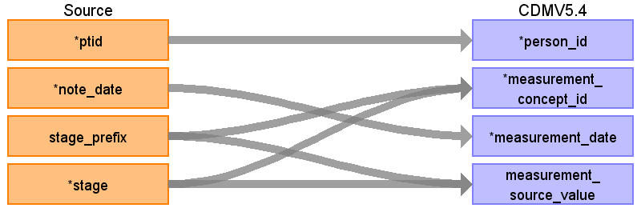


<table>
  <tr>
   <td>Destination Field
   </td>
   <td>Source Field
   </td>
   <td>Logic
   </td>
   <td>Comment
   </td>
  </tr>
  <tr>
   <td>measurement_id
   </td>
   <td>
   </td>
   <td>
   </td>
   <td>
   </td>
  </tr>
  <tr>
   <td>person_id
   </td>
   <td>ptid
   </td>
   <td>
   </td>
   <td>
   </td>
  </tr>
  <tr>
   <td>measurement_concept_id
   </td>
   <td><strong><code>replace ( 'stage '|| stage_prefix || ' '|| stage, '  ', ' ')</code></strong>
   </td>
   <td>Use the <a href="https://github.com/OHDSI/ETL-LambdaBuilder/blob/master/docs/Standard%20Queries/SOURCE_TO_STANDARD.sql">SOURCE_TO_STANDARD</a> query to map the code to standard concept(s) with the following filters:

Where source_vocabulary_id = ‘JNJ_OPTUM_EHR_ONCSTG’ and Target_standard_concept = ‘S’ and target_invalid_reason is NULL
 \
If there is no mapping available, set concept_id to zero
   </td>
   <td>
   </td>
  </tr>
  <tr>
   <td>measurement_date
   </td>
   <td>note_date
   </td>
   <td>
   </td>
   <td>
   </td>
  </tr>
  <tr>
   <td>measurement_source_value
   </td>
   <td><strong><code>replace ( 'stage '|| stage_prefix || ' '|| stage, '  ', ' ')</code></strong>
   </td>
   <td>
   </td>
   <td>
   </td>
  </tr>
  <tr>
   <td>value_as_number
   </td>
   <td>
   </td>
   <td>
   </td>
   <td>
   </td>
  </tr>
  <tr>
   <td>unit_concept_id
   </td>
   <td>
   </td>
   <td>
   </td>
   <td>
   </td>
  </tr>
  <tr>
   <td>value_as_concept_id
   </td>
   <td>
   </td>
   <td>
   </td>
   <td>
   </td>
  </tr>
  <tr>
   <td>meas_event_field_concept_id
   </td>
   <td><code>1147127</code>
   </td>
   <td><code>'condition_occurrence.condition_occurrence_id'</code>
   </td>
   <td>
   </td>
  </tr>
  <tr>
   <td>measurement_event_id
   </td>
   <td>
   </td>
   <td>fill by CONDITION.condition_id using neoplasm_histology_key OR if neoplasm_histology_key is null, use (ptid, note_date) to connect with the onc_neoplasm_histology table
   </td>
   <td>
   </td>
  </tr>
  <tr>
   <td>measurement_source_concept_id
   </td>
   <td>0
   </td>
   <td>
   </td>
   <td>
   </td>
  </tr>
  <tr>
   <td>measurement_datetime
   </td>
   <td>
   </td>
   <td>
   </td>
   <td>
   </td>
  </tr>
  <tr>
   <td>measurement_time
   </td>
   <td>
   </td>
   <td>
   </td>
   <td>
   </td>
  </tr>
  <tr>
   <td>measurement_type_concept_id
   </td>
   <td>32882
   </td>
   <td>
   </td>
   <td><a href="https://athena.ohdsi.org/search-terms/terms/32882">Standard algorithm from EHR</a>
   </td>
  </tr>
  <tr>
   <td>operator_concept_id
   </td>
   <td>
   </td>
   <td>
   </td>
   <td>
   </td>
  </tr>
  <tr>
   <td>range_low
   </td>
   <td>
   </td>
   <td>
   </td>
   <td>
   </td>
  </tr>
  <tr>
   <td>range_high
   </td>
   <td>
   </td>
   <td>
   </td>
   <td>
   </td>
  </tr>
  <tr>
   <td>provider_id
   </td>
   <td>
   </td>
   <td>
   </td>
   <td>
   </td>
  </tr>
  <tr>
   <td>visit_occurrence_id
   </td>
   <td>
   </td>
   <td>
   </td>
   <td>
   </td>
  </tr>
  <tr>
   <td>visit_detail_id
   </td>
   <td>
   </td>
   <td>
   </td>
   <td>
   </td>
  </tr>
  <tr>
   <td>unit_source_value
   </td>
   <td>
   </td>
   <td>
   </td>
   <td>
   </td>
  </tr>
  <tr>
   <td>unit_source_concept_id
   </td>
   <td>
   </td>
   <td>
   </td>
   <td>
   </td>
  </tr>
  <tr>
   <td>value_source_value
   </td>
   <td>
   </td>
   <td>
   </td>
   <td>
   </td>
  </tr>
</table>


## Reading from onc_metastatic_location


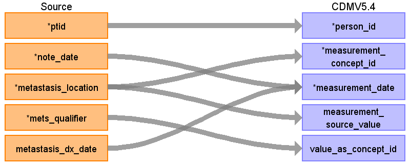


Rule: populate CDM only when mets_temporal_status = 'current', history of measurement is not supported by the model. Rows where metastasis_location is NULL (metastasis_location=’’) are included, they mean that metastasis is present but the exact location is unknown.


<table>
  <tbody><tr>
   <td>Destination Field
   </td>
   <td>Source Field
   </td>
   <td>Logic
   </td>
   <td>Comment
   </td>
  </tr>
  <tr>
   <td>measurement_id
   </td>
   <td>
   </td>
   <td>
   </td>
   <td>
   </td>
  </tr>
  <tr>
   <td>person_id
   </td>
   <td>ptid
   </td>
   <td>
   </td>
   <td>
   </td>
  </tr>
  <tr>
   <td>measurement_concept_id
   </td>
   <td>‘Metastasis to ‘|| metastasis_location
   </td>
   <td>Use the&nbsp;<a href="https://github.com/OHDSI/ETL-LambdaBuilder/blob/master/docs/Standard%20Queries/SOURCE_TO_STANDARD.sql">SOURCE_TO_STANDARD</a>&nbsp;query to map the code to standard concept(s) with the following filters:
Where source_vocabulary_id = ‘JNJ_OPTUM_EHR_ONCMET’ and Target_standard_concept = ‘S’ and target_invalid_reason is NULL
<p>If there is no mapping available, set concept_id to zero</p>
   </td>
   <td>
   </td>
  </tr>
  <tr>
   <td>measurement_date
   </td>
   <td>note_date
<p>
metastasis_dx_date
   </p></td>
   <td>When <code>metastasis_dx_date_type</code>=’exact’ then to_date (metastasis_dx_date, ‘yyyyMMdd’)
<p>
When <code>metastasis_dx_date_type</code>=’incomplete’ and day is unknown and <code>metastasis_dx_date_type(</code>yyMM) &lt; note_date (yyMM) \
then to_date (metastasis_dx_date, ‘yyyyMM(dd =15)’
</p><p>
When <code>metastasis_dx_date_type</code>=’incomplete’ and day and month are unknown and
</p><p>
<code>metastasis_dx_date_type(</code>yy) &lt; note_date (yy) \
then to_date (metastasis_dx_date, ‘yyyy(MM =06 dd =30)’
</p><p>
Else note_date
   </p></td>
   <td>
   </td>
  </tr>
  <tr>
   <td>measurement_source_value
   </td>
   <td>‘Metastasis to ‘|| metastasis_location
   </td>
   <td>
   </td>
   <td>
   </td>
  </tr>
  <tr>
   <td>value_as_number
   </td>
   <td>
   </td>
   <td>
   </td>
   <td>
   </td>
  </tr>
  <tr>
   <td>unit_concept_id
   </td>
   <td>
   </td>
   <td>
   </td>
   <td>
   </td>
  </tr>
  <tr>
   <td>value_as_concept_id
   </td>
   <td>mets_qualifier
   </td>
   <td>When mets_qualifier = ‘actual’ then 4181412 -- <a href="https://athena.ohdsi.org/search-terms/terms/4181412">Present</a>
<p>
When mets_qualifier =’absent’ then 4132135 -- <a href="https://athena.ohdsi.org/search-terms/terms/4132135">Absent</a>
   </p></td>
   <td>
   </td>
  </tr>
  <tr>
   <td>meas_event_field_concept_id
   </td>
   <td><code>1147127</code>
   </td>
   <td><code>'condition_occurrence.condition_occurrence_id'</code>
   </td>
   <td>
   </td>
  </tr>
  <tr>
   <td>measurement_event_id
   </td>
   <td>
   </td>
   <td>fill by CONDITION.condition_id using neoplasm_histology_key OR if  neoplasm_histology_key is null, use (ptid, note_date), this should be analyzed better, maybe we do not connect the events at all if neoplasm_histology_key is null
   </td>
   <td>
   </td>
  </tr>
  <tr>
   <td>measurement_source_concept_id
   </td>
   <td>0
   </td>
   <td>
   </td>
   <td>
   </td>
  </tr>
  <tr>
   <td>measurement_datetime
   </td>
   <td>
   </td>
   <td>
   </td>
   <td>
   </td>
  </tr>
  <tr>
   <td>measurement_time
   </td>
   <td>
   </td>
   <td>
   </td>
   <td>
   </td>
  </tr>
  <tr>
   <td>measurement_type_concept_id
   </td>
   <td>32882
   </td>
   <td>
   </td>
   <td><a href="https://athena.ohdsi.org/search-terms/terms/32882">Standard algorithm from EHR</a>
   </td>
  </tr>
  <tr>
   <td>operator_concept_id
   </td>
   <td>
   </td>
   <td>
   </td>
   <td>
   </td>
  </tr>
  <tr>
   <td>range_low
   </td>
   <td>
   </td>
   <td>
   </td>
   <td>
   </td>
  </tr>
  <tr>
   <td>range_high
   </td>
   <td>
   </td>
   <td>
   </td>
   <td>
   </td>
  </tr>
  <tr>
   <td>provider_id
   </td>
   <td>
   </td>
   <td>
   </td>
   <td>
   </td>
  </tr>
  <tr>
   <td>visit_occurrence_id
   </td>
   <td>
   </td>
   <td>
   </td>
   <td>
   </td>
  </tr>
  <tr>
   <td>visit_detail_id
   </td>
   <td>
   </td>
   <td>
   </td>
   <td>
   </td>
  </tr>
  <tr>
   <td>unit_source_value
   </td>
   <td>
   </td>
   <td>
   </td>
   <td>
   </td>
  </tr>
  <tr>
   <td>unit_source_concept_id
   </td>
   <td>
   </td>
   <td>
   </td>
   <td>
   </td>
  </tr>
  <tr>
   <td>value_source_value
   </td>
   <td>mets_qualifier
   </td>
   <td>mets_qualifier
   </td>
   <td>
   </td>
  </tr>
</tbody></table>


## Reading from onc_tumor_node_metastasis


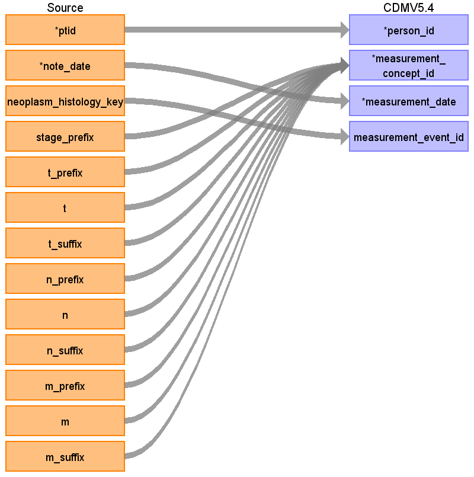


Populate only if the main value (T, N or M) is not null:


<table>
  <tr>
   <td>Destination Field
   </td>
   <td>Source Field
   </td>
   <td>Logic
   </td>
   <td>Comment
   </td>
  </tr>
  <tr>
   <td>measurement_id
   </td>
   <td>
   </td>
   <td>
   </td>
   <td>
   </td>
  </tr>
  <tr>
   <td>person_id
   </td>
   <td>ptid
   </td>
   <td>
   </td>
   <td>
   </td>
  </tr>
  <tr>
   <td>measurement_concept_id
   </td>
   <td><strong><code>trim (stage_prefix||' '|| t_prefix|| 'T'||t|| t_suffix)</code></strong>
<strong><code>trim (stage_prefix||' '||n_prefix||'N'||n|| n_suffix)</code></strong>
<strong><code>trim (stage_prefix||' '|| m_prefix||'M'||m|| m_suffix)</code></strong>
Before concatenation NULL values to be replaced with ‘’
   </td>
   <td>Use the <a href="https://github.com/OHDSI/ETL-LambdaBuilder/blob/master/docs/Standard%20Queries/SOURCE_TO_STANDARD.sql">SOURCE_TO_STANDARD</a> query to map the code to standard concept(s) with the following filters:

Where source_vocabulary_id = ‘JNJ_OPTUM_EHR_ONCTNM’ and Target_standard_concept = ‘S’ and target_invalid_reason is NULL

If there is no mapping available, set concept_id to zero
   </td>
   <td>each T, N and M category makes a separate measurement entry
   </td>
  </tr>
  <tr>
   <td>measurement_date
   </td>
   <td>note_date
   </td>
   <td>
   </td>
   <td>
   </td>
  </tr>
  <tr>
   <td>measurement_source_value
   </td>
   <td>See measurement_concept_id
   </td>
   <td>
   </td>
   <td>
   </td>
  </tr>
  <tr>
   <td>value_as_number
   </td>
   <td>
   </td>
   <td>
   </td>
   <td>
   </td>
  </tr>
  <tr>
   <td>unit_concept_id
   </td>
   <td>
   </td>
   <td>
   </td>
   <td>
   </td>
  </tr>
  <tr>
   <td>value_as_concept_id
   </td>
   <td>
   </td>
   <td>
   </td>
   <td>
   </td>
  </tr>
  <tr>
   <td>meas_event_field_concept_id
   </td>
   <td><code>1147127</code>
   </td>
   <td>
   </td>
   <td><code>'condition_occurrence.condition_occurrence_id'</code>
   </td>
  </tr>
  <tr>
   <td>measurement_event_id
   </td>
   <td><code>condition_occurrence.condition_occurrence_id</code>
   </td>
   <td>
   </td>
   <td>fill by CONDITION.condition_id using neoplasm_histology_key OR if  neoplasm_histology_key is null, use (ptid, note_date) this should be analyzed better.
   </td>
  </tr>
  <tr>
   <td>measurement_source_concept_id
   </td>
   <td>
   </td>
   <td>
   </td>
   <td>
   </td>
  </tr>
  <tr>
   <td>measurement_datetime
   </td>
   <td>
   </td>
   <td>
   </td>
   <td>
   </td>
  </tr>
  <tr>
   <td>measurement_time
   </td>
   <td>
   </td>
   <td>
   </td>
   <td>
   </td>
  </tr>
  <tr>
   <td>measurement_type_concept_id
   </td>
   <td>32882
   </td>
   <td>
   </td>
   <td><a href="https://athena.ohdsi.org/search-terms/terms/32882">Standard algorithm from EHR</a>
   </td>
  </tr>
  <tr>
   <td>operator_concept_id
   </td>
   <td>
   </td>
   <td>
   </td>
   <td>
   </td>
  </tr>
  <tr>
   <td>range_low
   </td>
   <td>
   </td>
   <td>
   </td>
   <td>
   </td>
  </tr>
  <tr>
   <td>range_high
   </td>
   <td>
   </td>
   <td>
   </td>
   <td>
   </td>
  </tr>
  <tr>
   <td>provider_id
   </td>
   <td>
   </td>
   <td>
   </td>
   <td>
   </td>
  </tr>
  <tr>
   <td>visit_occurrence_id
   </td>
   <td>
   </td>
   <td>
   </td>
   <td>
   </td>
  </tr>
  <tr>
   <td>visit_detail_id
   </td>
   <td>
   </td>
   <td>
   </td>
   <td>
   </td>
  </tr>
  <tr>
   <td>unit_source_value
   </td>
   <td>
   </td>
   <td>
   </td>
   <td>
   </td>
  </tr>
  <tr>
   <td>unit_source_concept_id
   </td>
   <td>
   </td>
   <td>
   </td>
   <td>
   </td>
  </tr>
  <tr>
   <td>value_source_value
   </td>
   <td>
   </td>
   <td>
   </td>
   <td>
   </td>
  </tr>
</table>


## Reading from onc_tumor_grade


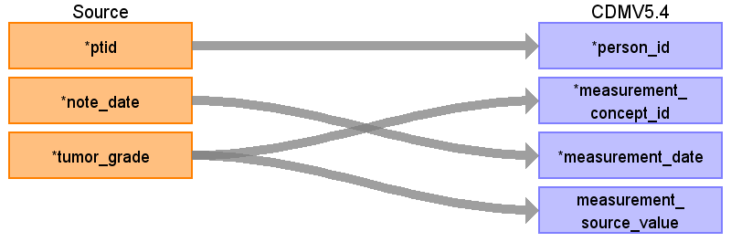


<table>
  <tr>
   <td>Destination Field
   </td>
   <td>Source Field
   </td>
   <td>Logic
   </td>
   <td>Comment
   </td>
  </tr>
  <tr>
   <td>measurement_id
   </td>
   <td>
   </td>
   <td>
   </td>
   <td>
   </td>
  </tr>
  <tr>
   <td>person_id
   </td>
   <td>ptid
   </td>
   <td>
   </td>
   <td>
   </td>
  </tr>
  <tr>
   <td>measurement_concept_id
   </td>
   <td>‘Tumor grade: ’|| tumor_grade
   </td>
   <td>Use the <a href="https://github.com/OHDSI/ETL-LambdaBuilder/blob/master/docs/Standard%20Queries/SOURCE_TO_STANDARD.sql">SOURCE_TO_STANDARD</a> query to map the code to standard concept(s) with the following filters:


Where source_vocabulary_id = ‘JNJ_OPTUM_EHR_ONCTGR’ and Target_standard_concept = ‘S’ and target_invalid_reason is NULL

If there is no mapping available, set concept_id to zero
   </td>
   <td>each category makes a separate measurement entry
   </td>
  </tr>
  <tr>
   <td>measurement_date
   </td>
   <td>note_date
   </td>
   <td>
   </td>
   <td>
   </td>
  </tr>
  <tr>
   <td>measurement_source_value
   </td>
   <td>‘Tumor grade: ’|| tumor_grade
   </td>
   <td>
   </td>
   <td>
   </td>
  </tr>
  <tr>
   <td>value_as_number
   </td>
   <td>
   </td>
   <td>
   </td>
   <td>
   </td>
  </tr>
  <tr>
   <td>unit_concept_id
   </td>
   <td>
   </td>
   <td>
   </td>
   <td>
   </td>
  </tr>
  <tr>
   <td>value_as_concept_id
   </td>
   <td>
   </td>
   <td>
   </td>
   <td>
   </td>
  </tr>
  <tr>
   <td>meas_event_field_concept_id
   </td>
   <td><code>1147127</code>
   </td>
   <td>
   </td>
   <td><code>'condition_occurrence.condition_occurrence_id'</code>
   </td>
  </tr>
  <tr>
   <td>measurement_event_id
   </td>
   <td><code>condition_occurrence.condition_occurrence_id</code>
   </td>
   <td>
   </td>
   <td>fill by CONDITION.condition_id using neoplasm_histology_key OR if  neoplasm_histology_key is null, use (ptid, note_date) this should be analyzed better.
   </td>
  </tr>
  <tr>
   <td>measurement_source_concept_id
   </td>
   <td>0
   </td>
   <td>
   </td>
   <td>
   </td>
  </tr>
  <tr>
   <td>measurement_datetime
   </td>
   <td>
   </td>
   <td>
   </td>
   <td>
   </td>
  </tr>
  <tr>
   <td>measurement_time
   </td>
   <td>
   </td>
   <td>
   </td>
   <td>
   </td>
  </tr>
  <tr>
   <td>measurement_type_concept_id
   </td>
   <td>32882
   </td>
   <td>
   </td>
   <td><a href="https://athena.ohdsi.org/search-terms/terms/32882">Standard algorithm from EHR</a>
   </td>
  </tr>
  <tr>
   <td>operator_concept_id
   </td>
   <td>
   </td>
   <td>
   </td>
   <td>
   </td>
  </tr>
  <tr>
   <td>range_low
   </td>
   <td>
   </td>
   <td>
   </td>
   <td>
   </td>
  </tr>
  <tr>
   <td>range_high
   </td>
   <td>
   </td>
   <td>
   </td>
   <td>
   </td>
  </tr>
  <tr>
   <td>provider_id
   </td>
   <td>
   </td>
   <td>
   </td>
   <td>
   </td>
  </tr>
  <tr>
   <td>visit_occurrence_id
   </td>
   <td>
   </td>
   <td>
   </td>
   <td>
   </td>
  </tr>
  <tr>
   <td>visit_detail_id
   </td>
   <td>
   </td>
   <td>
   </td>
   <td>
   </td>
  </tr>
  <tr>
   <td>unit_source_value
   </td>
   <td>
   </td>
   <td>
   </td>
   <td>
   </td>
  </tr>
  <tr>
   <td>unit_source_concept_id
   </td>
   <td>
   </td>
   <td>
   </td>
   <td>
   </td>
  </tr>
  <tr>
   <td>value_source_value
   </td>
   <td>
   </td>
   <td>
   </td>
   <td>
   </td>
  </tr>
</table>


## Reading from onc_characteristic

Rule: Populate only with` temporal_status ='current' `and` `exclude characteristics that are the part of a condition or NULL:

Note, the char_temporal_status always accompanies its respective characteristic.

**If onc_characteristic.histology_characteristic = ‘in situ’ and at the same day onc_characteristic.histology_characteristic = ‘invasive’, do not use these onc_characteristic entries in the ETL.**


```
So, in SQL we can say (use similar logic to extract the concepts for mapping):
Select ptid, note_date, neoplasm_characteristic
from onc_characteristic
where neoplasm_char_temporal_status ='current'
and neoplasm_characteristic not in ('in situ', 'malignant', 'benign')
and neoplasm_characteristic !=''
```


`Union –- deals with duplicates when `neoplasm_characteristic = histology_characteristic


```
Select ptid, note_date, histology_characteristic
from onc_characteristic
where histology_char_temporal_status ='current'
and histology_characteristic not in ('in situ', 'malignant', 'benign')
and histology_characteristic !=''
```


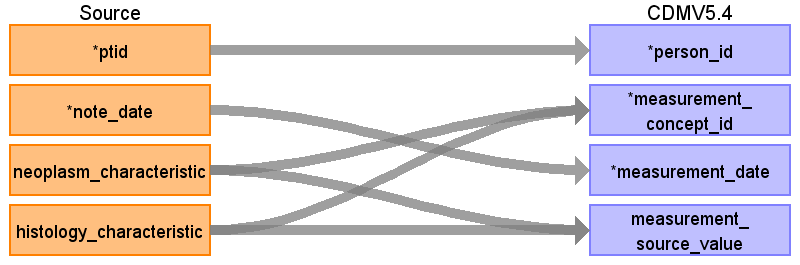


<table>
  <tbody><tr>
   <td>Destination Field
   </td>
   <td>Source Field
   </td>
   <td>Logic
   </td>
   <td>Comment
   </td>
  </tr>
  <tr>
   <td>measurement_id
   </td>
   <td>
   </td>
   <td>
   </td>
   <td>
   </td>
  </tr>
  <tr>
   <td>person_id
   </td>
   <td>ptid
   </td>
   <td>
   </td>
   <td>
   </td>
  </tr>
  <tr>
   <td>measurement_concept_id
   </td>
   <td>neoplasm_characteristic
<p>
histology_characteristic
   </p></td>
   <td>Use the&nbsp;<a href="https://github.com/OHDSI/ETL-LambdaBuilder/blob/master/docs/Standard%20Queries/SOURCE_TO_STANDARD.sql">SOURCE_TO_STANDARD</a>&nbsp;query to map the code to standard concept(s) with the following filters:
<p>Where source_vocabulary_id = ‘JNJ_OPTUM_EHR_ONCCHR’ and Target_standard_concept = ‘S’ and target_invalid_reason is NULL</p>
<p>If there is no mapping available, set concept_id to zero</p>
   </td>
   <td>Each field creates its own entry in measurement table except the cases when neoplasm_characteristic = histology_characteristic
   </td>
  </tr>
  <tr>
   <td>measurement_date
   </td>
   <td>note_date
   </td>
   <td>
   </td>
   <td>
   </td>
  </tr>
  <tr>
   <td>measurement_source_value
   </td>
   <td>neoplasm_characteristic
<p>
histology_characteristic
   </p></td>
   <td>
   </td>
   <td>Each field creates its own entry in measurement table except the cases when neoplasm_characteristic = histology_characteristic
   </td>
  </tr>
  <tr>
   <td>value_as_number
   </td>
   <td>
   </td>
   <td>
   </td>
   <td>
   </td>
  </tr>
  <tr>
   <td>unit_concept_id
   </td>
   <td>
   </td>
   <td>
   </td>
   <td>
   </td>
  </tr>
  <tr>
   <td>value_as_concept_id
   </td>
   <td>
   </td>
   <td>when the neoplasm_characteristic  = ‘metastatic’ or histology_characteristic = ‘metastatic’ then
<p>
4181412 -- <a href="https://athena.ohdsi.org/search-terms/terms/4181412">Present</a><span> </span>
   </p></td>
   <td>
   </td>
  </tr>
  <tr>
   <td>meas_event_field_concept_id
   </td>
   <td><code>1147127</code>
   </td>
   <td>
   </td>
   <td><code>'condition_occurrence.condition_occurrence_id'</code>
   </td>
  </tr>
  <tr>
   <td>measurement_event_id
   </td>
   <td><code>condition_occurrence.condition_occurrence_id</code>
   </td>
   <td>
   </td>
   <td>fill by CONDITION.condition_id using neoplasm_histology_key OR if  neoplasm_histology_key is null, use (ptid, note_date) this should be analyzed better.
   </td>
  </tr>
  <tr>
   <td>measurement_source_concept_id
   </td>
   <td>0
   </td>
   <td>
   </td>
   <td>
   </td>
  </tr>
  <tr>
   <td>measurement_datetime
   </td>
   <td>
   </td>
   <td>
   </td>
   <td>
   </td>
  </tr>
  <tr>
   <td>measurement_time
   </td>
   <td>
   </td>
   <td>
   </td>
   <td>
   </td>
  </tr>
  <tr>
   <td>measurement_type_concept_id
   </td>
   <td>32882
   </td>
   <td>
   </td>
   <td><a href="https://athena.ohdsi.org/search-terms/terms/32882">Standard algorithm from EHR</a>
   </td>
  </tr>
  <tr>
   <td>operator_concept_id
   </td>
   <td>
   </td>
   <td>
   </td>
   <td>
   </td>
  </tr>
  <tr>
   <td>range_low
   </td>
   <td>
   </td>
   <td>
   </td>
   <td>
   </td>
  </tr>
  <tr>
   <td>range_high
   </td>
   <td>
   </td>
   <td>
   </td>
   <td>
   </td>
  </tr>
  <tr>
   <td>provider_id
   </td>
   <td>
   </td>
   <td>
   </td>
   <td>
   </td>
  </tr>
  <tr>
   <td>visit_occurrence_id
   </td>
   <td>
   </td>
   <td>
   </td>
   <td>
   </td>
  </tr>
  <tr>
   <td>visit_detail_id
   </td>
   <td>
   </td>
   <td>
   </td>
   <td>
   </td>
  </tr>
  <tr>
   <td>unit_source_value
   </td>
   <td>
   </td>
   <td>
   </td>
   <td>
   </td>
  </tr>
  <tr>
   <td>unit_source_concept_id
   </td>
   <td>
   </td>
   <td>
   </td>
   <td>
   </td>
  </tr>
  <tr>
   <td>value_source_value
   </td>
   <td>
   </td>
   <td>
   </td>
   <td>
   </td>
  </tr>
</tbody></table>


## Reading from onc_biomarker

Problem 1. (to be discussed with the WG)

There are both numeric (1+, 2+, 3+) and narrative results such as negative, equivocal, positive.

Can we interpret 1+ as negative, 2+ as equivocal, 3+ as positive?

For example, 2+ has an equivalent number of equivocal and (positive+negative)

The query:


```
select  narrative_result, count(*) from onc_biomarker where  numeric_result ='2 +'
and biomarker in ('erb-b2 receptor tyrosine kinase 2 (ERBB2 or HER2/neu)', 'estrogen receptor (ER)')
group by  narrative_result
order by count(*) desc
```


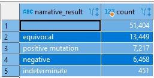


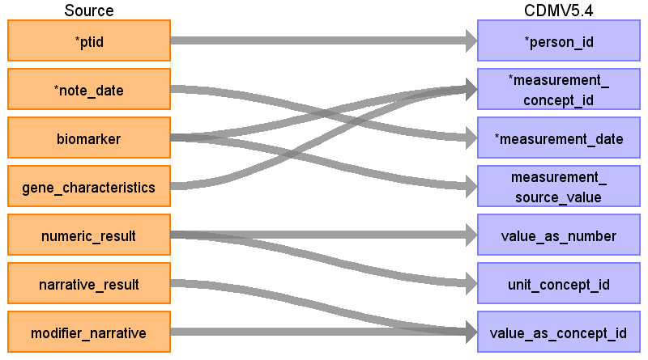


* Rule: Migrate only the rows where temporal_status=’current’ and biomarker is not NULL and with results (either numeric_result or narrative_result are populated).

    Don’t worry about The rows with biomarker_temporal_status is null, it’s ONLY for rows including test_name-s, like ‘Flow Cytometry’, etc. And we don’t map these as OMOP genomics model doesn’t support this. And it has small scientific Impact


<table>
  <tbody><tr>
   <td>
Destination Field
   </td>
   <td>Source Field
   </td>
   <td>Logic
   </td>
   <td>Comment
   </td>
  </tr>
  <tr>
   <td>measurement_id
   </td>
   <td>
   </td>
   <td>
   </td>
   <td>
   </td>
  </tr>
  <tr>
   <td>person_id
   </td>
   <td>ptid
   </td>
   <td>
   </td>
   <td>
   </td>
  </tr>
  <tr>
   <td>measurement_concept_id
   </td>
   <td>Biomarker||’ ‘||
<p>
gene_characteristics
   </p></td>
   <td>Use the&nbsp;<a href="https://github.com/OHDSI/ETL-LambdaBuilder/blob/master/docs/Standard%20Queries/SOURCE_TO_STANDARD.sql">SOURCE_TO_STANDARD</a>&nbsp;query to map the code to standard concept(s) with the following filters:
<p>Where source_vocabulary_id = ‘JNJ_OPTUM_EHR_ONCBM’ and Target_standard_concept = ‘S’ and target_invalid_reason is NULL</p>
<p>If there is no mapping available, set concept_id to zero</p>
   </td>
   <td>Source names are different from the NLP_biomarker table, so a new source vocabulary_id is created
   </td>
  </tr>
  <tr>
   <td>measurement_date
   </td>
   <td>note_date
   </td>
   <td>
   </td>
   <td>
   </td>
  </tr>
  <tr>
   <td>measurement_source_value
   </td>
   <td>Biomarker, gene_characteristics
   </td>
   <td>Biomarker || ‘ ‘|| gene_characteristics
   </td>
   <td>
   </td>
  </tr>
  <tr>
   <td>value_as_number
   </td>
   <td>numeric_result
   </td>
   <td>Extract number from numeric_result except of ‘num +’ cases, e.g. ‘1 +’, these will be mapped to concept.
<p>
When result is given as an <strong>interval, for example, 14-16%,</strong> create 2 rows in measurement table, one with &gt;=14%, another with &lt;=16% (populating operator_concept_id, value_as_number, unit_concept_id)
   </p></td>
   <td>
   </td>
  </tr>
  <tr>
   <td>unit_concept_id
   </td>
   <td>numeric_result
   </td>
   <td>Extract ‘Muts/Mb’, ‘%’ from numeric_result and map using STCM with the source_vocabulary_id =’JNJ UNITS’
   </td>
   <td>
   </td>
  </tr>
  <tr>
   <td>value_as_concept_id
   </td>
   <td>narrative_result|| ‘ ‘ || modifier_narrative
<p>
numeric_result \
where numeric_result like ‘num +’
</p><p>
   </p></td>
   <td>Use the&nbsp;<a href="https://github.com/OHDSI/ETL-LambdaBuilder/blob/master/docs/Standard%20Queries/SOURCE_TO_STANDARD.sql">SOURCE_TO_STANDARD</a>&nbsp;query with case insensitive match to map the code to standard concept(s) with the following filters:
<p>Where source_vocabulary_id = ‘JNJ_OPTUM_EHR_LABRES’ and Target_standard_concept = ‘S’ and target_invalid_reason is NULL</p>
<p>If there is no mapping available, set concept_id to zero.</p>
   </td>
   <td>
   </td>
  </tr>
  <tr>
   <td>meas_event_field_concept_id
   </td>
   <td><code>1147127</code>
   </td>
   <td><code>'condition_occurrence.condition_occurrence_id'</code>
   </td>
   <td>
   </td>
  </tr>
  <tr>
   <td>measurement_event_id
   </td>
   <td><code>condition_occurrence.condition_occurrence_id</code>
   </td>
   <td>Connect with the Condition table through onc_neopls_histology using (neoplasm_histology_key) or using  (ptid, note_date)
   </td>
   <td>
   </td>
  </tr>
  <tr>
   <td>measurement_source_concept_id
   </td>
   <td>0
   </td>
   <td>
   </td>
   <td>
   </td>
  </tr>
  <tr>
   <td>measurement_datetime
   </td>
   <td>
   </td>
   <td>
   </td>
   <td>
   </td>
  </tr>
  <tr>
   <td>measurement_time
   </td>
   <td>
   </td>
   <td>
   </td>
   <td>
   </td>
  </tr>
  <tr>
   <td>measurement_type_concept_id
   </td>
   <td>32882
   </td>
   <td>
   </td>
   <td><a href="https://athena.ohdsi.org/search-terms/terms/32882">Standard algorithm from EHR</a>
   </td>
  </tr>
  <tr>
   <td>operator_concept_id
   </td>
   <td>numeric_result
   </td>
   <td>Extract operators from numeric_result and map using CONCEPT.name where domain_id =’Meas Value Operator’
   </td>
   <td>
   </td>
  </tr>
  <tr>
   <td>range_low
   </td>
   <td>
   </td>
   <td>
   </td>
   <td>
   </td>
  </tr>
  <tr>
   <td>range_high
   </td>
   <td>
   </td>
   <td>
   </td>
   <td>
   </td>
  </tr>
  <tr>
   <td>provider_id
   </td>
   <td>
   </td>
   <td>
   </td>
   <td>
   </td>
  </tr>
  <tr>
   <td>visit_occurrence_id
   </td>
   <td>
   </td>
   <td>
   </td>
   <td>
   </td>
  </tr>
  <tr>
   <td>visit_detail_id
   </td>
   <td>
   </td>
   <td>
   </td>
   <td>
   </td>
  </tr>
  <tr>
   <td>unit_source_value
   </td>
   <td>numeric_result
   </td>
   <td>Extract ‘Muts/Mb’, ‘%’ from numeric_result
   </td>
   <td>
   </td>
  </tr>
  <tr>
   <td>unit_source_concept_id
   </td>
   <td>
   </td>
   <td>0
   </td>
   <td>
   </td>
  </tr>
  <tr>
   <td>value_source_value
   </td>
   <td>narrative_result
<p>
modifier_narrative
   </p></td>
   <td>Numeric_result ||’ ‘||
<p>
narrative_result ||’ ‘||
</p><p>
modifier_narrative
   </p></td>
   <td>If some field is null, use other fields to concat
   </td>
  </tr>
</tbody></table>


## Reading from onc_evaluation_system


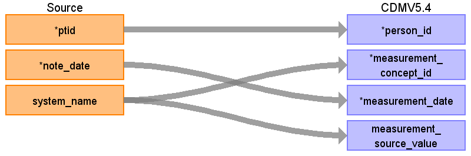


* Rule: Migrate only the rows where temporal_status=’current’,

We omit rows with a NULL temporal_status since they also have a NULL system_name, and we don’t want to guess both the temporal_status and the system_name.


<table>
  <tbody><tr>
   <td>Destination Field
   </td>
   <td>Source Field
   </td>
   <td>Comment
   </td>
  </tr>
  <tr>
   <td>measurement_id
   </td>
   <td>
   </td>
   <td>
   </td>
   <td>
   </td>
  </tr>
  <tr>
   <td>person_id
   </td>
   <td>ptid
   </td>
   <td>
   </td>
   <td>
   </td>
  </tr>
  <tr>
   <td>measurement_concept_id
   </td>
   <td><code>concept obtained using the rules:</code>
<p>
<code>Rules 1 – 3 note: do not populate if the result (column name in red) is null</code>
</p><ol>
<li><code>when system_name like 'Nottingham%'</code>
<p>
<code>then system_name and related columns make new concepts:</code>
</p><p>
<code>system_name ||' grade tubular '|| grade_tubular
system_name ||' grade nuclear '|| grade_nuclear
system_name ||' grade mitotic '|| grade_mitotic</code>
</p><p>
For example, “Nottingham Score grade tubular 3”
</p><ol>
<li><strong><code>when system_name like 'Gleason%'</code></strong>
<p><strong><code>then</code></strong>
<code>system_name and related columns make new concepts:</code></p>
<p>
<code>system_name ||' grade primary '|| grade_primary
system_name ||' grade secondary '|| grade_secondary
system_name ||' grade tertiary '|| grade_tertiary
system_name ||' result numeric '|| result_numeric</code>
</p><p>
For example,<code> </code>“Gleason score grade primary 2”
</p><ol>
<li><code>When system_name in (</code>
<p>
<code>'FIGO grade',</code>
</p><p>
<code>'Durie/Salmon Stage',</code>
</p><p>
<code>'International Staging System Stage',</code>
</p><p>
<code>'RISS Stage',</code>
</p><p>
<code>'Rai Stage',</code>
</p><p>
<code>'FIGO Stage',</code>
</p><p>
<code>'Binet Stage')</code>
</p><p>
<code>Then system_name||' ' ||result_numeric</code>
</p><p>
Rule 4 note: do not populate when result_numeric is null
</p><ol>
<li><code>when system_name in ('ECOG performance status',</code>
<p>
<code>'Karnofsky Performance Status',</code>
</p><p>
<code>'Oncotype DX recurrence score',
'Recurrence score'
)</code>
</p><p>
<code>Then system_name
</code>In the other cases do not populate CDM, for example entries with system =<code> 'Performance Status' </code>are excluded because we don’t know what type of 'Performance Status it is.
</p></li>
</ol>
</li>
</ol>
</li>
</ol>
</li>
</ol>
   </td>
   <td>
   </td>
   <td>Use the&nbsp;<a href="https://github.com/OHDSI/ETL-LambdaBuilder/blob/master/docs/Standard%20Queries/SOURCE_TO_STANDARD.sql">SOURCE_TO_STANDARD</a>&nbsp;query to map the code to standard concept(s) with the following filters: \
 \
Where source_vocabulary_id = ‘JNJ_OPTUM_EHR_ONCEVS’ and Target_standard_concept = ‘S’ and target_invalid_reason is NULL \
 \
If there is no mapping available, set concept_id to zero.
   </td>
  </tr>
  <tr>
   <td>measurement_date
   </td>
   <td>note_date
   </td>
   <td>
   </td>
   <td>
   </td>
  </tr>
  <tr>
   <td>measurement_source_value
   </td>
   <td>See the rules in measurement_concept_id
   </td>
   <td>
   </td>
   <td>
   </td>
  </tr>
  <tr>
   <td>value_as_number
   </td>
   <td><code>result_numeric</code>
   </td>
   <td>Values like 0/5, 1/5 – 5/5 are parsed to respective 0, 1, 5
<p>
Those stand for ECOG score out of 5
   </p></td>
   <td>Populate when<code> system_name in ('ECOG performance status',</code>
<p>
<code>'Performance Status',</code>
</p><p>
<code>'Karnofsky Performance Status',</code>
</p><p>
<code>'Oncotype DX recurrence score',</code>
</p><p>
<code>'Recurrence score')</code>
</p><p>
In the other cases result_numeric precoordinates with the other fields and maps to measurement_concept_id
   </p></td>
  </tr>
  <tr>
   <td>unit_concept_id
   </td>
   <td>
   </td>
   <td>
   </td>
   <td>
   </td>
  </tr>
  <tr>
   <td>value_as_concept_id
   </td>
   <td><code>result_narrative</code>
   </td>
   <td>
   </td>
   <td>Use the&nbsp;<a href="https://github.com/OHDSI/ETL-LambdaBuilder/blob/master/docs/Standard%20Queries/SOURCE_TO_STANDARD.sql">SOURCE_TO_STANDARD</a>&nbsp;query with case insensitive match to map the code to standard concept(s) with the following filters :
<p>Where source_vocabulary_id = ‘JNJ_OPTUM_EHR_LABRES’ and Target_standard_concept = ‘S’ and target_invalid_reason is NULL</p>
<p>If there is no mapping available, set concept_id to zero.</p>
   </td>
  </tr>
  <tr>
   <td>meas_event_field_concept_id
   </td>
   <td><code>1147127</code>
   </td>
   <td>
   </td>
   <td><code>condition_occurrence.condition_occurrence_id</code>
   </td>
  </tr>
  <tr>
   <td>measurement_event_id
   </td>
   <td><code>condition_occurrence.condition_occurrence_id</code>
   </td>
   <td>
   </td>
   <td>Connect with the Condition table through onc_neopls_histology using (neoplasm_histology_key) or using (ptid, note_date)
   </td>
  </tr>
  <tr>
   <td>measurement_source_concept_id
   </td>
   <td>0
   </td>
   <td>
   </td>
   <td>
   </td>
  </tr>
  <tr>
   <td>measurement_datetime
   </td>
   <td>
   </td>
   <td>
   </td>
   <td>
   </td>
  </tr>
  <tr>
   <td>measurement_time
   </td>
   <td>
   </td>
   <td>
   </td>
   <td>
   </td>
  </tr>
  <tr>
   <td>measurement_type_concept_id
   </td>
   <td>32882
   </td>
   <td>
   </td>
   <td><a href="https://athena.ohdsi.org/search-terms/terms/32882">Standard algorithm from EHR</a>
   </td>
  </tr>
  <tr>
   <td>operator_concept_id
   </td>
   <td>
   </td>
   <td>
   </td>
   <td>
   </td>
  </tr>
  <tr>
   <td>range_low
   </td>
   <td>
   </td>
   <td>
   </td>
   <td>
   </td>
  </tr>
  <tr>
   <td>range_high
   </td>
   <td>
   </td>
   <td>
   </td>
   <td>
   </td>
  </tr>
  <tr>
   <td>provider_id
   </td>
   <td>
   </td>
   <td>
   </td>
   <td>
   </td>
  </tr>
  <tr>
   <td>visit_occurrence_id
   </td>
   <td>
   </td>
   <td>
   </td>
   <td>
   </td>
  </tr>
  <tr>
   <td>visit_detail_id
   </td>
   <td>
   </td>
   <td>
   </td>
   <td>
   </td>
  </tr>
  <tr>
   <td>unit_source_value
   </td>
   <td>
   </td>
   <td>
   </td>
   <td>
   </td>
  </tr>
  <tr>
   <td>unit_source_concept_id
   </td>
   <td>
   </td>
   <td>
   </td>
   <td>
   </td>
  </tr>
  <tr>
   <td>value_source_value
   </td>
   <td><code>result_narrative</code>
   </td>
   <td>
   </td>
   <td>
   </td>
  </tr>
</tbody></table>


## Reading from onc_tumor_size


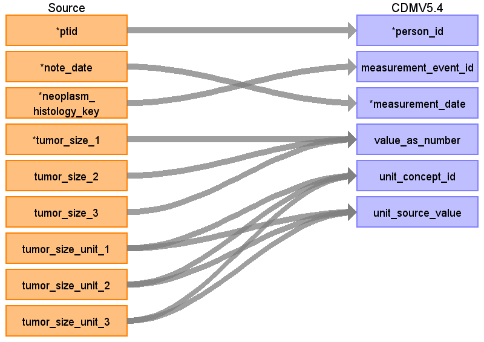


<table>
  <tbody><tr>
   <td>Destination Field
   </td>
   <td>Source Field
   </td>
   <td>Logic
   </td>
   <td>Comment
   </td>
  </tr>
  <tr>
   <td>measurement_id
   </td>
   <td>
   </td>
   <td>
   </td>
   <td>
   </td>
  </tr>
  <tr>
   <td>person_id
   </td>
   <td>ptid
   </td>
   <td>
   </td>
   <td>
   </td>
  </tr>
  <tr>
   <td>measurement_event_id
   </td>
   <td>neoplasm_histology_key
   </td>
   <td>
   </td>
   <td>fill by CONDITION.condition_id using neoplasm_histology_key
   </td>
  </tr>
  <tr>
   <td>measurement_concept_id
   </td>
   <td>Rule 1: 36768255
<p>
Rule 2: 36768664
   </p></td>
   <td>
   </td>
   <td>Rule 1: Largest Dimension of Tumor
<p>
Rule 2: Dimension of Tumor
   </p></td>
  </tr>
  <tr>
   <td>measurement_date
   </td>
   <td>note_date
   </td>
   <td>
   </td>
   <td>
   </td>
  </tr>
  <tr>
   <td>measurement_source_value
   </td>
   <td>
   </td>
   <td>
   </td>
   <td>Rule 1: Largest Dimension of Tumor
<p>
Rule 2: Dimension of Tumor
   </p></td>
  </tr>
  <tr>
   <td>value_as_number
   </td>
   <td>Rule 1: Greatest (tumor_size_1, tumor_size_2, tumor_size_3)
<p>
Rule 2: another size, not defined as greatest
   </p></td>
   <td>
   </td>
   <td><a href="#heading=h.30j0zll">See query here</a>
   </td>
  </tr>
  <tr>
   <td>unit_concept_id
   </td>
   <td>8582
   </td>
   <td>
   </td>
   <td>	centimeter
   </td>
  </tr>
  <tr>
   <td>unit_source_value
   </td>
   <td>‘cm’
   </td>
   <td>
   </td>
   <td>
   </td>
  </tr>
  <tr>
   <td>value_as_concept_id
   </td>
   <td>
   </td>
   <td>
   </td>
   <td>
   </td>
  </tr>
  <tr>
   <td>meas_event_field_concept_id
   </td>
   <td>
   </td>
   <td>
   </td>
   <td>
   </td>
  </tr>
  <tr>
   <td>measurement_source_concept_id
   </td>
   <td>
   </td>
   <td>
   </td>
   <td>
   </td>
  </tr>
  <tr>
   <td>measurement_datetime
   </td>
   <td>
   </td>
   <td>
   </td>
   <td>
   </td>
  </tr>
  <tr>
   <td>measurement_time
   </td>
   <td>
   </td>
   <td>
   </td>
   <td>
   </td>
  </tr>
  <tr>
   <td>measurement_type_concept_id
   </td>
   <td>32882
   </td>
   <td>
   </td>
   <td><a href="https://athena.ohdsi.org/search-terms/terms/32882">Standard algorithm from EHR</a>
   </td>
  </tr>
  <tr>
   <td>operator_concept_id
   </td>
   <td>
   </td>
   <td>
   </td>
   <td>
   </td>
  </tr>
  <tr>
   <td>range_low
   </td>
   <td>
   </td>
   <td>
   </td>
   <td>
   </td>
  </tr>
  <tr>
   <td>range_high
   </td>
   <td>
   </td>
   <td>
   </td>
   <td>
   </td>
  </tr>
  <tr>
   <td>provider_id
   </td>
   <td>
   </td>
   <td>
   </td>
   <td>
   </td>
  </tr>
  <tr>
   <td>visit_occurrence_id
   </td>
   <td>
   </td>
   <td>
   </td>
   <td>
   </td>
  </tr>
  <tr>
   <td>visit_detail_id
   </td>
   <td>
   </td>
   <td>
   </td>
   <td>
   </td>
  </tr>
  <tr>
   <td>unit_source_concept_id
   </td>
   <td>
   </td>
   <td>
   </td>
   <td>
   </td>
  </tr>
  <tr>
   <td>value_source_value
   </td>
   <td>
   </td>
   <td>
   </td>
   <td>
   </td>
  </tr>
</tbody></table>


# Table name: episode


## Reading from onc_lines_of_therapy


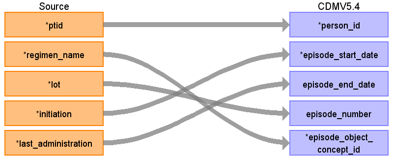


<table>
  <tbody><tr>
   <td>Destination Field
   </td>
   <td>Source Field
   </td>
   <td>Logic
   </td>
   <td>Comment
   </td>
  </tr>
  <tr>
   <td>episode_id
   </td>
   <td>
   </td>
   <td>Auto-increment
   </td>
   <td>
   </td>
  </tr>
  <tr>
   <td>person_id
   </td>
   <td>ptid
   </td>
   <td>
   </td>
   <td>
   </td>
  </tr>
  <tr>
   <td>episode_concept_id
   </td>
   <td>32531
   </td>
   <td>
   </td>
   <td>Treatment Regimen
   </td>
  </tr>
  <tr>
   <td>episode_start_date
   </td>
   <td>initiation
   </td>
   <td>
   </td>
   <td>
   </td>
  </tr>
  <tr>
   <td>episode_start_datetime
   </td>
   <td>
   </td>
   <td>
   </td>
   <td>
   </td>
  </tr>
  <tr>
   <td>episode_end_date
   </td>
   <td>last_administration
   </td>
   <td>
   </td>
   <td>
   </td>
  </tr>
  <tr>
   <td>episode_end_datetime
   </td>
   <td>
   </td>
   <td>
   </td>
   <td>
   </td>
  </tr>
  <tr>
   <td>episode_parent_id
   </td>
   <td>
   </td>
   <td>The episode corresponding to onc_lines_of_therapy.cancer_type. (can be connected to the actual diagnosis, to investigate after generation of CONDITION occurrence as described above)
<p>
episode_concept_id = 32533 (Disease Episode)
</p><p>
episode_object = cancer_type mapped to a standard condition concept
   </p></td>
   <td>Can be implemented in the next run
   </td>
  </tr>
  <tr>
   <td>episode_number
   </td>
   <td>lot
   </td>
   <td>
   </td>
   <td>
   </td>
  </tr>
  <tr>
   <td>episode_object_concept_id
   </td>
   <td>regimen_name
   </td>
   <td>Use the&nbsp;<a href="https://github.com/OHDSI/ETL-LambdaBuilder/blob/master/docs/Standard%20Queries/SOURCE_TO_STANDARD.sql">SOURCE_TO_STANDARD</a>&nbsp;query to map the code to standard concept(s) with the following filters:
<p>Where source_vocabulary_id = ‘JNJ_OPTUM_EHR_ONCLOT’ and Target_standard_concept = ‘S’ and target_invalid_reason is NULL</p>
<p>If there is no mapping available, set concept_id to zero or Consider creating new concepts.</p>
   </td>
   <td>
   </td>
  </tr>
  <tr>
   <td>episode_type_concept_id
   </td>
   <td>32882
   </td>
   <td>
   </td>
   <td><a href="https://athena.ohdsi.org/search-terms/terms/32882">Standard algorithm from EHR</a>
   </td>
  </tr>
  <tr>
   <td>episode_source_value
   </td>
   <td>
   </td>
   <td>regimen_name
   </td>
   <td>
   </td>
  </tr>
  <tr>
   <td>episode_source_concept_id
   </td>
   <td>
   </td>
   <td>NULL
   </td>
   <td>
   </td>
  </tr>
</tbody></table>


# Table name: episode_event

**Connects episode table and drug_exposure**

connect with the drug_exposure, with a query like [this](#heading=h.3znysh7):


#


# Table name: observation


## Reading from onc_treatment_response


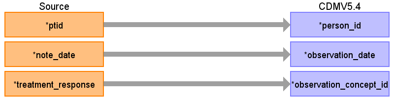


<table>
  <tr>
   <td>Destination Field
   </td>
   <td>Source Field
   </td>
   <td>Logic
   </td>
   <td>Comment
   </td>
  </tr>
  <tr>
   <td>observation_id
   </td>
   <td>
   </td>
   <td>
   </td>
   <td>
   </td>
  </tr>
  <tr>
   <td>person_id
   </td>
   <td>ptid
   </td>
   <td>
   </td>
   <td>
   </td>
  </tr>
  <tr>
   <td>observation_date
   </td>
   <td>note_date
   </td>
   <td>
   </td>
   <td>
   </td>
  </tr>
  <tr>
   <td>observation_concept_id
   </td>
   <td>0
   </td>
   <td>
   </td>
   <td>Do not even create a source concept for it.
   </td>
  </tr>
  <tr>
   <td>observation_datetime
   </td>
   <td>
   </td>
   <td>
   </td>
   <td>
   </td>
  </tr>
  <tr>
   <td>observation_type_concept_id
   </td>
   <td>32882
   </td>
   <td>
   </td>
   <td><a href="https://athena.ohdsi.org/search-terms/terms/32882">Standard algorithm from EHR</a>
   </td>
  </tr>
  <tr>
   <td>value_as_number
   </td>
   <td>
   </td>
   <td>
   </td>
   <td>
   </td>
  </tr>
  <tr>
   <td>value_as_string
   </td>
   <td>
   </td>
   <td>
   </td>
   <td>
   </td>
  </tr>
  <tr>
   <td>value_as_concept_id
   </td>
   <td>
   </td>
   <td>
   </td>
   <td>
   </td>
  </tr>
  <tr>
   <td>qualifier_concept_id
   </td>
   <td>
   </td>
   <td>
   </td>
   <td>
   </td>
  </tr>
  <tr>
   <td>unit_concept_id
   </td>
   <td>
   </td>
   <td>
   </td>
   <td>
   </td>
  </tr>
  <tr>
   <td>provider_id
   </td>
   <td>
   </td>
   <td>
   </td>
   <td>
   </td>
  </tr>
  <tr>
   <td>visit_occurrence_id
   </td>
   <td>
   </td>
   <td>
   </td>
   <td>
   </td>
  </tr>
  <tr>
   <td>visit_detail_id
   </td>
   <td>
   </td>
   <td>
   </td>
   <td>
   </td>
  </tr>
  <tr>
   <td>observation_source_value
   </td>
   <td><code>treatment_response || ' to ' || treatment</code>
   </td>
   <td>
   </td>
   <td>Populate it as is in the first run, if someone wants to use it the data will be available in the CDM
   </td>
  </tr>
  <tr>
   <td>observation_source_concept_id
   </td>
   <td>0
   </td>
   <td>
   </td>
   <td>
   </td>
  </tr>
  <tr>
   <td>unit_source_value
   </td>
   <td>
   </td>
   <td>
   </td>
   <td>
   </td>
  </tr>
  <tr>
   <td>qualifier_source_value
   </td>
   <td>
   </td>
   <td>
   </td>
   <td>
   </td>
  </tr>
  <tr>
   <td>value_source_value
   </td>
   <td>
   </td>
   <td>
   </td>
   <td>
   </td>
  </tr>
  <tr>
   <td>observation_event_id
   </td>
   <td>Event of a drug regimen the response is recorded to
   </td>
   <td>
   </td>
   <td>Can be done in the next iteration
   </td>
  </tr>
  <tr>
   <td>obs_event_field_concept_id
   </td>
   <td>EPISODE
   </td>
   <td>
   </td>
   <td>Can be done in the next iteration
   </td>
  </tr>
</table>


## Reading from onc_tumor_progression

This table has to be mapped to an Episode table, but in the first version it can sit in the Observation.


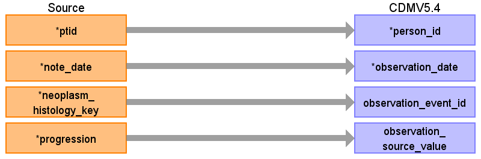


<table>
  <tr>
   <td>Destination Field
   </td>
   <td>Source Field
   </td>
   <td>Logic
   </td>
   <td>Comment
   </td>
  </tr>
  <tr>
   <td>observation_id
   </td>
   <td>
   </td>
   <td>
   </td>
   <td>
   </td>
  </tr>
  <tr>
   <td>person_id
   </td>
   <td>ptid
   </td>
   <td>
   </td>
   <td>
   </td>
  </tr>
  <tr>
   <td>observation_date
   </td>
   <td>note_date
   </td>
   <td>
   </td>
   <td>
   </td>
  </tr>
  <tr>
   <td>observation_event_id
   </td>
   <td>neoplasm_histology_key
   </td>
   <td>
   </td>
   <td>Connect with the corresponding condition
   </td>
  </tr>
  <tr>
   <td>observation_source_value
   </td>
   <td>progression
   </td>
   <td>
   </td>
   <td>
   </td>
  </tr>
  <tr>
   <td>observation_concept_id
   </td>
   <td>
   </td>
   <td>
   </td>
   <td>
   </td>
  </tr>
  <tr>
   <td>observation_datetime
   </td>
   <td>
   </td>
   <td>
   </td>
   <td>
   </td>
  </tr>
  <tr>
   <td>observation_type_concept_id
   </td>
   <td>32882
   </td>
   <td>
   </td>
   <td><a href="https://athena.ohdsi.org/search-terms/terms/32882">Standard algorithm from EHR</a>
   </td>
  </tr>
  <tr>
   <td>value_as_number
   </td>
   <td>
   </td>
   <td>
   </td>
   <td>
   </td>
  </tr>
  <tr>
   <td>value_as_string
   </td>
   <td>
   </td>
   <td>
   </td>
   <td>
   </td>
  </tr>
  <tr>
   <td>value_as_concept_id
   </td>
   <td>
   </td>
   <td>
   </td>
   <td>
   </td>
  </tr>
  <tr>
   <td>qualifier_concept_id
   </td>
   <td>
   </td>
   <td>
   </td>
   <td>
   </td>
  </tr>
  <tr>
   <td>unit_concept_id
   </td>
   <td>
   </td>
   <td>
   </td>
   <td>
   </td>
  </tr>
  <tr>
   <td>provider_id
   </td>
   <td>
   </td>
   <td>
   </td>
   <td>
   </td>
  </tr>
  <tr>
   <td>visit_occurrence_id
   </td>
   <td>
   </td>
   <td>
   </td>
   <td>
   </td>
  </tr>
  <tr>
   <td>visit_detail_id
   </td>
   <td>
   </td>
   <td>
   </td>
   <td>
   </td>
  </tr>
  <tr>
   <td>observation_source_concept_id
   </td>
   <td>
   </td>
   <td>
   </td>
   <td>
   </td>
  </tr>
  <tr>
   <td>unit_source_value
   </td>
   <td>
   </td>
   <td>
   </td>
   <td>
   </td>
  </tr>
  <tr>
   <td>qualifier_source_value
   </td>
   <td>
   </td>
   <td>
   </td>
   <td>
   </td>
  </tr>
  <tr>
   <td>value_source_value
   </td>
   <td>
   </td>
   <td>
   </td>
   <td>
   </td>
  </tr>
  <tr>
   <td>obs_event_field_concept_id
   </td>
   <td>
   </td>
   <td>
   </td>
   <td>
   </td>
  </tr>
</table>


# Useful queries


## Get Condition concepts for the mapping


```
select distinct
case when neoplasm_characteristic = histology_characteristic then
regexp_replace (trim (coalesce (histology_characteristic, '')||' '||coalesce (direction, '')||' '|| coalesce (neoplasm_type, '')||' '|| coalesce (histology, '')), ' +',' ')
else regexp_replace (trim (coalesce (neoplasm_characteristic, '') ||' '|| coalesce (histology_characteristic, '')||' '||coalesce (direction, '')||' '|| coalesce (neoplasm_type, '')||' '
|| coalesce (histology, 'neoplasm')), ' +',' ') end as source_code,
0 as source_concept_id,
'JNJ_OPTUM_EHR_ONCNHC'   as source_vocabulary_id,
case when neoplasm_characteristic = histology_characteristic then
regexp_replace (trim (coalesce (histology_characteristic, '')||' '||coalesce (direction, '')||' '|| coalesce (neoplasm_type, '')||' '|| coalesce (histology, '')), ' +',' ')
else regexp_replace (trim (coalesce (neoplasm_characteristic, '') ||' '|| coalesce (histology_characteristic, '')||' '||coalesce (direction, '')||' '|| coalesce (neoplasm_type, '')||' '
|| coalesce (histology, 'neoplasm')), ' +',' ') end as source_code_description,
0 as target_concept_id,
to_date ('10-10-2022', 'dd-MM-yyyy') as valid_start_date,
to_date ('31-12-2099', 'dd-MM-yyyy') as valid_end_date,
null as invalid_reason
from onc_neoplasm_histology nh
left join onc_characteristic ch on  nh.neoplasm_histology_key= ch.neoplasm_histology_key And (ch.neoplasm_char_temporal_status ='current' OR ch.histology_char_temporal_status ='current')
and (neoplasm_characteristic in ('in situ','malignant', 'benign') or histology_characteristic in ('in situ', 'malignant', 'benign') )
where (neoplasm_temporal_status  ='current' OR  histology_temporal_status  ='current')
AND (neoplasm_qualifier ='actual' OR histology_qualifier ='actual')
```


## Extracting the Largest Dimension of Tumor


```
--convert tumor size
--convert tumor size
create view
 ts_values as
 with
ts_clean as (
select * from (
select ptid, note_date, neoplasm_histology_key,
case when tumor_size_unit_1 ='mm' then tumor_size_1::float/10  when tumor_size_unit_1 ='cm' then tumor_size_1::float  end as tumor_size_1 ,
case when tumor_size_unit_2 ='mm' then tumor_size_2::float/10  when tumor_size_unit_2 ='cm' then tumor_size_2::float end as tumor_size_2,
case when tumor_size_unit_3 ='mm' then tumor_size_3::float/10  when tumor_size_unit_3 ='cm' then tumor_size_3::float end as tumor_size_3
 from (
select ptid, note_date, neoplasm_histology_key, tumor_size_1, coalesce (tumor_size_unit_1,tumor_size_unit_2,tumor_size_unit_3) as tumor_size_unit_1,
tumor_size_2, coalesce (tumor_size_unit_2,tumor_size_unit_3) as tumor_size_unit_2 , tumor_size_3, tumor_size_unit_3
from native_optum_ehr_v2438.onc_tumor_size)
)
where tumor_size_1 is not null -- when unit is empty it becomes null or when the first value is null, it's still looks like a missing data
)
select  CASE
    WHEN tumor_size_1 >= coalesce (tumor_size_2,0) AND tumor_size_1 >= coalesce (tumor_size_3,0) THEN tumor_size_1
    WHEN coalesce (tumor_size_2,0) >= tumor_size_1 AND coalesce (tumor_size_2,0) >= coalesce (tumor_size_3,0) THEN tumor_size_2
    ELSE tumor_size_3
    END as max_value,
    ptid, note_date, neoplasm_histology_key, tumor_size_1, tumor_size_2, tumor_size_3
    from ts_clean
;
--rule 1
    select  ptid, note_date, neoplasm_histology_key, max_value as value_as_number, 36768255 as measurement_concept_id, 8582 as unit_as_concept_id from ts_values
;
--rule 2
    select  ptid, note_date, neoplasm_histology_key, tumor_size_1 as value_as_number, 36768664 as measurement_concept_id, 8582 as unit_as_concept_id from ts_values
    where tumor_size_1 !=max_value
    union
    select  ptid, note_date, neoplasm_histology_key, tumor_size_2 as value_as_number, 36768664 as measurement_concept_id, 8582 as unit_as_concept_id from ts_values
    where tumor_size_2 !=max_value
    union
    select  ptid, note_date, neoplasm_histology_key, tumor_size_3 as value_as_number, 36768664 as measurement_concept_id, 8582 as unit_as_concept_id from ts_values
    where tumor_size_3 !=max_value;
--draft of a query that merges onc_neoplasm_histology when one of the fields is empty and at the same date this field is populated
with bb as (
(
select distinct
b.neoplasm_histology_key
from onc_neoplasm_histology a
join onc_neoplasm_histology b on a.ptid =b.ptid
and a.note_date = b.note_date
and a.neoplasm_type ='' and b.neoplasm_type !='' and b.neoplasm_qualifier ='actual' and b.neoplasm_temporal_status ='current'
and a.histology !='' and b.histology='' and a.histology_qualifier ='actual' and a.histology_temporal_status ='current'
),
aa as (
select distinct
a.neoplasm_histology_key
from onc_neoplasm_histology a
join onc_neoplasm_histology b on a.ptid =b.ptid
and a.note_date = b.note_date
and a.neoplasm_type ='' and b.neoplasm_type !='' and b.neoplasm_qualifier ='actual' and b.neoplasm_temporal_status ='current'
and a.histology !='' and b.histology='' and a.histology_qualifier ='actual' and a.histology_temporal_status ='current'
),
aa_bb as (
select distinct
a.neoplasm_histology_key ||'/'||b.neoplasm_histology_key , --list colums needed, that usually the table has as a result of merge
from onc_neoplasm_histology a
join onc_neoplasm_histology b on a.ptid =b.ptid
and a.note_date = b.note_date
and a.neoplasm_type ='' and b.neoplasm_type !='' and b.neoplasm_qualifier ='actual' and b.neoplasm_temporal_status ='current'
and a.histology !='' and b.histology='' and a.histology_qualifier ='actual' and a.histology_temporal_status ='current'
)
select * from onc_neoplasm_histology where neoplasm_histology_key not in (select aa.neoplasm_histology_key) and neoplasm_histology_key not in (select bb.neoplasm_histology_key)
union
select * from aa_bb
```


## Connect Drug Exposure and lines of therapy


```
--this is just one patient, need to check how it works with all the patients after we map Episodes
select ma.drug_name, admin_date, lt.* from medication_administrations ma
join onc_lines_of_therapy lt on lt.ptid = ma.ptid and ma.admin_date between lt.initiation and lt.last_administration
where ma.ptid = 'PT306269791'
and ma.drug_name ~'BEVACIZUMAB|FLUOROURACIL|LEUCOVORIN|OXALIPLATIN|IRINOTECAN|CETUXIMAB|PANITUMUMAB|SODIUM IODINE I-131' -- maybe
order by admin_date
```


# Future development


## To connect onc_treatment_response and the actual treatment

We need to connect Episode table made from the Lines of therapy to the Observational table made from treatment_response, we can use the query like this: **(it returns 18007 out 74698 onc_treatment_response patients has, so these tables are not very consistent)**

**THUS it is a lower priority**

select count(distinct ptid) 

from onc_treatment_response r 

join onc_lines_of_therapy olot using (ptid) 

where r.note_date between olot.initiation and olot.last_administration +30 

and treatment not like '%radiotherapy%' -- exclude these as we work with the drugs 


The treatment response can be stored in Observation table and connected through the **observation_event_id** to the **EPISODE** with drug regimen.


## Add the Lymph Nodes table to the cancer modifiers


## Add empty system name entries

*If the system name is not documented in the table it means, the system name was not mentioned in the notes; Null SYSTEM_NAME with grades for GRADE_TUBULAR, GRADE_NUCLEAR and GRADE_MITOTIC are typically associated with mammary neoplasms, but also can be applied to other NEOPLASM_TYPES.


# Justification of decisions


## Omit entries where histology_characteristic = ‘in situ’  and invasive at the same day

Since there are mostly same diagnoses associated with both modifiers, we treat these entries as erroneous and remove such entries.

Answer from OPTUM:

_There could be multiple reasons that you see more than one characteristics for a neoplasm or histology._

_Using the examples provided, 'in situ' and 'invasive' were mentioned in the same notes but the NLP model didn't accurately capture the context to make sense of them. For example, the temporality for 'in situ' might actually be 'history' or a more granular term '5 months ago'._

_Another reason is one of the terms belongs to another cancer if the patient has multiple cancers. For example on row 3 of the stats table, the patients being counted have both 'ductal carcinoma' and 'carcinoma' without a linked neoplasm. While 'ductal carcinoma' indicates breast cancer, 'carcinoma' might be for other cancers._

_The workaround we recommend is using ICD code to corroborate. 'in situ' is a 'D%' code and 'invasive' is 'C%'. So when a patient had been coded as 'C%' while having both 'in situ' and 'invasive' mentions, they are more likely already an 'invasive'._

I’ve noticed  1 308 343 entries or 86 550 distinct patients when `onc_characteristic.histology_characteristic = 'in situ' and at the same day it's equal to 'invasive'`


```
select –1308343
count(1)
from onc_characteristic a
join onc_characteristic b using(ptid , note_date)
where a.histology_characteristic ='in situ' and b.histology_characteristic = 'invasive'
and (a.neoplasm_char_temporal_status  ='current' OR  a.histology_char_temporal_status  ='current') and (b.neoplasm_char_temporal_status  ='current' OR  b.histology_char_temporal_status  ='current')
;
```


And if we look at the diagnoses associated, **it’s the same diagnoses mostly:**


```
select oa.neoplasm_type , oa.histology , ob.neoplasm_type , ob.histology, count(1)
from onc_characteristic a
join onc_characteristic b using(ptid , note_date)
join onc_neoplasm_histology oa on oa.neoplasm_histology_key =a.neoplasm_histology_key
join onc_neoplasm_histology ob on ob.neoplasm_histology_key =b.neoplasm_histology_key
where a.histology_characteristic ='in situ' and b.histology_characteristic = 'invasive'
and (a.neoplasm_char_temporal_status  ='current' OR  a.histology_char_temporal_status  ='current') and (b.neoplasm_char_temporal_status  ='current' OR  b.histology_char_temporal_status  ='current')
group by oa.neoplasm_type , oa.histology , ob.neoplasm_type , ob.histology
order by count(1) desc
;
```


Here are some top diagnoses, the left associated with ‘in situ’, the right one associated with ‘invasive’ characteristic.


<table>
  <tr>
   <td>neoplasm_type
   </td>
   <td>histology
   </td>
   <td>neoplasm_type
   </td>
   <td>histology
   </td>
   <td>count
   </td>
  </tr>
  <tr>
   <td>[NULL]
   </td>
   <td>ductal carcinoma
   </td>
   <td>[NULL]
   </td>
   <td>ductal carcinoma
   </td>
   <td><p style="text-align: right">
475,240</p>

   </td>
  </tr>
  <tr>
   <td>[NULL]
   </td>
   <td>ductal carcinoma
   </td>
   <td>mammary
   </td>
   <td>ductal carcinoma
   </td>
   <td><p style="text-align: right">
204,608</p>

   </td>
  </tr>
  <tr>
   <td>[NULL]
   </td>
   <td>ductal carcinoma
   </td>
   <td>[NULL]
   </td>
   <td>carcinoma
   </td>
   <td><p style="text-align: right">
148,016</p>

   </td>
  </tr>
  <tr>
   <td>mammary
   </td>
   <td>ductal carcinoma
   </td>
   <td>[NULL]
   </td>
   <td>ductal carcinoma
   </td>
   <td><p style="text-align: right">
42,496</p>

   </td>
  </tr>
  <tr>
   <td>[NULL]
   </td>
   <td>lobular carcinoma
   </td>
   <td>[NULL]
   </td>
   <td>lobular carcinoma
   </td>
   <td><p style="text-align: right">
41,146</p>

   </td>
  </tr>
  <tr>
   <td>[NULL]
   </td>
   <td>lobular carcinoma
   </td>
   <td>[NULL]
   </td>
   <td>ductal carcinoma
   </td>
   <td><p style="text-align: right">
34,411</p>

   </td>
  </tr>
  <tr>
   <td>mammary
   </td>
   <td>ductal carcinoma
   </td>
   <td>mammary
   </td>
   <td>ductal carcinoma
   </td>
   <td><p style="text-align: right">
27,113</p>

   </td>
  </tr>
  <tr>
   <td>[NULL]
   </td>
   <td>lobular carcinoma
   </td>
   <td>[NULL]
   </td>
   <td>carcinoma
   </td>
   <td><p style="text-align: right">
25,848</p>

   </td>
  </tr>
  <tr>
   <td>[NULL]
   </td>
   <td>ductal carcinoma
   </td>
   <td>[NULL]
   </td>
   <td>lobular carcinoma
   </td>
   <td><p style="text-align: right">
22,801</p>

   </td>
  </tr>
  <tr>
   <td>[NULL]
   </td>
   <td>lobular carcinoma
   </td>
   <td>mammary
   </td>
   <td>lobular carcinoma
   </td>
   <td><p style="text-align: right">
18,299</p>

   </td>
  </tr>
  <tr>
   <td>[NULL]
   </td>
   <td>ductal carcinoma
   </td>
   <td>mammary
   </td>
   <td>carcinoma
   </td>
   <td><p style="text-align: right">
17,361</p>

   </td>
  </tr>
  <tr>
   <td>[NULL]
   </td>
   <td>carcinoma
   </td>
   <td>[NULL]
   </td>
   <td>carcinoma
   </td>
   <td><p style="text-align: right">
16,622</p>

   </td>
  </tr>
  <tr>
   <td>[NULL]
   </td>
   <td>carcinoma
   </td>
   <td>[NULL]
   </td>
   <td>ductal carcinoma
   </td>
   <td><p style="text-align: right">
16,081</p>

   </td>
  </tr>
  <tr>
   <td>[NULL]
   </td>
   <td>lobular carcinoma
   </td>
   <td>mammary
   </td>
   <td>ductal carcinoma
   </td>
   <td><p style="text-align: right">
13,753</p>

   </td>
  </tr>
</table>

